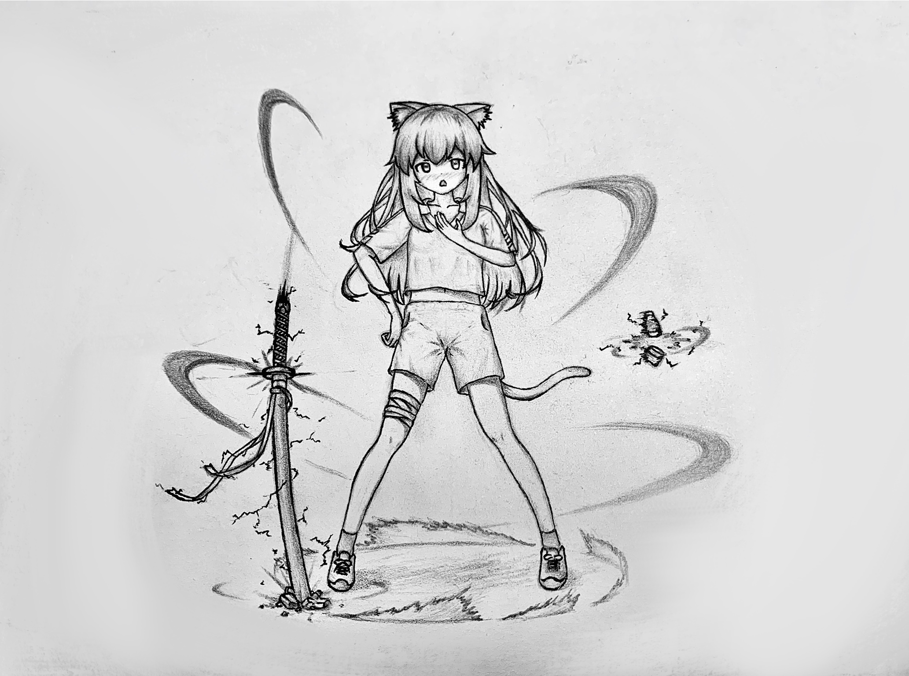
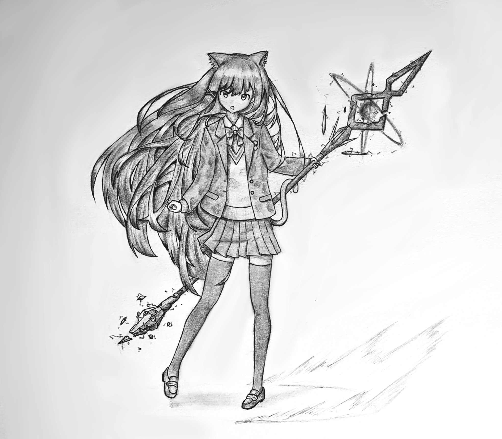
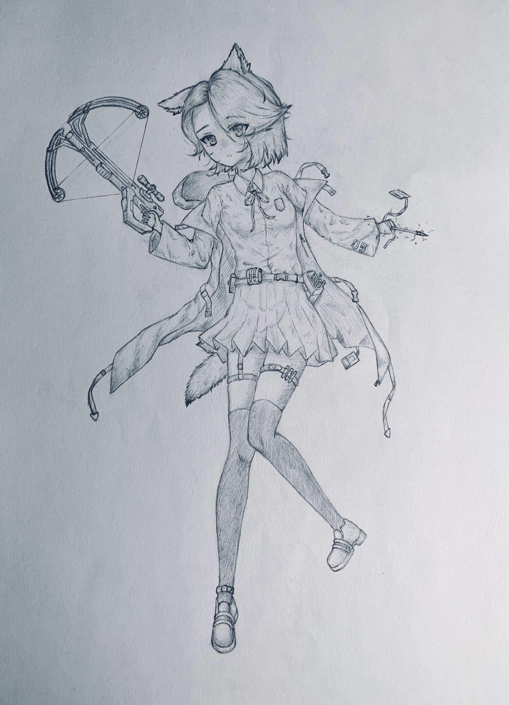
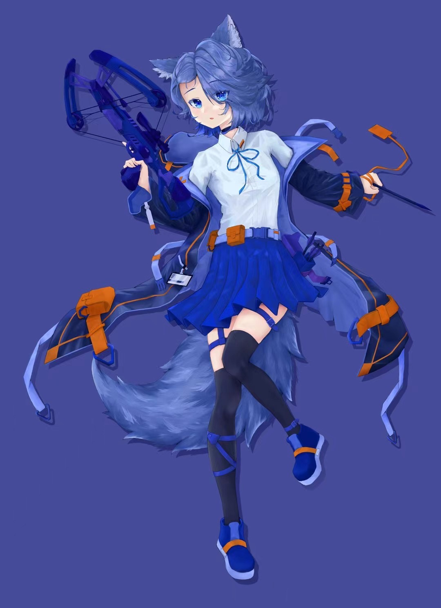
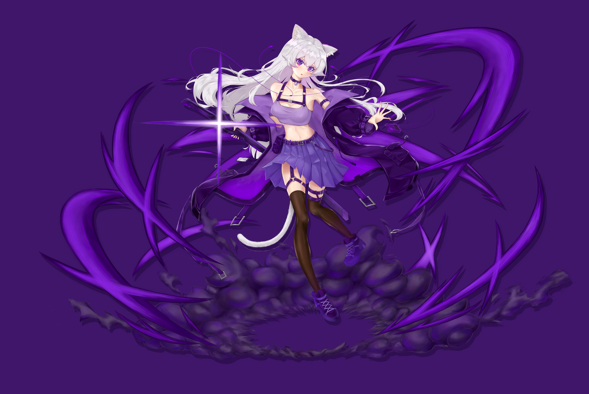

# 个人介绍

## 你好，我是 Max1122Chen

一名专注于 **游戏开发** 的开发者。这个网站既是我的个人主页，也是学习笔记与项目记录的集合。

这是一篇比较闲谈式的个人介绍，便于你快速了解我。[更正经的简历在这](简历.md)。

如果你想了解更多，我曾在社交平台小黑盒上发布过一篇更走心的[帖子](https://www.xiaoheihe.cn/app/bbs/link/166517342)（虽然过了一段时间现在时效性略差了），不过鉴于这里算是一个个人网站我就不像帖子里那样说了（咳咳

## 个人背景
我来自广州，现在正在北京邮电大学计算机科学与技术专业学习，目前主要的学习方向是游戏客户端开发以及游戏引擎开发相关的技术，现在正在开发自己的个人迷你引擎学习项目[minEngine](https://github.com/Max1122Chen/minEngine)。
个人性格评价：内倾不内向，内需不内耗。比较能和自己相处，不善于到处社交（准确地说是没兴趣，而不是没能力），应该算是比较容易相处吧，比较平易近人，属于是可以不主动维护但是和谁关系都还不错那种。

## 技术素养简介
和简历里的差不多

- 熟练使用C++，熟悉C++11以来的常见特性，具备模板编程经验，熟悉 STL 常用容器与算法；熟悉 C# 基础语法及面向对象编程。
- 熟悉计算机图形学基础，理解光栅化流程与 GPU 渲染管线；掌握 Shader 基础开发，了解常见渲染技术（如 Shadow Mapping、基础光照模型等）；了解现代渲染架构（如 RenderGraph）及其设计思想。
- 熟练使用 UE5 编辑器，具备 C++ 与蓝图开发能力，理解 UE Gameplay 框架（UObject、Actor、Component、Controller、GameMode 等）；了解 UE 类型系统（反射系统）；了解 Gameplay Ability System（GAS）基本结构（ASC、GA、GE 等）。
- 熟练使用 Unity 编辑器，熟悉 MonoBehaviour 生命周期（Awake/Start/Update 等），能够独立完成游戏逻辑开发；具备基础 UI 开发经验（UGUI）；熟悉 Prefab、资源管理及场景搭建流程。

## 兴趣爱好
### 爱玩游戏
引用自[小黑盒的帖子](https://www.xiaoheihe.cn/app/bbs/link/166517342)
> 鼠鼠从小就是一个网瘾少年，人菜瘾大，小时候天天半夜偷手机玩游戏。鼠鼠玩过的游戏不算很多，但是涉猎算比较广泛。
> 
> 鼠鼠不是那种会抱着玩一个游戏一定要通关的类型，玩到一定程度感觉获得的体验耗尽了就会放在一边，寻找新的体验。
> 
> 玩过《老头环》《黑魂》《只狼》《黑神话》这些高难RPG，但是比较菜，都没通关。这里面最喜欢的是《只狼》。（二编只狼通关了）
> 
> 挺喜欢玩模拟经营游戏，例如《星露谷物语》《戴森球计划》，我看了一下才发现我的模拟经营游戏对我来说还挺多的，感觉它们很能满足自我实现的需求，能够让我享受创造的感受。
> 
> 喜欢玩沙盒游戏，情感上所有游戏中最喜欢的游戏是《泰拉瑞亚》，从小学玩到高中，从iPad上玩到steam。《我的世界》也挺喜欢，短暂地玩过一段时间生电。《饥荒》没那么喜欢，《方舟生存进化》《Grounded》这些也玩过。
> 
> 类银河战士恶魔城的横板卷轴游戏也很喜欢，但是主要只玩过两部《奥日》，很享受受到能力锁引导和获得新能力把玩，探索精妙的地图的感觉。
> 
> 也喜欢玩《杀戮尖塔》这种重策略和选择的游戏，因为它们不吃瞬间的操作而是长远的决策和运营，相对来说比较休闲。
> 
> 玩过《女神异闻录5》，打到后面有点无聊，遂摆。
> 
> 《死亡搁浅》虽然玩起来似乎游戏性不高，但其中蕴含的人文关怀和思想还挺意外地让我喜欢的。
> 
> 只简单地玩过一些射击游戏，手机上的吃鸡，电脑上三角洲，玩得巨菜，没什么练枪的执念。
> 
> 玩LOL，自我评价水平不高但也不算太菜，除了中路各个位置都稍微会点，没有打排位上分的执念，现在已经退化成赛事观众和大乱斗选手。
> 
> 手游曾经玩过王者荣耀、皇室战争、吃鸡、明日方舟这些现代手游，小时候经常玩远古时期的水果忍者、割绳子、愤怒的小鸟、无尽之剑等等一大堆老手游。
> 
> 情感上最爱的游戏是《泰拉瑞亚》，理性上最喜欢的游戏是《博德之门3》和《奥日2》。

最近在玩《怪物猎人：世界》，主玩太刀。“我就要登！”

有时候会想一些游戏设计点子或者是拆解一些游戏机制，要么在[游戏设计艺术目录](../各种笔记和随笔/游戏设计艺术/Idea/游戏设计创意练习.md)中，要么在[飞书知识库](https://jcna3c1bqfds.feishu.cn/wiki/space/7458093281902084115?ccm_open_type=lark_wiki_spaceLink&open_tab_from=wiki_home)中，由于基本只是随笔，所以写得比较随意，感兴趣可以随意阅读。

### 曾经会画点小画

高中的时候曾经有一段时间沉迷画二次元人物，不过后来逐渐就没画了（悲

### 偶尔玩玩乐器

稍微上课学过一段时间钢琴，后来没系统性学了就自己玩。

自学过木吉他，主要是弹指弹作品，现在不太会弹了。

现在在玩电吉他，主要在练习Beyond的一些经典曲目的solo，毕竟是老广。

### 其他杂七杂八的爱好
音乐方面平时听听周杰伦、陶喆、陈奕迅、方大同等歌手的作品，或者是随机播放粤语劲歌金曲。

不太看动漫，主要是不会特意追，小时候看《海贼王》比较多。现在看得比较多的是《JOJO的奇妙冒险》，正在追更第9部。也挺喜欢《剑风传奇》，豪堪。

游戏方面赛事基本只关注英雄联盟赛事，LPL菜鸡互啄和世界级比赛基本都看，没有特别支持的队伍或选手个人。

## 联系方式

- GitHub：[Max1122Chen](https://github.com/Max1122Chen)
- QQ：2541925704
- 邮箱：`max1122chen@126.com`

最后更新时间：2026.06.13
