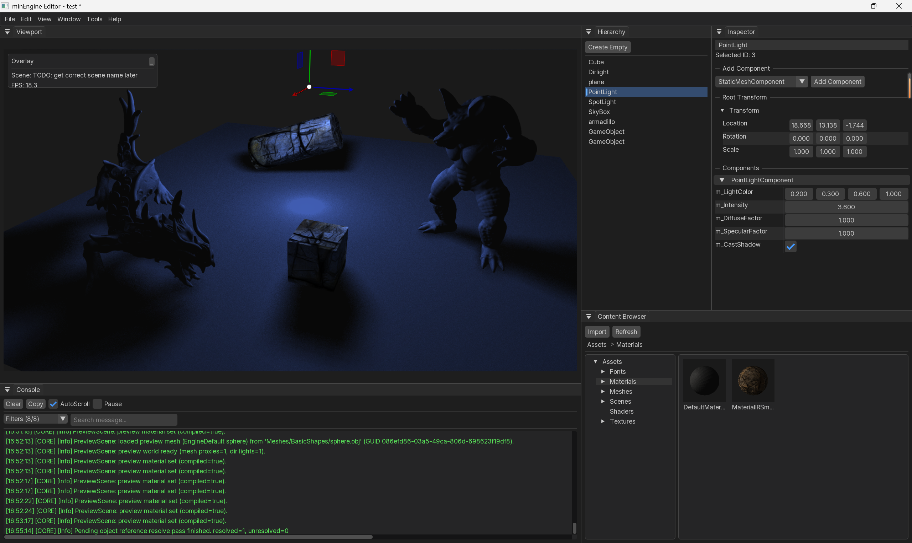
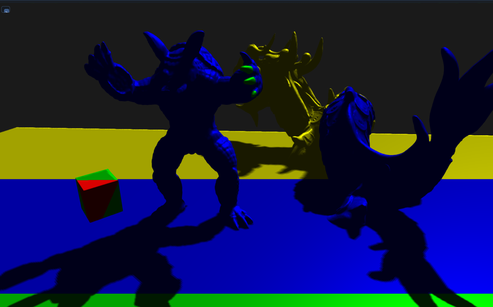
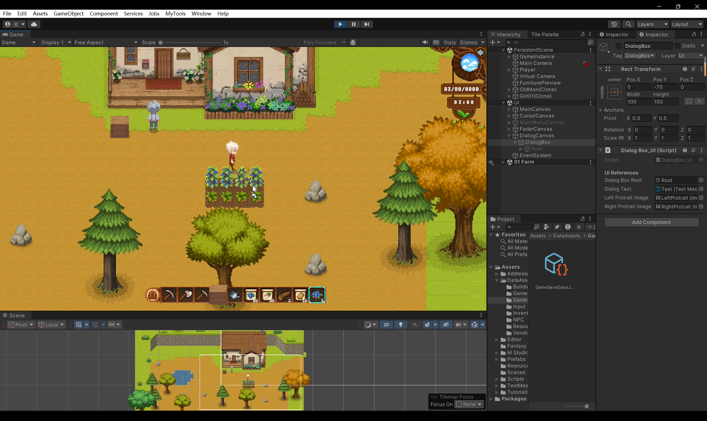
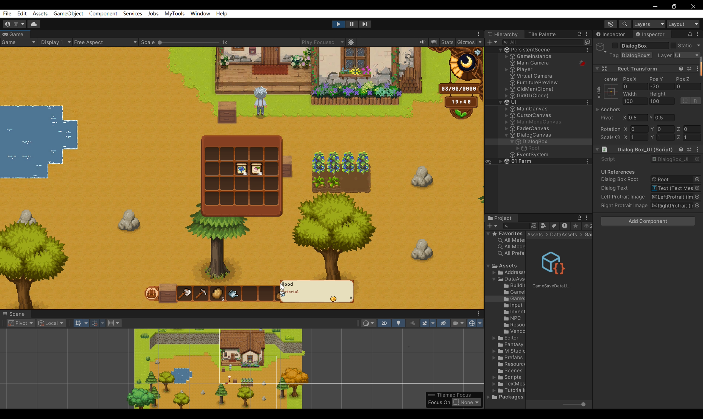
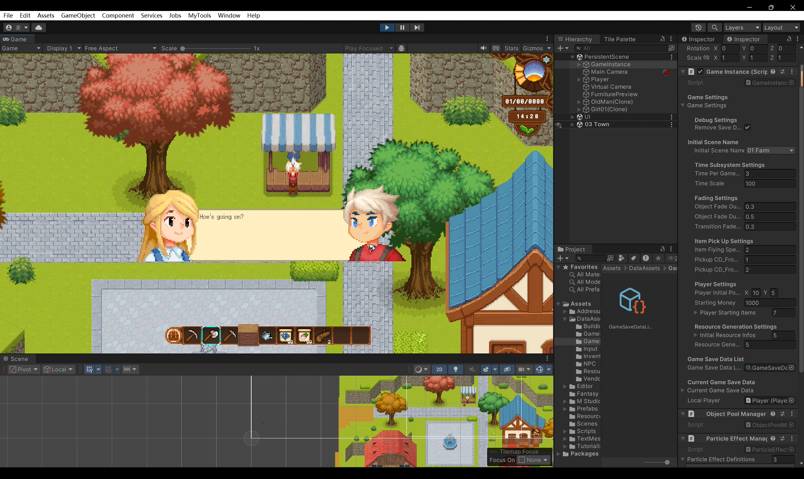
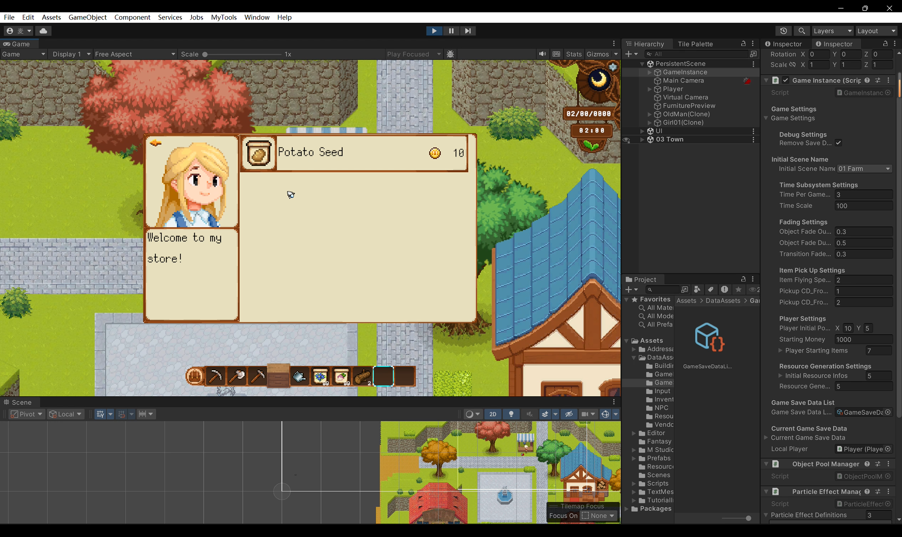

# 项目展示

这里汇总我在游戏开发方向的主要个人项目。详细技术文档与架构说明见各项目外链。

---

## minEngine

**类型：** 个人学习项目 · **角色：** 主程序员 · **时间：** 2025.12 – 至今  
**技术栈：** C++17 · OpenGL · Jolt · CMake · ImGui

### 链接

- [GitHub 仓库](https://github.com/Max1122Chen/minEngine)
- [项目文档站](https://max1122chen.github.io/minEngine/)

### 简介

**minEngine** 是一个用 C++ 从零搭建的个人学习型游戏引擎。目标不是做商业引擎，而是把渲染管线、引擎架构和编辑器工作流亲手走一遍：模块分层清晰，核心系统（渲染、场景、资源、反射/序列化、输入）均为自主实现。

目前已具备多 Pass 前向渲染（阴影 / 主场景 / 透明 / 后处理 / 呈现）、方向光 CSM 阴影、GameObject-Component 场景模型、GUID 资源管理与 `.meta` 元数据、代码生成式反射与 JSON 序列化，以及基于 ImGui 的基础编辑器（层级、检视、视口、Gizmo）。

更详细的介绍详见仓库README。

### 引擎运行截图

引擎编辑器主界面展示：

材质编辑器展示：

点光源阴影展示：

方向光阴影的级联阴影贴图的级联着色：
红、绿、蓝、黄分别对应落在1，2，3，4级级联

由于关闭了级联混合，可以见到级联接缝处明显的阴影分辨率突变

---

## 《麦田物语》

**类型：** 个人 Demo · **角色：** 主程序员 · **时间：** 2026.02 – 2026.03  
**技术栈：** Unity · C#

### 链接

- [GitHub 仓库](https://github.com/Max1122Chen/minEngine)

### 简介

基于 Unity 的 2D 模拟经营类 Demo，独立完成了从角色交互、资源采集种植到背包、交易、存档的完整 gameplay 链路。系统侧采用 Subsystem/Manager 划分模块，UI 采用 MVC + 委托观察者模式；场景侧基于 Tilemap 与自定义 TileInfo 实现 A\* 寻路，并用泊松盘采样做资源点的自然分布生成。

### 项目快照

