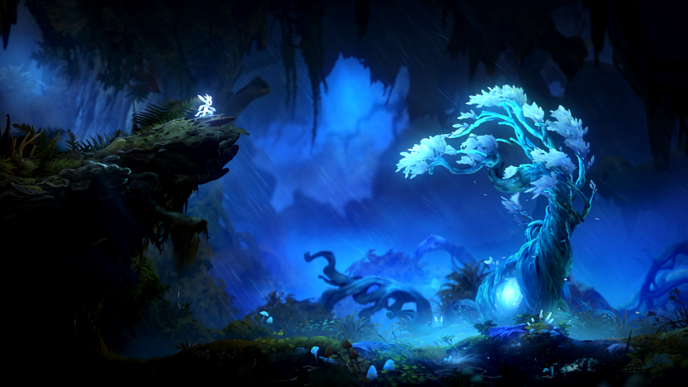
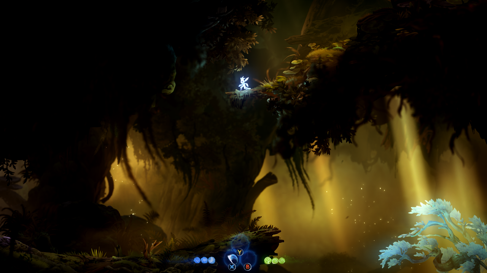
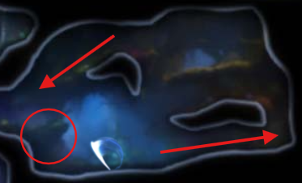
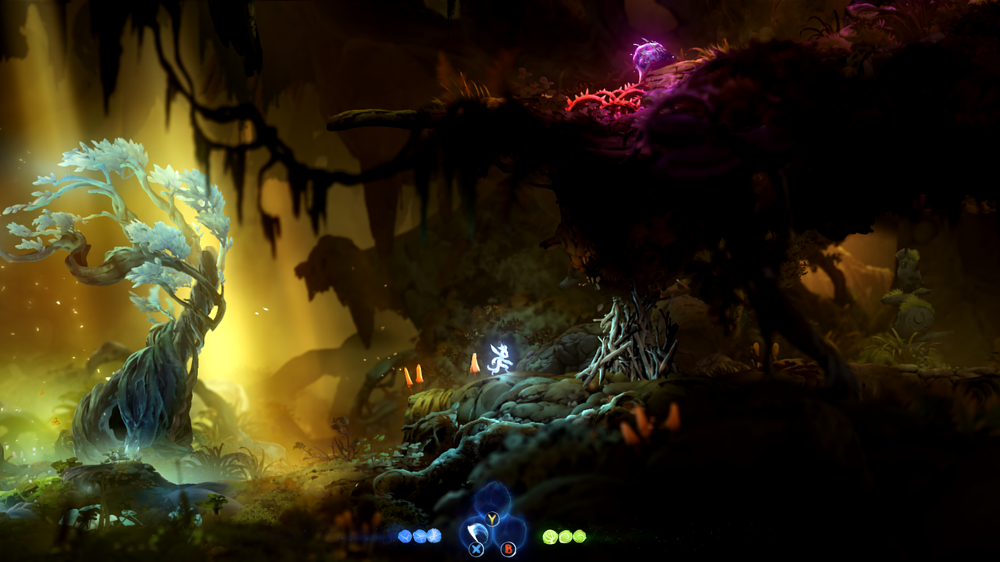

# 《奥日1&2》

## 写在前面

这是《玩后短评》系列的第一篇文章，本系列文章旨在对笔者最近玩完或之前玩过的一些游戏做一个简短的回顾和评价，是依靠笔者的主观印象的快速回忆和没有固定顺序的杂谈，而不是严谨的分析、拆解、鉴赏、游戏推荐以及其他类似的东西，内容保证不客观不中立不严谨不科学不全面，仅供娱乐。

## 正文

这是一篇迟到了很久的短评，笔者早在3月末就已经通关了两部作品了，不过之前没打算在网路平台上发表评价。

笔者在游玩《奥日》第一部和第二部之前早已久闻其大名，但实际上在真正玩过之前，笔者都不甚了解这个作品具体是怎样的，只知道“类银河战士恶魔城”“音乐画面唯美”等几个标签。但是笔者在游玩这个作品之前，对“类银河战士恶魔城”这个游戏类型的理解也不多。

笔者开始游玩这个游戏的契机是笔者游玩了同一间工作室Moon Studio的新作《恶意不息》。笔者从这个游戏刚开始抢先体验，也就是首发的时候就入坑了。尽管这个游戏现在由于抢先体验端出半成品、游戏内一些有争议的游戏设计、制作组表现出的方向迷茫等问题评价一般，但在笔者看来，这个游戏背后藏了制作组不小的野心和追求，其玩法和风格也挺命中了笔者的喜好。笔者就这个游戏的一次版本更新也写过一篇长评，也是笔者的第一篇在网络平台上发表的游戏评论性内容，在此就不继续展开了。

我最初选择盲注首发抢先体验入坑《恶意不息》其实有一部分原因正是出于其工作室前作《奥日》系列的口碑，出于一种对“老字号”的信任，尽管笔者当时还未品尝过老字号之前的出品。《恶意不息》的游戏体验成功挑起了我对《奥日》系列的兴趣，因此笔者才决定尝试《奥日》。

最初仅仅出于尝试的心理，笔者虽然已知《奥日》有两部，但笔者选择了从第二部开始游玩，两部的评价都很高，那续作肯定不会比前作差嘛。后续通关之后笔者就立马补了第一部。按理说写游戏评论应该一个作品单独写一篇，但《奥日》两部内容其实很相近，两部玩法上主体逻辑是统一连贯了，且笔者个人认为第二部完全继承了第一部的优良品质，同时优化了一些不足，很明显地反映出了制作组功力的提升，因此笔者决定将两部的评论合一篇文章，重点关注第二部的内容，同时简单提一提第一部的一些内容。

简单地概括一下我对《奥日》系列的总体印象：横板平台跳跃玩法为主配合轻度战斗玩法；重视玩家角色的丰富的特殊能力机制设计并搭配上与之高度相关的关卡设计，不仅如此，关卡设计还非常重视“回溯”的结构（后文简单解释一下），总体来说《奥日》系列的关卡设计非常“规矩”，难度曲线比较平滑，“可读性”很强，对玩家来说能提供很有趣的体验，对留心观察的游戏设计师也可以作为参考。画面表现比较优美且具有风格特色，视觉效果令人挺舒服；音乐风格也非常贴近视觉表现的唯美，并且与游戏节奏和游戏内容配合得很好，让人印象很深刻。

很多玩家在讨论《奥日》的时候都会把比较多的注意力放在其美术和音乐表现上，但是笔者个人反而是被美术和音乐的包装之下的能力设计和关卡设计吸引了更多兴趣，所以笔者想更多聊聊这一点。

《奥日》中为玩家角色，也就是小奥日，设计了很多“能力”，笔者把一段跳、冲刺、二段跳、爬墙这些比较基本的能力也归为当前所讨论的“能力”的一部分。之所以说《奥日》的能力设计和关卡设计是高度相关的，实际上更清晰地表述应该说是关卡设计是**服从**于能力设计的。

《奥日》的关卡设计，给玩家提出的挑战永远是“我要怎么利用已有的能力过关？尤其是怎么利用最近获得的新能力”。一个关卡内的元素和机制，必然是和玩家最近获得的新能力所相关的，例如当玩家获得了二段跳的能力，那么接下来的平台跳跃就必然需要使用二段跳才能过关（《奥日》中有许多特色的能力和相关的机制，如果展开描述的话，可能要花很多笔墨描述，但笔者仅想做一个短评，因此就不像严谨的拆解那样描述了）。这保证了玩家在游玩时，永远在设计师的刻意设计下锻炼对已有能力和新能力的运用，因此加深了对新能力或者说新机制的理解，并且锻炼的强度是平滑地提升的。

这种设计思路显然遵循了一个已有的关卡设计理论“IPMT设计思路”，IPMT分别指的是Introduce——引入，用比较简单的内容为玩家初步介绍新机制；Practice——练习，用难度稍高一点的内容使得玩家逐渐对新机制熟悉并学会利用；Master——掌握，玩家已经能够比较熟练地运用新机制，现在设计难度更高的游戏内容给玩家更多挑战；Twist——转化（笔者个人理解这样翻译会比较好），让玩家把新学习到的机制和之前学习过的机制结合起来灵活运用，这往往也意味着更大的挑战！

这里贴一个介绍IPMT思路的链接，有兴趣的读者可以了解一下，在此就不展开细聊IPMT具体发生了什么了。[浅谈IPMT：游戏是如何带玩家熟悉游戏机制的？ | 机核 GCORES](https://www.gcores.com/articles/122318)

《奥日》全部的关卡设计可以说都遵循了IPMT的设计思路，笔者想特别指出的是，IPMT并不是一种设计公式或者教条，它是一种思路，符合人类认知新事物的游戏机制教学思路。由于始终遵循了一个统一的设计思路，《奥日》的关卡设计逻辑上非常统一，非常规矩。当玩家熟悉了《奥日》的设计模式之后，就能很快根据已有的认知理解新的机制，这使得笔者个人游玩的过程感觉非常舒服，几乎没有因为不理解游戏内容而卡关。笔者唯一感到遗憾的是，在游玩第二部时，笔者觉得其前中期的内容太过规矩和舒适，当进入后期的内容时，因为最惊艳的内容都早已端出，前面的劲太大，笔者个人认为稍有一点后劲不足了，也倒不是说虎头蛇尾，要一直保持高水准并且要不断突破之前的上限是很难的，在这一点上，《奥日》只是没能击败自己罢了。

除此之外，《奥日》的关卡设计上还有一个比较有趣的特色，其运用了大量回溯型的关卡结构。这指的是游玩《奥日》的一些关卡，“过关”并不是从起点走到终点——路径总趋势是向前的，而是从起点走了一段时间，克服了一些挑战，最后又回到了起点。并且从起点走回起点的路并不是同一条，换句话说，玩家并不是在原路返回。逻辑上玩家类似于经历了一个“Q”形路线，而且是“回路”。Q的小尾巴是玩家走到小关卡的来路，玩家顺着Q的O形身体，绕了一圈又走回了小尾巴，玩家向前走其实是在向起点“往回走”，但由于是向新的地方前进，所以感觉上是在前进。设计师通过关卡结构的特殊处理，使得玩家只能继续往前走而不能走回头路，例如通过用高低差使玩家向下跳之后没办法回到高处的起点，就使得玩家只能继续向前探索。

这种回溯型关卡结构常常被用在玩家获得新能力的小关卡中。例如下图，右侧的精灵树能够给予玩家新能力“精灵之刃”，就是玩家第一个固有的近战能力，玩家必然受到其吸引，但玩家跳下去之后就不能再原路跳回高处了，只能向前走。

仔细看，下图其实和上图是同一个场景，只是从晚上变成了早上，这时玩家是从上图开始往前走，走了一圈又走回起点了。

下图展示了从地图上看上面两张图片中的关卡的结构，整体上是不是很像一个“Q”呢。

而玩家在这个小关卡内具体经历了什么呢？下图是精灵树右边的关卡内容，我们可以看到，玩家的必经之路上挡着一个障碍物，上方还有一个明显的敌人。障碍物可以用新获得的精灵之刃打破，敌人也可以用精灵之刃杀死，这不正是上文提到的IPMT中的第一个环节Introduce嘛。当玩家用新的获得的精灵之刃克服路上的障碍，就能回到小关卡的起点了。

上面这个“精灵之刃”能力房的设计就展现出了《奥日》中经典的回溯型关卡结构。

笔者引用自己没写完的对《奥日2》的详细拆解，有机会笔者将它完成也分享给大家吧。

> 这样的回路设计，把”解锁能力“和”练习技巧“压缩在一个很小的关卡内，使得该小关卡的设计显得十分的**简练**和**优雅**，同时正像上文所说的，当玩家发现自己凭借新的能力回到了起点，打破了之前单向通行的束缚，很自然就能够产生一种掌握感。实际上，这个例子中其实本质上还是单向通行的，只不过通过回路建立起了终点单向通往起点的一条新的单向路。

要详细展开论说《奥日》中有趣的关卡设计和与之分不开的能力设计，一篇短评可远远说不完，尽管笔者很想向各位读者热烈地分享，但考虑到短评的性质，笔者还是赶紧克制一下这种冲动吧/笑。关于《奥日》的关卡设计的有趣之处，笔者暂且就分享这么一点。当然《奥日》中还有很多有趣的创新性的能力和机制设计按理说是不得不提的，但是考虑到要讨论它们的话，更像是一篇拆解分析了，也就此作罢，不深入具体的内容了。

接下来笔者想要说说《奥日》两部之间的一些变化，解释为什么笔者认为第二部相比第一部有一定的进步。

两部的能力设计和关卡设计上是比较一脉相承的，第二部引入了一些新的更具创新性的能力，但本质上创造体验的方式没有太大变化，《奥日》的根基没有变，保持了一个：“探索地图->获得新能力->在关卡中运用能力克服挑战->和大关卡的boss发生追逐战 + 打boss战->完成关卡，继续探索地图”的主游戏循环。

出现较大变化的地方笔者认为有两点：

1. 第二部的战斗系统比第一部做得更有趣
2. 第二部的“护符系统”（《奥日》中的名字应该是精灵碎片）比第一部的“天赋树”要更好，这是对于《奥日》这个系列来说而不是对于所有游戏

第二部中，玩家有好几种武器或者攻击手段，有攻速快的精灵之刃，攻速较慢但有强力击退能力的大锤，还有弓箭、投掷长矛等等。

第一部玩家就只有一种主动攻击方式，自始至终只能通过跟随着玩家的“小精灵”攻击，玩家按下攻击键它会自动寻找攻击范围内最近的敌人进行远程攻击，而且可以穿墙攻击。笔者个人认为第一部的攻击方式给到玩家的操作空间其实比较小，玩家只要靠近敌人，按攻击键就能自动索敌，玩家对战斗的掌控其实某种程度上是略低的，而且受击产生的反馈也会比较少。好在第二部制作组有留意这个方面，改善了战斗的体验。虽然笔者认为《奥日》最大的魅力还是其平台跳跃过关的部分，战斗系统作为一个地位略低的系统，也是值得重视的。

第二部中，制作组用类似空洞骑士的“护符”系统替代了第一部的天赋树。第一部的天赋树中的天赋是用游戏中的货币“精灵之光”解锁的，而第二部的“精灵碎片”是分布在地图中的一种“奖励”。

为什么笔者认为“精灵碎片”比“天赋树”要好？精灵碎片作为一种奖励分布在地图中，关卡设计师就可以围绕它们设计小关卡，这样一方面能够丰富游戏地图，充实游戏内容，为遵循IPMT提供更多让玩家练习的机会；另一方面它们可以起到作为对玩家的奖励和兴趣引导，给予玩家更多的正反馈。而通过积攒游戏货币激活天赋树，笔者认为给到的正反馈会略少一些。

最后再简单说说其他内容。美术音乐的鉴赏已经有很多人做过了，在这方面水平也不高，除了说“很好”“很棒”，笔者也给不到太多有用的信息，就不班门弄斧了。在故事上，笔者把《奥日》的故事是当作童话来看待的，一个比较简单的承担责任践行使命奉献自我的故事，至于一些矛盾、冲突设置，人物成长之类的点，看作童话的话，笔者个人就认为没有太多可细究的内容了。

说是短评，其实好像也不短了，到此为止吧，感谢你能看到这里。
