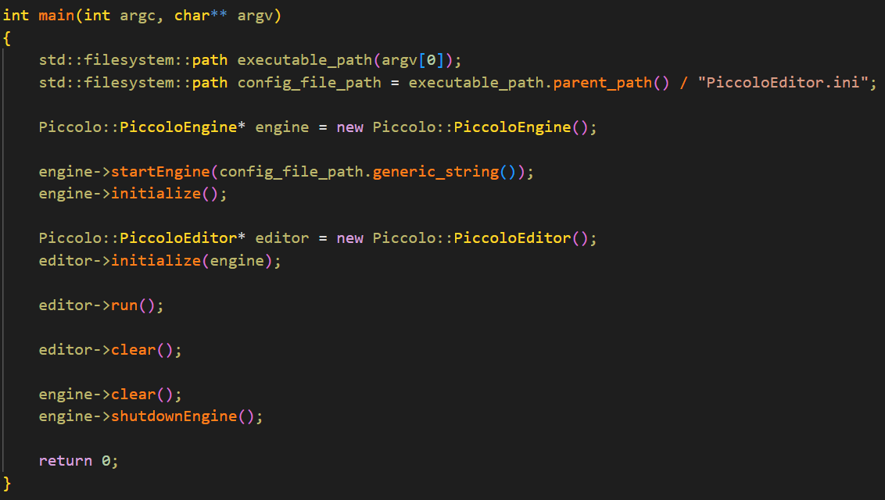
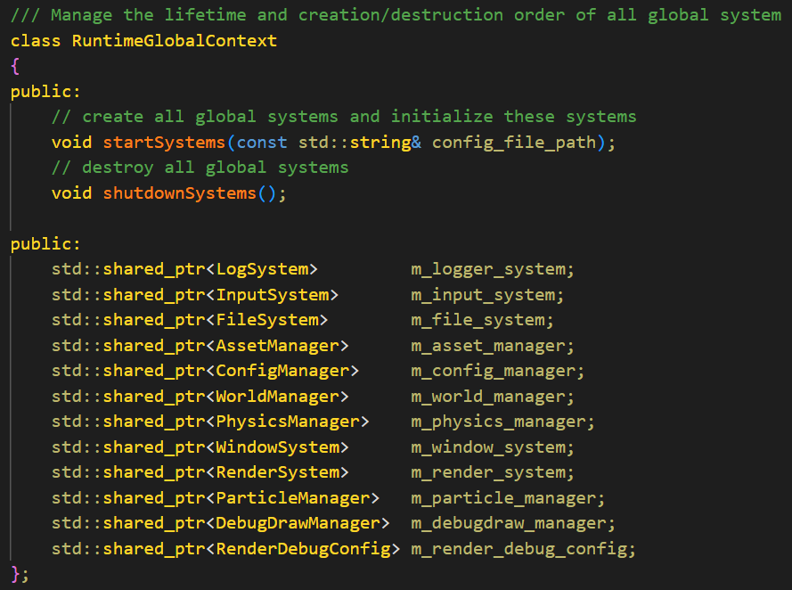
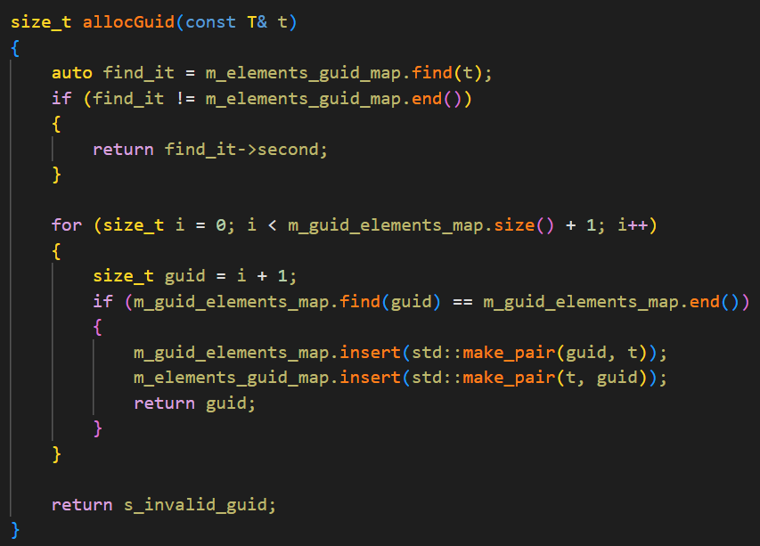

# Piccolo源码解读

## EntryPoint

Piccolo的EntryPoint main()在editor/source/main.cpp中

在此new，启动并初始化了Engine和Editor

一个值得注意的点是，main实际上并没有调用Engine的run而是调用的Editor的run

Engine的run除了在定义中，没有被任何其他文件使用，这也说明了其实这只是在Editor下运行的情况，而不是真正游戏运行的情况下。

阅读Editor的run就可以知道在Editor中实际上直接tick了RuntimeGlobalContext中的几个系统

## PiccoloEngine

Piccolo运行的核心类，负责调用各个系统的功能。

但是有个神奇的事情是，Engine并不拥有一个RuntimeGlobalContext，RuntimeGlobalContext是独立存在的，这个玩意是在栈内存中的一个单例（其实也没有很神奇了）

值得注意的是，实际上Engine的initialize和clear是空方法

## RuntimeGlobalContext

记录了Engine运行时所启用的system和manager，也就是各种系统

提供了startSystems和shutdownSystems两个方法

## RenderSystem

Piccolo的RenderSystem以class RenderSystem为核心

其下控制了

- RHI 渲染硬件接口，通过图形学API与硬件打交道
- RenderCamera，相机
- RenderScene，需要渲染的事物的集合
- RenderSourceBase，渲染时要用到的资源，如纹理之类的
- RenderPipelineBase，实际执行Draw的管线，分为多个渲染通道（RenderPass）。

RenderSystem本身是一个相当干净的class，因为各种任务都交由其下的各个“组件”去完成了。

### Tick

#### processSwapData

RenderSystem的核心功能入口就是tick，首先其会执行processSwapData，处理游戏逻辑层和渲染层的数据交换，

RenderSystem最重要的是tick方法，在其中首先”处理“（而不是进行，因为数据交换是在游戏逻辑层中不断进行的）游戏逻辑到实际渲染之间的数据交换，被交换的数据都来自于RenderSwapContext这个东西，它是RenderSystem中的一个直接的变量成员，而不是一个指针或智能指针，直属于RenderSystem。

在逻辑层对所有GO tick的时候，自然也就顺着Components tick下去，对于MeshComponent这些东西，当其被tick，就会在RenderSwapContext中被标记为Dirty，将要进行数据交换

（逻辑层tick的脉络其实是engine->tick() ---> call logicalTick() ---> call WorldManager->tick() ---> call active_level->tick() ---> foreach GOs, call GO->tick() ---> foreach components, call comp->tick(), 后续分析逻辑层这一块再细细品尝)

processSwapData会针对一系列渲染中可能要用到的数据进行处理。

”处理“包括检查交换的数据中的可渲染GO的图形资源是否已经被加载，这一步是通过检查GO以及各种资源的GUID来实现的。注意，这里的GUID是相对于”渲染“这个事情来说的，而不是一个适用于”全局“的GUID，它并不是一个可供所有游戏资产使用的概念，这就有点尴尬了。

GUID的生成非常简单，依靠一个模板类GuidAllocator来实现，一种渲染资源单独享有一个GuidAllocator，其本质就是一个GUID和T的双向map，生成GUID的方式也很简单，就是枚举搜索map中空余的GUID，然后分配给要Allocate GUID的对象，而不是特别地基于Object生成哈希值，优劣不好评价

再做一系列操作（还没看懂）

最后执行渲染管线的对应渲染方式——前向渲染/延迟渲染

而管线中的前向渲染/延迟渲染，就是正式执行渲染这一步操作的地方。

在这一步下，又会分出不同的渲染通道，进行各自的渲染

## World

Piccolo中的World其实就是Level，只不过用了WorldManager这个词语去表示管理Level的子系统

Level中用一个unorderd_map记录了（id，GO）对，并且拥有create和destroy Object的函数，实际上负责管理其生命周期

这点和UE和Unity都是相似的（UE中的实际的Level也被叫做World，而Unity中的概念是Scene）