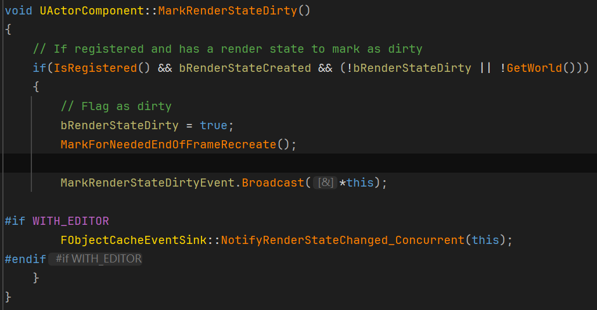
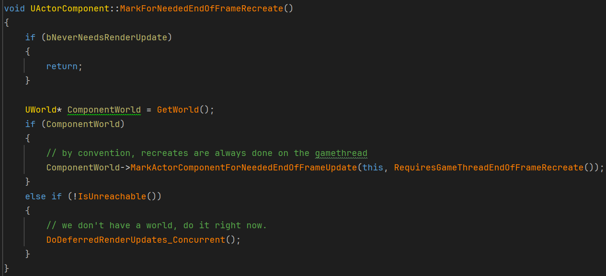
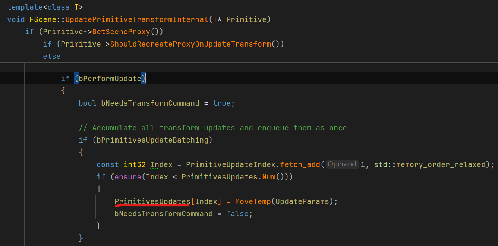
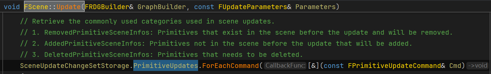
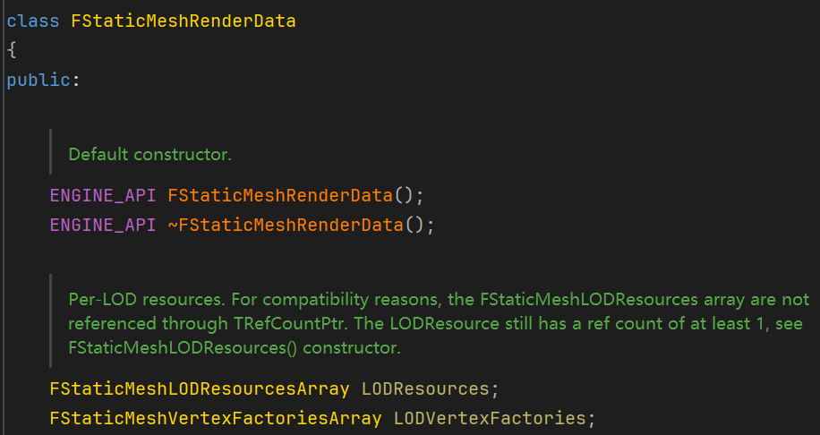
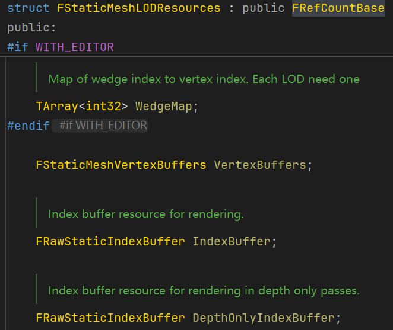
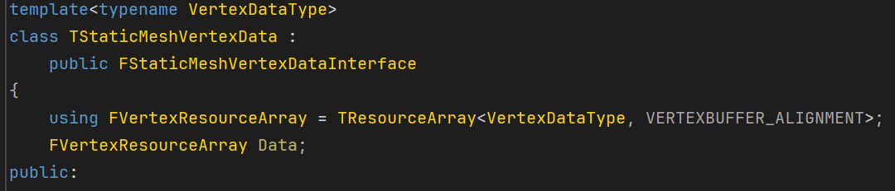
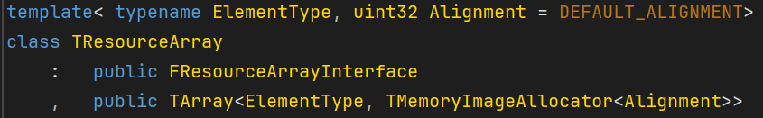

# UE 源码解读

## MainLoop

UE 的Loop入口在FEngineLoop的Tick中，其中调用了GEngine的Tick

FEngineLoop::Tick()主要流程分析：

from Gemini：

FEngineLoop::Tick() 是整个引擎的心跳函数，每一帧都会执行一次。它的主要职责按执行顺序通常包括以下几个方面：
时间管理与帧率控制 (Time Management)
计算上一帧到这一帧的时间差（DeltaTime）。
更新全局时间 FApp::CurrentTime。
如果设置了固定帧率或最大帧率，会在这里进行休眠等待以控制节奏。
平台消息泵 (Platform Message Pump)
处理操作系统的窗口消息（如 Windows 的 PeekMessage），响应鼠标、键盘输入，以及窗口的移动、缩放、关闭请求。
核心系统更新
热修复 (Hotfix): 代码中可见的 FPlatformMisc::TickHotfixables() 用于在运行时应用一些平台特定的热修复或即时调整。
回调处理: 执行注册在 FTicker 或 FCoreDelegates 上的每帧回调。
异步任务: 处理主线程需要同步的异步加载结果、着色器编译结果等。
游戏逻辑更新 (Game Logic - GEngine->Tick)
这是最重要的一步。它会调用 GEngine->Tick()（在编辑器模式下是 GEditor->Tick()）。
World Tick: 更新所有 UWorld。
Actor/Component Tick: 遍历场景中所有启用了 Tick 的 Actor 和 Component 并执行它们的逻辑（蓝图或 C++ 的 Tick 函数）。
物理模拟: 推进 PhysX/Chaos 物理引擎的模拟。
渲染命令生成 (Rendering)
虽然实际的渲染发生在渲染线程（Render Thread），但主线程需要在 Tick 中计算摄像机位置、更新场景代理（Scene Proxies），并将绘制命令推送到渲染线程。
UI 系统更新 (Slate Tick)
调用 FSlateApplication::Get().Tick() 来更新用户界面，处理 UI 的布局计算和事件响应。
垃圾回收 (Garbage Collection)
检查是否满足 GC 条件，如果满足则执行垃圾回收，清理不再使用的 UObject。
帧结束 (End of Frame)
更新性能统计数据（Stats/Profiler）。
同步渲染线程（如果需要），确保 CPU 不会领先 GPU 太多。


## Render

### 渲染数据交换

#### Primitive数据交换基础——数据流动与数据收集

PrimitiveComponent是一个顶级类，没有继承自UObject

它的作用是：

> Encapsulates the data which is mirrored to render a UPrimitiveComponent parallel to the game thread. This is intended to be subclassed to support different primitive types.

也就是用来为渲染层提供资源的镜像，负责将渲染所必须的资源打包起来用于传递给渲染层。

其通过一个32位整型id FPrimitiveComponentId来分辨其属于哪个PrimitiveComp

值得注意的是，PrimitiveComp自己会保存一份自己的Proxy的指针，并且会在被调用CreateSceneProxy时为指针赋值，不同的PrimitiveComp的子类自然会有不同的实现

而CreateSceneProxy会被在FScene::BatchAddPrimitivesInternal中被调用，用于把未被注册到Scene的管理中的Primitives创建Proxy，最终会调用ENQUEUE_RENDER_COMMAND为CommandList添加渲染指令


当和渲染相关的组件的“RenderState”出现变化时，例如Transform发生变化，使用的材质发生变化等状态变化发生时，就会调用MarkRenderStateDirty，将自身的RenderState标记为Dirty，以“通知”引擎在渲染之前重建自己的RenderState，这时就需要CreateSceneProxy，来为渲染层提供新的符合现在逻辑层状态的PrimitiveComponent的镜像。（对吗？？？严重怀疑GPT在乱来）


PrimitiveComp调用MarkRenderStateDirty将自己标记为Dirty时也会调用MarkForNeededEndOfFrameRecreate



MarkForNeededEndOfFrameRecreate会get到World并且调用World的MarkActorComponentForNeededEndOfFrameUpdate

这个函数最终会将Dirty的Component的指针添加到一个数组ComponentsThatNeedEndOfFrameUpdate中，这就实现了需要更新渲染状态的comp**收集**



通知引擎哪些Comp Dirty的关键在FEngineLoop的Tick函数中，即引擎的主循环中


但是如果是无需重建RenderState的变化，则会调用MarkForNeededEndOfFrameUpdate，这个函数也会调用MarkActorComponentForNeededEndOfFrameUpdate


而所有被收集起来的Dirty的Comp（主要是可渲染的Comp了），最终就会在SendAllEndOfFrameUpdates中通过调用Component的DoDeferredRenderUpdates_Concurrent发送给Scene。

DoDeferredRenderUpdates_Concurrent做的就是把Comp的新渲染状态同步给Scene

ActorComponent.cpp:

```c++
void UActorComponent::DoDeferredRenderUpdates_Concurrent()
{
    LLM_SCOPE(ELLMTag::SceneRender);
    LLM_SCOPE_DYNAMIC_STAT_OBJECTPATH(GetPackage(), ELLMTagSet::Assets);
    UE_TRACE_METADATA_SCOPE_ASSET_FNAME(NAME_None, NAME_None, GetPackage()->GetFName());

    checkf(!IsUnreachable(), TEXT("%s"), *GetFullName());
    checkf(!IsTemplate(), TEXT("%s"), *GetFullName());
    checkf(IsValidChecked(this), TEXT("%s"), *GetFullName());

    FScopeCycleCounterUObject ContextScope(this);
    FScopeCycleCounterUObject AdditionalScope(STATS ? AdditionalStatObject() : nullptr);

    if(!IsRegistered())
    {
       UE_LOG(LogActorComponent, Log, TEXT("UpdateComponent: (%s) Not registered, Aborting."), *GetPathName());
       return;
    }

    if(bRenderStateDirty)
    {
       SCOPE_CYCLE_COUNTER(STAT_PostTickComponentRecreate);
       RecreateRenderState_Concurrent();
       checkf(!bRenderStateDirty, TEXT("Failed to route CreateRenderState_Concurrent (%s)"), *GetFullName());
    }
    else
    {
       SCOPE_CYCLE_COUNTER(STAT_PostTickComponentLW);
       if(bRenderTransformDirty)
       {
          // Update the component's transform if the actor has been moved since it was last updated.
          SendRenderTransform_Concurrent();
       }

       if(bRenderDynamicDataDirty)
       {
          SendRenderDynamicData_Concurrent();
       }

       if (bRenderInstancesDirty)
       {
          SendRenderInstanceData_Concurrent();
       }
    }
}
```

其中的SendXXXX函数，不同的PrimitiveComp各自重写，它们会直接访问Scene，调用诸如UpdatePrimitiveTransform这样的函数，然后更新某个数据的这一事件作为一个Update存入一个缓存PrimitivesUpdates中，实现一个类似命令模式的效果




而SendAllEndOfFrameUpdates的调用时机就是在Engine的Tick中（在EditorEngine中是可以容易找到的，但在GameEngine中不太好找到


在执行引擎的逻辑前会让Scene执行StartFrame，逻辑执行完毕后会执行EndFrame，在此之间收集逻辑层发生的渲染状态变化，而在Scene的EndFrame中实际就执行了UpdateAllPrimitiveSceneInfos，来更新渲染场景信息，其本质最终调用了FScene的Update函数

最后在FScene::Update中处理上述所说的这些命令，去更新Proxy的数据




最后，状态正确的Proxy就会被用来执行渲染指令

通过ENQUEUE_RENDER_COMMAND真正创建渲染指令，执行渲染


所以数据交换的逻辑就是：

当PrimitiveComp自己发生了一些影响渲染状态的事情后，把自己标记为Dirty，并且把自己变成Dirty这个事情告知World，World就会把这些Dirty的Comp添加到一个数组缓存中，在逻辑帧帧末把这些标记为Dirty的Comp通过SendAllEndOfFrameUpdates统一告知渲染层（在这里是Scene），Scene会把它们保存在一个缓存PrimitivesUpdates中，最后通过Update通过渲染指令发送给实际执行渲染的渲染器


#### Primitive渲染数据更新

UE区分了RenderState和Transform，RenderDynamicData等更细粒度的属性的变化时的SceneProxy更新和重建

在SendAllEndOfFrameUpdates中，会去调用ActorComponent的DoDeferredRenderUpdates_Concurrent，这个函数在渲染方面实际上就是去告知RenderScene说我的（comp）哪些渲染数据发生了变化，并且把渲染数据变化传递给RenderScene，然后RenderScene似乎会把这些变化也收集起来到一个Queue中，之后在RenderScene的Update中再统一处理，这点的意义没看懂


#### Light渲染数据

和Primitive类似，UE中的灯同样使用Proxy来实现逻辑层和渲染层数据解耦


#### StaticMeshComponent

StaticMeshComponent下保存了一个StaticMesh，StaticMesh保存了渲染一个StaticMesh所需要的资源


#### StaticMesh

StaticMesh的关于渲染资源的关键字段：

**FStaticMeshRenderData**（RenderData）
顶层渲染数据容器，通过FStaticMeshLODResourcesArray包含每个 LOD 的渲染资源与元数据（FStaticMeshLODResources）。



其包含了关键的VertexBuffers（每种VertexBuffer保存了顶点位置、切线、法线等元素），比较有趣的就是UE 的VertexBuffer区分了不同顶点元素的Buffer



而Buffer的实际数据就保存在FXXXVertexData* VertexData中，不同顶点元素使用各自的VertexData类，其由模板TStaticMeshVertexData类生成，其本质是一个TResourceArray



而TResourceArray继承自TArray，所以本质就是一个数组




并且还保存了一个uint8* Data作为VertexData（实际的数组）的引用（就是数组首地址）


简化一下，首先StaticMesh中就是包含了Mesh的顶点数据（的引用）


材质数据保存在

TArray<FStaticMaterial> StaticMaterials中。

其中FStaticMaterial包装了一下UMaterialInterface


#### StaticMeshSceneProxy

StaticMeshScenProxy继承自PrimitiveSceneProxy

其通过CreateStaticMeshSceneProxy创建


### MeshBatch

ref:

剖析虚幻渲染体系（03）- 渲染机制（1/2） - 向往的文章 - 知乎
https://zhuanlan.zhihu.com/p/547473974

MeshBatch含有一组MeshBatchElement，它们享有相同的VertexBuffer和Material

MeshBatch存有一个MaterialSceneProxy


### ~~RenderCommand~~

### DrawCommand

UE中RenderCommand最终会被用于调用RHI中的DrawMethod实际执行Draw动作

~~非常值得注意的是，RenderCommand实际上包含了两个层级~~

👆这个理解是错误的，搞混了RenderCommand和DrawCommand两个东西。它们看似都叫“Command”，实际上并不是一个东西。RenderCommand是指导GPU干活的具体指令，而DrawCommand更多是一个绘制某种物体的资源的包装，包括顶点数据、ShaderBinding，PSO（PipelineState）等数据，用于物体绘制前绘制顺序的重排等等工作。

~~一种RenderCommand~~DrawCommand是纯数据性的，只用于存储渲染所需的数据，例如FMeshDrawCommand，使用这类Command的用处是，可以允许使用存储简单~~RenderCommand~~DrawCommand实例的数组（TArray）来连续地在内存中存储它们，来提高handle Command时的缓存命中率，如果使用含有Execute虚函数的设计，就必须使用指针，这在需要对RenderCommand进行排序的场景，例如半透明物体重排，时的缓存命中是很糟糕的

FMeshDrawCommand这种Command要做的就仅仅只有存储渲染数据


### RHITexture

RHITexture中不维护Wrapping和Filtering，因为它们并不是纹理本身的一种固定属性，而是shader采样它们时的一种行为，它们并不是绑定死在RHITexture上的，可以动态改变

Wrapping和Filtering之类的采样器行为是存储在FSamplerState中的

以OpenGL的API为例，其被在FOpenGLDynamicRHI::ApplyTextureStage中修改Texture的采样器行为，其中TexParameter()就是对glTexParameteri的一个包装而已

```C++
inline void FOpenGLDynamicRHI::ApplyTextureStage(GLint TextureIndex, const FTextureStage& TextureStage, FOpenGLSamplerState* SamplerState)
{
	GLenum Target = TextureStage.Target;
	VERIFY_GL_SCOPE();
	const bool bHasTexture = (TextureStage.Texture != NULL);
	if (!bHasTexture || TextureStage.Texture->SamplerState != SamplerState)
	{
		// Texture must be bound first
		if (ContextState.ActiveTexture != TextureIndex)
		{
			glActiveTexture(GL_TEXTURE0 + TextureIndex);
			ContextState.ActiveTexture = TextureIndex;
		}

		GLint WrapS = SamplerState->Data.WrapS;
		GLint WrapT = SamplerState->Data.WrapT;

		// Sets parameters of currently bound texture
		FOpenGL::TexParameter(Target, GL_TEXTURE_WRAP_S, WrapS);
		FOpenGL::TexParameter(Target, GL_TEXTURE_WRAP_T, WrapT);
		if( FOpenGL::SupportsTexture3D() )
		{
			FOpenGL::TexParameter(Target, GL_TEXTURE_WRAP_R, SamplerState->Data.WrapR);
		}

		if( FOpenGL::SupportsTextureLODBias() )
		{
			FOpenGL::TexParameter(Target, GL_TEXTURE_LOD_BIAS, SamplerState->Data.LODBias);
		}
		// Make sure we don't set mip filtering on if the texture has no mip levels, as that will cause a crash/black render on ES.
		GLint MinFilter = ModifyFilterByMips(SamplerState->Data.MinFilter, TextureStage.bHasMips);
		if (OpenGLConsoleVariables::GOpenGLForceBilinear && MinFilter == GL_LINEAR_MIPMAP_LINEAR)
		{
			MinFilter = GL_LINEAR_MIPMAP_NEAREST;
		}

		FOpenGL::TexParameter(Target, GL_TEXTURE_MIN_FILTER, MinFilter);
		FOpenGL::TexParameter(Target, GL_TEXTURE_MAG_FILTER, SamplerState->Data.MagFilter);
		if( FOpenGL::SupportsTextureFilterAnisotropic() )
		{
			// GL_EXT_texture_filter_anisotropic requires value to be at least 1
			GLint MaxAnisotropy = FMath::Max(1, SamplerState->Data.MaxAnisotropy);
			FOpenGL::TexParameter(Target, GL_TEXTURE_MAX_ANISOTROPY_EXT, MaxAnisotropy);
		}

		if( FOpenGL::SupportsTextureCompare() )
		{
			FOpenGL::TexParameter(Target, GL_TEXTURE_COMPARE_MODE, SamplerState->Data.CompareMode);
			FOpenGL::TexParameter(Target, GL_TEXTURE_COMPARE_FUNC, SamplerState->Data.CompareFunc);
		}

		if (bHasTexture)
		{
			TextureStage.Texture->SamplerState = SamplerState;
		}
	}
}
```


## 材质系统

### 新材质表达式编译系统

入口：
FMaterial::Translate_New()

```C++
bool FMaterial::Translate_New(const FMaterialShaderMapId& InShaderMapId,
    const FStaticParameterSet& InStaticParameters,
    EShaderPlatform InShaderPlatform,
    const ITargetPlatform* InTargetPlatform,
    FMaterialCompilationOutput& OutCompilationOutput,
    TRefCountPtr<FSharedShaderCompilerEnvironment>& OutMaterialEnvironment)
{
    // Clear existing Material Errors.
    CompileErrors.Empty();
    ErrorExpressions.Empty();

    FMaterialIRModule Module;

    // 这里开始是先把材质节点图转换成着色器语言无关的IR Graph（IRModule）
    // Build the material
    FMaterialIRModuleBuilder Builder = {
       .Material = GetMaterialInterface()->GetMaterial(),
       .ShaderPlatform = InShaderPlatform,
       .TargetPlatform = InTargetPlatform,
       .StaticParameters = InStaticParameters,
       .TargetInsights = GetMaterialInterface()->MaterialInsight.Get(),
    };

    // 构建IRModule（关键）
    if (!Builder.Build(&Module))
    {
       for (const FMaterialIRModule::FError& Error : Module.GetErrors())
       {
          ErrorExpressions.Push(Error.Expression);
          CompileErrors.Push(Error.Message);
       }

       return false;
    }
    
    // Copy over the compilation output
    OutCompilationOutput = Module.GetCompilationOutput();
    OutMaterialEnvironment = new FSharedShaderCompilerEnvironment();

    // 这里开始把转换好的IRMoudle再翻译成HLSL
    // Translate the material IR module to HLSL template string parameters and material environment
    TMap<FString, FString> ShaderStringParameters;

    FMaterialIRToHLSLTranslation Translation{
       .Module = &Module,
       .Material = this,
       .StaticParameters = &InStaticParameters,
       .TargetPlatform = InTargetPlatform,
    };

    Translation.Run(ShaderStringParameters, *OutMaterialEnvironment);

    // 把生成完毕的HLSL代码插入材质着色器代码模板中
    // Interpolate HLSL parameters with the material shader template to produce the final shader source
    int32 LineNumber;
    FStringTemplateResolver Resolver = FMaterialSourceTemplate::Get().BeginResolve(InShaderPlatform, &LineNumber);
    ShaderStringParameters.Add({TEXT("line_number"), FString::Printf(TEXT("%u"), LineNumber)});
    Resolver.SetParameterMap(&ShaderStringParameters);

    // Interpolate the final material shader source string
    FString MaterialShaderCode = Resolver.Finalize();

    // Emit uniform data debug information to the end of the generated shader
    EmitDebugInfoComment(*GetMaterialInterface()->MaterialInsight, MaterialShaderCode);

    GetMaterialInterface()->MaterialInsight->New_ShaderStringParameters = ShaderStringParameters;

    OutMaterialEnvironment->IncludeVirtualPathToContentsMap.Add(TEXT("/Engine/Generated/Material.ush"), MoveTemp(MaterialShaderCode));
    
    return true;
}
```

先看IR生成过程

MIRModule定义：

```c++
// This class represents the intermediate representation (IR) of a material build.
// The IRModule includes an IR value graph, produced through expression analysis,
// as well as metadata on resource usage and reflection. The IR graph serves as an
// abstract representation of the material and must be translated into a target backend
// such as HLSL or specific Preshader opcodes for execution.
//
// This class is designed to be backend-agnostic, meaning it does not contain any
// HLSL code nor does it configure a MaterialCompilationOutput instance. The data
// stored within this class should be sufficient to enable translation to any supported
// backend without requiring additional processing or validation.
class FMaterialIRModule
{
public:
    // Represents an error encountered during material processing.
    struct FError
    {
       // The expression that caused the error.
       UMaterialExpression* Expression;

       // Description of the error.
       FString Message;
    };

    // Stores information about the resources used by the translated material.
    struct FStatistics
    {
       // Tracks external inputs used per frequency.
       TBitArray<> ExternalInputUsedMask[MIR::NumStages]; 

       // Number of vertex texture coordinates used.
       int32 NumVertexTexCoords;

       // Number of pixel texture coordinates used.
       int32 NumPixelTexCoords;
    };

public:
    FMaterialIRModule();
    ~FMaterialIRModule();

    // Clears the module, releasing all stored data.
    void Empty();

    // Returns the shader platform associated with this module.
    EShaderPlatform GetShaderPlatform() const { return ShaderPlatform; }

    // Retrieves the material compilation output.
    const FMaterialCompilationOutput& GetCompilationOutput() const { return CompilationOutput; }

    // Returns the material outputs for a given stage.
    TArrayView<const MIR::FSetMaterialOutput* const> GetOutputs(MIR::EStage Stage) const { return Outputs[Stage]; }

    // Retrieves the root block (i.e. the "main" scope) for a specific shader stage.
    const MIR::FBlock& GetRootBlock(MIR::EStage Stage) const { return *RootBlock[Stage]; }

    // Returns a list of all environment define names this module requires to be enabled for shader compilation.
    const TSet<FName>& GetEnvironmentDefines() const { return EnvironmentDefines; }

    // Provides access to the translated material statistics.
    const FStatistics& GetStatistics() const { return Statistics; }

    // Provides mutable access to the translated material statistics.
    FStatistics& GetStatistics() { return Statistics; }

    // Retrieves parameter info for a given parameter ID.
    const FMaterialParameterInfo& GetParameterInfo(uint32 ParameterId) const { return ParameterIdToData[ParameterId].Key; }

    // Retrieves parameter metadata for a given parameter ID.
    const FMaterialParameterMetadata& GetParameterMetadata(uint32 ParameterId) const { return ParameterIdToData[ParameterId].Value; }

    // Stores a user-defined string and returns a pointer to it.
    const TCHAR* PushUserString(FString InString);

    // Checks if the module is valid (i.e., contains no errors).
    bool IsValid() const { return Errors.IsEmpty(); }

    // Returns a list of errors encountered during processing.
    TArrayView<const FError> GetErrors() const { return Errors; }

    // Reports a translation error.
    void AddError(UMaterialExpression* Expression, FString Message);

private:
    // Target shader platform.
    EShaderPlatform ShaderPlatform;

    // Compilation output data.
    FMaterialCompilationOutput CompilationOutput;

    // Memory allocator used to allocate IR data (values, payloads, etc).
    FMemStackBase Allocator{};

    // List of all the IR values contained in this module.
    TArray<MIR::FValue*> Values;

    // Output nodes per stage.
    TArray<MIR::FSetMaterialOutput*> Outputs[MIR::NumStages];

    // Root blocks per stage.
    MIR::FBlock* RootBlock[MIR::NumStages];

    // Compilation statistics.
    FStatistics Statistics;

    // Maps parameter info to IDs.
    TMap<FMaterialParameterInfo, uint32> ParameterInfoToId;

    // Parameter metadata.
    TArray<TPair<FMaterialParameterInfo, FMaterialParameterMetadata>> ParameterIdToData;

    // Stores user-defined strings.    
    TArray<FString> UserStrings;

    // Environment define names for shader compilation.
    TSet<FName> EnvironmentDefines;

    // List of compilation errors.
    TArray<FError> Errors;

    friend MIR::FEmitter;
    friend FMaterialIRModuleBuilder;
    friend FMaterialIRModuleBuilderImpl;
};
```


构建IRModule的关键方法，分成了多个Step，其具体功能由BuilderImpl实现

```C++
bool FMaterialIRModuleBuilder::Build(FMaterialIRModule* TargetModule)
{
    FMaterialIRModuleBuilderImpl Impl{ this, TargetModule };

    // Setup the emitter
    MIR::FEmitter Emitter;
    Emitter.BuilderImpl = &Impl;
    Emitter.Material = Material;
    Emitter.Module = TargetModule;
    Emitter.StaticParameterSet = &StaticParameters;

    // Setup the Builder implementation
    Impl.Emitter = &Emitter;
    Impl.ValueAnalyzer.Setup(Material, TargetModule, &TargetModule->CompilationOutput, TargetInsights);
    
    // 清理Module，避免有残余内容，并初始化之
    // 初始化Emitter，生成True和False常量的原型
    Impl.Step_Initialize();
    // 准备MaterialAttributeInput
    // 对各种MaterialProperty调用Emitter::SetMaterialOutput，它emit了一条SetMaterialOutput的Instruction，后续详细分析SetMaterialOutput
    Impl.Step_GenerateOutputInstructions();
    // 正式开始把材质表达式转成IRGraph
    // 内部是一个while(true)一直尝试去从AnalysisContextStack栈顶拿Expression出来去Build，直到栈空
    Impl.Step_BuildMaterialExpressionsToIRGraph();

    if (!TargetModule->IsValid())
    {
       return false;
    }

    Impl.Step_FlowValuesIntoMaterialOutputs();
    Impl.Step_AnalyzeIRGraph();
    Impl.Step_ConsolidateEnvironmentDefines();
    Impl.Step_AnalyzeBuiltinDefines();
    Impl.Step_LinkInstructions();
    Impl.Step_Finalize();

    check(Material->MaterialInsight.IsValid());
    Material->MaterialInsight.Get()->IRString = MIR::DebugDumpIR(Material->GetFullName(), *TargetModule);

    // Dump debugging information if requested 
    switch (CVarMaterialIRDebugDumpLevel.GetValueOnGameThread())
    {
       case 2: MIR::DebugDumpIRUseGraph(*TargetModule); // fallthrough
       case 1:
       {
          // Save the dump to file
          FString FilePath = FPaths::Combine(FPaths::ProjectSavedDir(), "Materials", TEXT("IRDump.txt"));
          FFileHelper::SaveStringToFile(Material->MaterialInsight.Get()->IRString, *FilePath);
          // fallthrough
       }
    }

    return TargetModule->IsValid();
}
```

先看Build中BuildModule的上半部分内容，源码如下：

```C++
void Step_Initialize()
{
    Module->Empty();
    Module->ShaderPlatform = Builder->ShaderPlatform;
    
    Emitter->Initialize();
    AnalysisContextStack.Emplace();
}

void Step_GenerateOutputInstructions()
{
    // The normal input is read back from the value set in the material attribute.
    // For this reason, the normal attribute is evaluated and set first, ensuring that
    // other inputs can read its value.
    PrepareSingleMaterialAttribute(MP_Normal);

    // Then prepare all the other material attributes.
    for (int32 Index = 0; MIR::Internal::NextMaterialAttributeInput(Builder->Material, Index); ++Index)
    {
       if (Index != MP_Normal)
       {
          PrepareSingleMaterialAttribute((EMaterialProperty)Index);
       }
    }
}

void PrepareSingleMaterialAttribute(EMaterialProperty Property)
{
    FMaterialInputDescription Input;
    Builder->Material->GetExpressionInputDescription(Property, Input);

    MIR::FSetMaterialOutput* Output = Emitter->SetMaterialOutput(Property, nullptr);

    if (Input.bUseConstant)
    {
       Output->Arg = Emitter->ConstantFromShaderValue(Input.ConstantValue);
    }
    else if (!Input.Input->IsConnected())
    {
       Output->Arg = MIR::Internal::CreateMaterialAttributeDefaultValue(*Emitter, Builder->Material, Property);
    }
    else
    {
       AnalysisContextStack.Last().ExpressionStack.Add(Input.Input->Expression);
    }
}

void Step_BuildMaterialExpressionsToIRGraph()
{
    while (true)
    {
       FAnalysisContext& Context = AnalysisContextStack.Last();

       if (!Context.ExpressionStack.IsEmpty())
       {
          // Some expression is on the expression stack of this context. Analyze it. This will
          // have the effect of either building the expression or pushing its other expression
          // dependencies onto the stack.
          BuildTopMaterialExpression();
       }
       else if (Context.Call)
       {
          // There are no more expressions to analyze on the stack, this analysis context is complete.
          // Context.Call isn't null so this context is for a function call, which has now been fully analyzed.
          // Pop the callee context from the stack and resume analyzing the parent context (the caller).
          PopFunctionCall();
       }
       else
       {
          // No other expressions on the stack to evaluate, nor this is a function
          // call context but the root context. Nothing left to do so simply quit.
          break;
       }
    }
}
```

PrepareSingleMaterialAttribute的分析：

它会新增一条指令，这条指令就是"SetMaterialOutput"，所以我们需要关注它的具体实现：

```C++
/*------------------------------ Instruction emission ------------------------------*/

FSetMaterialOutput* FEmitter::SetMaterialOutput(EMaterialProperty InProperty, FValue* Arg)
{
    FSetMaterialOutput Proto = MakePrototype<FSetMaterialOutput>(nullptr);
    Proto.Property           = InProperty;
    Proto.Arg              = Arg;

    // Initialize the instruction block to the root of each stage it is evaluated in.
    for (int i = 0; i < NumStages; ++i)
    {
        // MaterialOutputEvaluatesInStage就是判断Property是否属于某个ShaderStage
       if (MaterialOutputEvaluatesInStage(InProperty, (EStage)i))
       {
          Proto.Block[i] = Module->RootBlock[i];
       }
    }

    // Make the instruction
    FSetMaterialOutput* Instr = static_cast<FSetMaterialOutput*>(EmitPrototype(*this, Proto).Value);

    // Add the instruction to list of outputs of the stages it is evaluated in.
    for (int i = 0; i < NumStages; ++i)
    {
       if (MaterialOutputEvaluatesInStage(InProperty, (EStage)i))
       {
          Module->Outputs[i].Add(Instr);
       }
    }

    return Instr;
}
```

可以看到，Emitter::SetMaterialOutput实现的功能就是制造出了一条SetMaterialOutput指令，并且将其绑定到了Module的Output上。


BuildTopMaterialExpression的分析：

首先先补充FAnalysisContext的定义，它保存了某一“作用域”内的Value上下文，之所以说是作用域，是因为PushFunctionCall是会产生一个FAnalysisContext并压入栈的，这就实现了类似函数栈的效果，如果没有使用函数，那么实际上所有值就是在同一Ctx下

```C++
struct FAnalysisContext
{
    UMaterialExpressionMaterialFunctionCall* Call{};
    TSet<UMaterialExpression*> BuiltExpressions{};
    TArray<UMaterialExpression*> ExpressionStack{};
    TMap<const FExpressionInput*, MIR::FValue*> InputValues;
    TMap<const FExpressionOutput*, MIR::FValue*> OutputValues;

    MIR::FValue* GetInputValue(const FExpressionInput* Input)
    {
       MIR::FValue** Value = InputValues.Find(Input);
       return Value ? *Value : nullptr;
    }

    void SetInputValue(const FExpressionInput* Input, MIR::FValue* Value)
    {
       InputValues.Add(Input, Value);
    }

    MIR::FValue* GetOutputValue(const FExpressionOutput* Output)
    {
       MIR::FValue** Value = OutputValues.Find(Output);
       return Value ? *Value : nullptr;
    }
    
    void SetOutputValue(const FExpressionOutput* Output, MIR::FValue* Value)
    {
       OutputValues.Add(Output, Value);
    }
};
```


```C++
void BuildTopMaterialExpression()
{
    // 取出分析上下文栈栈顶的上下文，并且取出该上下文表达式栈顶的表达式
    FAnalysisContext& CurrContext = AnalysisContextStack.Last();
    Emitter->Expression = CurrContext.ExpressionStack.Last();

    // 如果表达式已经被build好了，就不用再build了
    // If expression is clean, nothing to be done.
    if (CurrContext.BuiltExpressions.Contains(Emitter->Expression))
    {
       CurrContext.ExpressionStack.Pop(EAllowShrinking::No);
       return;
    }

    // 把还没有被build的表达式依赖塞入栈中
    // Push to the expression stack all dependencies that still need to be analyzed.
    for (FExpressionInputIterator It{ Emitter->Expression }; It; ++It)
    {
       // Ignore disconnected inputs and connected expressions already built.
       if (!It->IsConnected() || CurrContext.BuiltExpressions.Contains(It->Expression))
       {
          continue;
       }

       CurrContext.ExpressionStack.Push(It->Expression);
    }

    // 如果塞入依赖之后发现栈顶不是一开始在build的表达式了，就要先build依赖的表达式，这里直接返回，回到BuildMaterialExpressionsToIRGraph后下一步其实就是尝试build依赖
    // If on top of the stack there's a different expression, we have a dependency to analyze first.
    if (CurrContext.ExpressionStack.Last() != Emitter->Expression)
    {
       return;
    }

    // 当前的表达式的依赖已处理完，可以开始build自身
    // Take the top expression out of the stack as ready for analysis. Also mark it as built.
    CurrContext.ExpressionStack.Pop();
    CurrContext.BuiltExpressions.Add(Emitter->Expression);

    // Flow the value into this expression's inputs from their connected outputs.
    for (FExpressionInputIterator It{ Emitter->Expression}; It; ++It)
    {
       // Fetch the value flowing through connected output.
       FExpressionOutput* ConnectedOutput = It->GetConnectedOutput();
       if (ConnectedOutput)
       {
          MIR::FValue** ValuePtr = CurrContext.OutputValues.Find(ConnectedOutput);
          if (ValuePtr)
          {
             // ...and flow it into this input.
             CurrContext.InputValues.Add(It.Input, *ValuePtr);
          }
       }
    }

    // 分成材质函数和非材质函数的表达式来处理，如果不是材质函数，就调用表达式子类重载的Build，这是下文的一个关键分析点
    if (auto Call = Cast<UMaterialExpressionMaterialFunctionCall>(Emitter->Expression))
    {
       // Function calls are handled internally as they manipulate the analysis context stack.
       PushFunctionCall(Call);
    }
    else
    {
       // Invoke the expression build function. This will perform semantic analysis, error reporting and
       // emit IR values for its outputs (which will flow into connected expressions inputs).
       Emitter->Expression->Build(*Emitter);

       // Populate the insight information about this expression pins.
       AddExpressionConnectionInsights(Emitter->Expression);
    }
}
```

再来看典型的MaterialExpression::Build的具体实现：

```C++
void UMaterialExpressionConstant::Build(MIR::FEmitter& Em)
{
    FValueRef Value = Em.ConstantFloat(R);
    Em.Output(0, Value);
}
```

实际上，MaterialExpression::Build的基本结构就是Em.Output，所以这个也就是分析的关键。

先来看看Em.ConstantFloat做了什么

```C++
FValueRef FEmitter::ConstantFloat(TFloat InX)
{
    FConstant Scalar = MakePrototype<FConstant>(FPrimitiveType::GetScalar(ScalarKind_Float));
    Scalar.Float = InX;
    return EmitPrototype(*this, Scalar);
}
```

它主要就是调用了一个MakePrototype<FConstant>，并且给它赋了值，其中FConstant是FValue的一个子类，MakePrototype和EmitPrototype如下：

```C++
template <typename T>
static T MakePrototype(const FType* InType)
{
    static_assert(std::is_trivially_constructible_v<T> && std::is_trivially_destructible_v<T> &&  std::is_trivially_copy_constructible_v<T> && std::is_trivially_copy_assignable_v<T>,
       "FValues are expected to be trivial types.");

    T Value;
    FMemory::Memzero(Value);
    Value.Kind = T::TypeKind;
    Value.Type = InType;
    return Value;
}

// Searches for an existing value in module that matches specified `Prototype`.
// If none found, it creates a new value as a copy of the prototype, adds it to
// the module then returns it.
template <typename TValueType>
static FValueRef EmitPrototype(FEmitter& Emitter, const TValueType& Prototype)
{
	if (FValue* Existing = FEmitter::FPrivate::FindValue(Emitter, &Prototype))
	{
		return Existing;
	}

	uint8* Bytes = FEmitter::FPrivate::Allocate(Emitter, sizeof(TValueType), alignof(TValueType));
	TValueType* Value = new (Bytes) TValueType{ Prototype };

	FEmitter::FPrivate::PushNewValue(Emitter, Value);

	return Value;
}
```

EmitPrototype是实现了对已有Value的复用来节省内存。FindValue调用了一个TSet的Find，这个Find是特殊设置过的

```C++
// The set of all values previously emitted. It is used to avoid duplicating identical
// values, explointing the strict SSA data-flow paradigm of MIR to efficiently reuse
// calculations.
TSet<FValue*, FValueKeyFuncs> ValueSet{};
```

ConstantFloat比较特殊的一点就是它会复用之前已经计算出来相等的ConstantFloat Value，避免浪费内存，同时应该也是实现了代码生成的简化，同一个常量不会被定义多次

最终我们终于可以看Em.Output做的东西：

```C++
/*-------------------------------- Output management -------------------------------*/

FEmitter& FEmitter::Output(int32 OutputIndex, FValueRef Value)
{
    Output(Expression->GetOutput(OutputIndex), Value);
    return *this;
}

FEmitter& FEmitter::Output(const FExpressionOutput* Output, FValueRef Value)
{
    MIR::Internal::BindValueToExpressionOutput(BuilderImpl, Output, Value);
    return *this;
}

void BindValueToExpressionOutput(FMaterialIRModuleBuilderImpl* Builder, const FExpressionOutput* Output, FValue* Value)
{
	Builder->AnalysisContextStack.Last().SetOutputValue(Output, Value);
}

FAnalysisContext:
void SetOutputValue(const FExpressionOutput* Output, MIR::FValue* Value)
{
    OutputValues.Add(Output, Value);
}
```

所以一个Em.Output最终所做的，就是简单地在当前的分析上下文中建立起ExpressionOutput和一个Value的输出关联，这个Value要么是已经存在的，要么是新生成的


再看看MaterialExpressionAdd::Build

```C++
static void BuildBinaryOperatorWithDefaults(MIR::FEmitter& Em, MIR::EOperator Op, const FExpressionInput* A, float ConstA, const FExpressionInput* B, float ConstB)
{
    FValueRef AVal = Em.InputDefaultFloat(A, ConstA);
    FValueRef BVal = Em.InputDefaultFloat(B, ConstB);
    Em.Output(0, Em.Operator(Op, AVal, BVal));
}

void UMaterialExpressionAdd::Build(MIR::FEmitter& Em)
{ 
    BuildBinaryOperatorWithDefaults(Em, MIR::BO_Add, &A, ConstA, &B, ConstB);
}
```

类似的单目、二目、三目运算符其实都是基于Emitter::Operator()实现的

```C++
FValueRef FEmitter::Operator(EOperator Op, FValueRef A, FValueRef B, FValueRef C)
{
    if (!A.IsValid() || (B && !B.IsValid()) || (C && !C.IsValid()))
    {
       return Poison();
    }

    // Validate the operation and retrieve the result type.
    const FPrimitiveType* ResultType = ValidateOperatorAndGetResultType(*this, Op, A, B, C);
    if (!ResultType)
    {
       return Poison();
    }

    // Try to apply some operator identity to simplify the operator.
    if (FValueRef Simplified = TrySimplifyOperator(*this, Op, A, B, C))
    {
       return Simplified;
    }

    // Try folding the operator first.
    if (FValue* FoldedValue = TryFoldOperator(*this, Op, A, B, C, ResultType))
    {
       return FoldedValue;
    }

    // Otherwise, we must emit a new instruction that executes the operator.
    FOperator Proto = MakePrototype<FOperator>(ResultType);
    Proto.Op = Op;
    Proto.AArg = A;
    Proto.BArg = B;
    Proto.CArg = C;

    return EmitPrototype(*this, Proto);
}
```

可以看到Operator中会尝试对运算本身进行优化


看完了Build的上半部分，接着来看下半部分的内容：


```C++
bool FMaterialIRModuleBuilder::Build(FMaterialIRModule* TargetModule)
{
    FMaterialIRModuleBuilderImpl Impl{ this, TargetModule };
     
    ...

    if (!TargetModule->IsValid())
    {
       return false;
    }

    // 把Output值真正连接到材质图根节点的Property上，真正把Value绑定到ExpressionInput上
    Impl.Step_FlowValuesIntoMaterialOutputs();
    // 分析已经构建好的IRGraph中的依赖关系，这和前面构图时的依赖解析不同，之前的目的是先build前置依赖，而到了这里则是集中式记录
    Impl.Step_AnalyzeIRGraph();
    Impl.Step_ConsolidateEnvironmentDefines();
    Impl.Step_AnalyzeBuiltinDefines();
    // 把Instructions按依赖关系连接起来，会处理其Block的关系
    Impl.Step_LinkInstructions();
    Impl.Step_Finalize();

    check(Material->MaterialInsight.IsValid());
    Material->MaterialInsight.Get()->IRString = MIR::DebugDumpIR(Material->GetFullName(), *TargetModule);

    // Dump debugging information if requested 
    switch (CVarMaterialIRDebugDumpLevel.GetValueOnGameThread())
    {
       case 2: MIR::DebugDumpIRUseGraph(*TargetModule); // fallthrough
       case 1:
       {
          // Save the dump to file
          FString FilePath = FPaths::Combine(FPaths::ProjectSavedDir(), "Materials", TEXT("IRDump.txt"));
          FFileHelper::SaveStringToFile(Material->MaterialInsight.Get()->IRString, *FilePath);
          // fallthrough
       }
    }

    return TargetModule->IsValid();
}
```
Step_FlowValuesIntoMaterialOutputs：

这个函数所做的事是最终把分析上下文中与具体MaterialProperty相关的Output最终流向材质图根节点，作为它的Input，流向例如BaseColor，Emissive等接口。之前在PrepareSingleMaterialAttribute这个函数中，它只是处理了使用常量或没有连接输出的Property，而并没有处理真正连接了非常量表达式的情况，最终就在这里完成了数据最后的流通。

为什么要延迟连接？讲道理我也不知道，可能是过程中会有一些事情发生？

```C++
void Step_FlowValuesIntoMaterialOutputs()
{
    FAnalysisContext& Context = AnalysisContextStack.Last();

    for (uint32 StageIndex = 0; StageIndex < MIR::NumStages; ++StageIndex)
    {
       for (MIR::FSetMaterialOutput* Output : Module->Outputs[StageIndex])
       {
          FMaterialInputDescription Input;
          ensure(Builder->Material->GetExpressionInputDescription(Output->Property, Input));

          if (!Output->Arg)
          {
             MIR::FValue** ValuePtr = Context.OutputValues.Find(Input.Input->GetConnectedOutput());
             check(ValuePtr && *ValuePtr);

             MIR::Internal::BindValueToExpressionInput(this, Input.Input, *ValuePtr);

             const MIR::FType* OutputArgType = MIR::FType::FromShaderType(Input.Type);
             Output->Arg = Emitter->Cast(*ValuePtr, OutputArgType);
          }

          // Push this connection insight
          check(Output->Arg);
          PushConnectionInsight(Builder->Material, (int)Output->Property, Input.Input->Expression, Input.Input->OutputIndex, Output->Arg->Type);
       }
    }
}
```


## Enhanced Input System

UE增强输入系统的几个关键概念或类：EnhancedInputSystem，InputMappingContext，InputAction，EnhancedPlayerInput，InputActionInstance


EnhancedPlayerInput具体维护了某个玩家的输入的状态，包括一个Action当前的激活状态，当前它发出的值等，其被存储在一个TMap<TObjPtr<InputAction>,InputActionInstance>中，

EnhancedInputSystem使用InputModifier的概念来改变InputActionValue

InputAction可以自行拥有一些Modifier

而IMC中ActionKeyMapping也可以有Modifier，因为一个Action可能对应多个按键，而对应不同的按键，需要的Modify可能是不同的，例如IA_Move就需要：

（假设以X轴正方向为世界的“前”方向）

IA_Move

W: // None

S: Negate

A: Negate + Swizzle_ZYX

D: Swizzle_ZYX

KeyMapping中的Modifier的应用是前于IA内部的Modifier的，IA内部的Modifier可以看作是对这个IA的全局”实例“的修改


EvaluateInputDelegates是EnhancedInputSystem处理输入的起点

EnhancedPlayerInput中的ProcessActionMappingEvent是处理ActionValue的关键地方


UE的InputActionValue允许有Accumulate这个性质，但是值得注意的是，并不是跨帧的积累，而是在一帧之内的积累

例如WASD，WS控制X轴，AD控制轴，而如果我们想要实现八方向移动，就必须允许例如W时的(1.0, 0.0, 0.0)和D时的(0.0, 0.0, 1.0)的积累变成(1.0, 0.0 ,1.0)。而不是在多帧之间一直积累


EvaluateInputDelegates处理当前帧输入的逻辑是这样的：首先遍历所有的ActionKeyMapping，再向KeyStateMap查询按键状态，如果发现发生了新的输入事件就进去处理，这样就不必遍历所有的按键。

并且把在本帧第一次发生的对某个IA的触发记录下来，这样如果发现一个IA在本帧并没有触发过任何事件，就重置其IAInstance中的IAValue，以此实现了每帧重置IAValue

EnhancedInputSystem的处理输入的一个主要逻辑是：

接收到物理输入->调用ProcessActionMappingEvent处理：

首先不管怎样，对InputActionValue Apply所有的Modifier，获得一个Modified Value，然后拿这个modified value去给Triggers判断InputAction的触发状态，这一步不会直接更新InputActionInstance中的一个ETriggerState（实际上，IAInstance中也没有存储一个TriggerState，因为没有必要存储一个现态，现态总是在更新时计算出来的），而是会暂存在TriggerStateTracker中，用来合并为最活跃的状态

在最终对所有本帧更新过的IA应用IA级别的Modifiers和Triggers之后，才会真正更新IAinstance的TriggerState