# 游戏引擎导论

## History

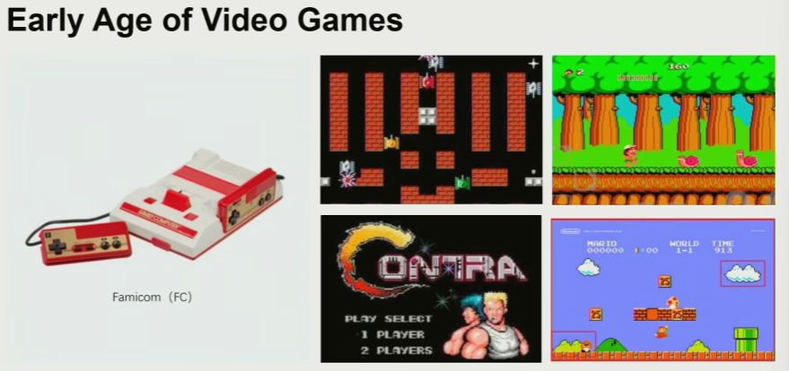

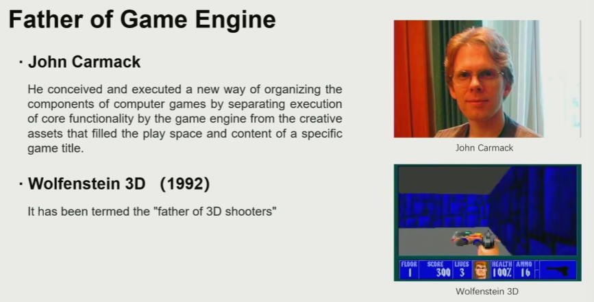

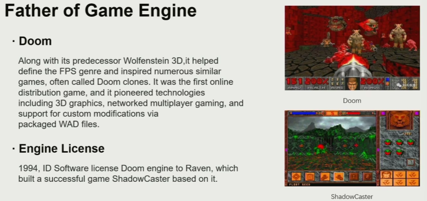

最初的游戏引擎：为了代码重用

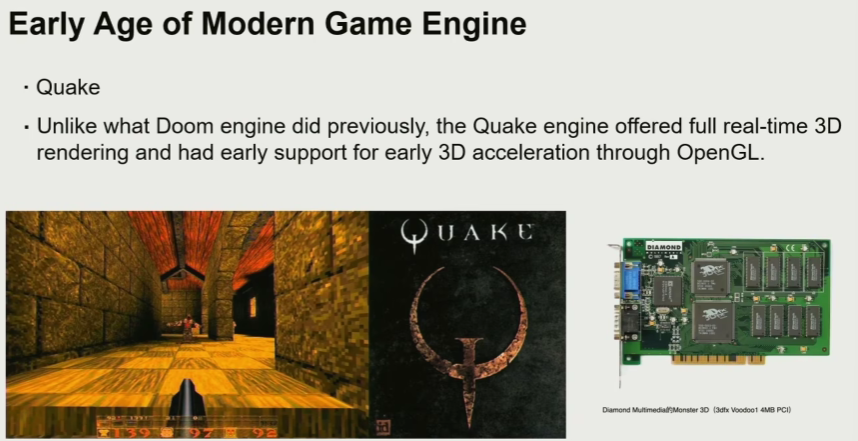

现代游戏引擎突破：显卡的诞生

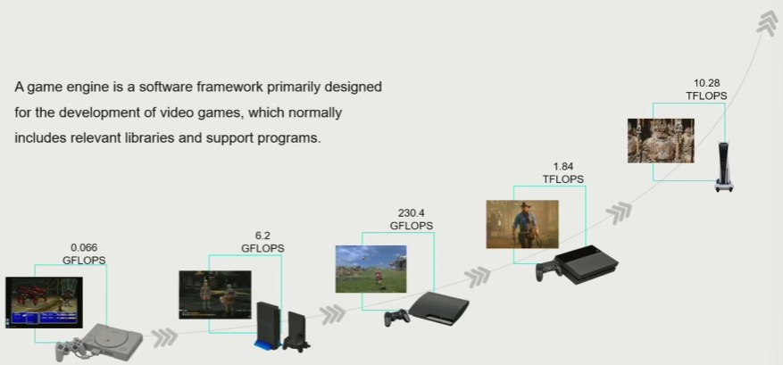

算力的提升，想要落到游戏效果的真正提升，对系统的拓展来说是巨大的挑战

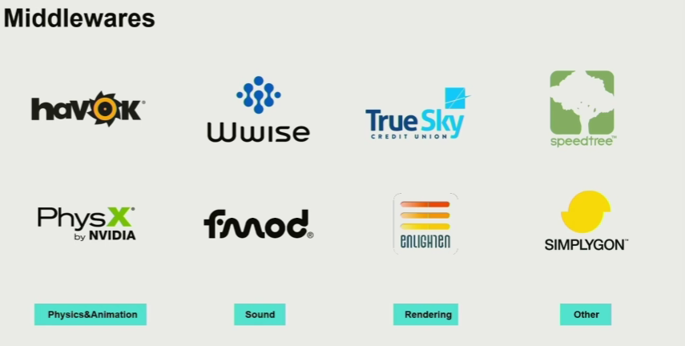

引擎所需的中间件

## What is Game Engine？

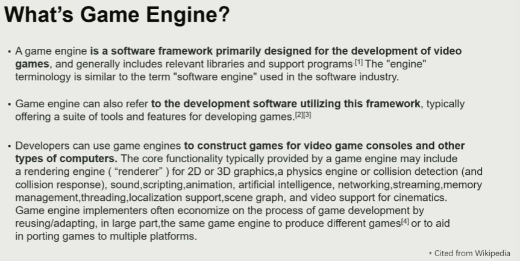

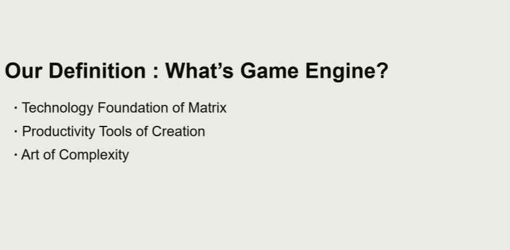

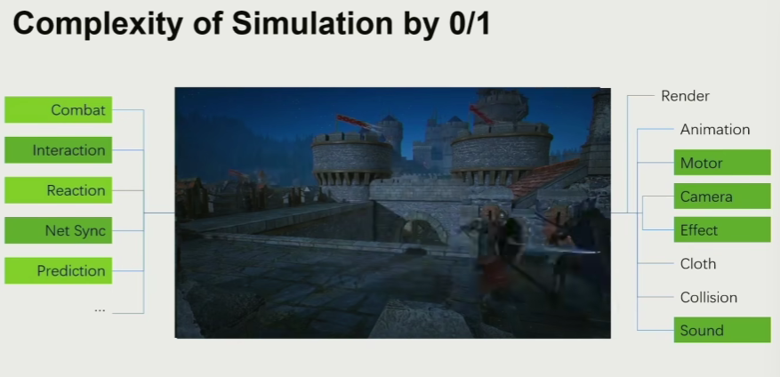

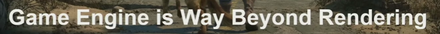

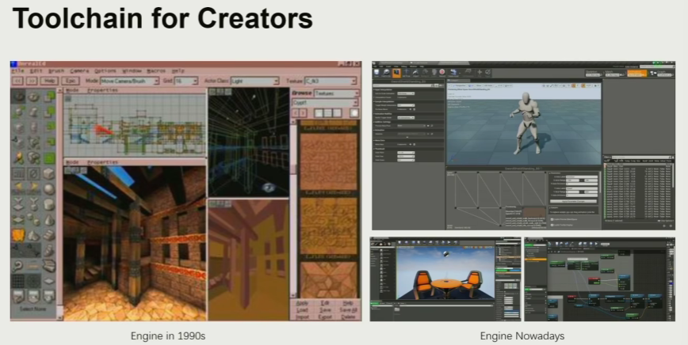

做引擎首先应该会做工具

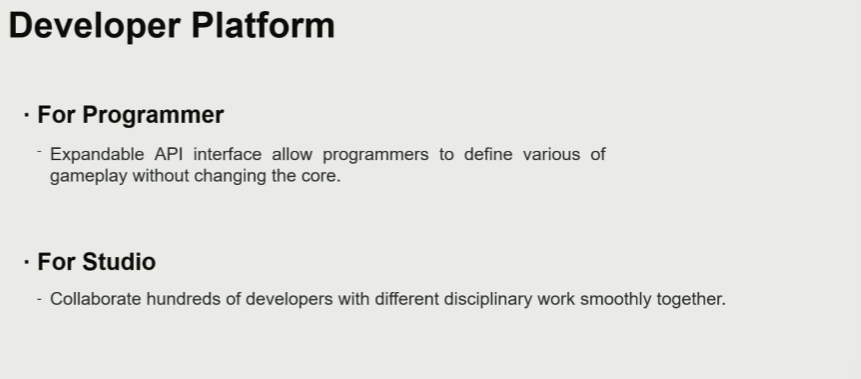

二次开发很重要

## How to Study

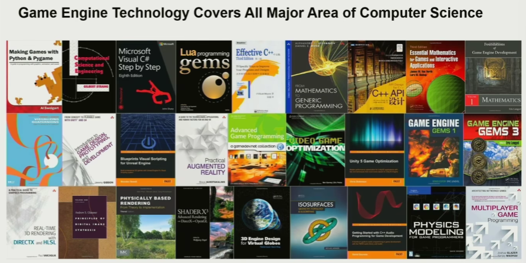

## Course Content

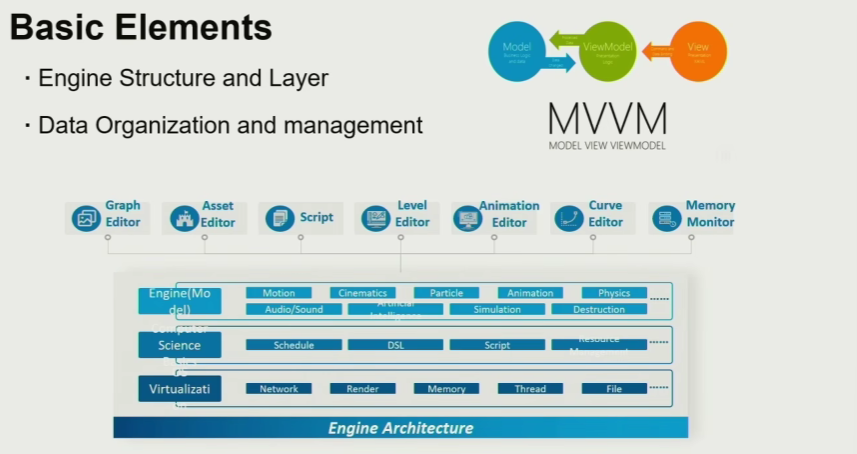

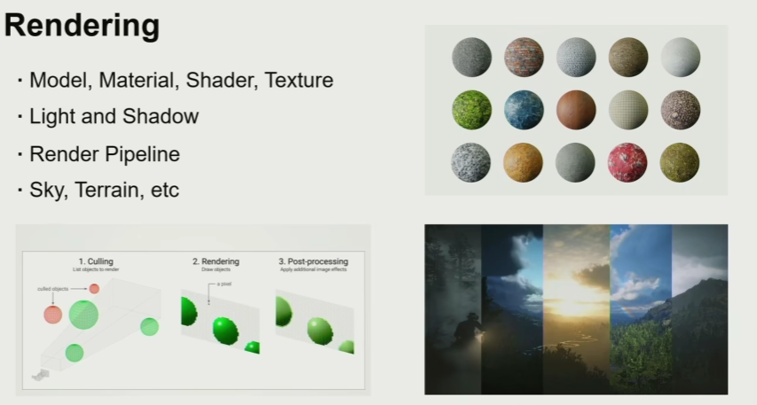

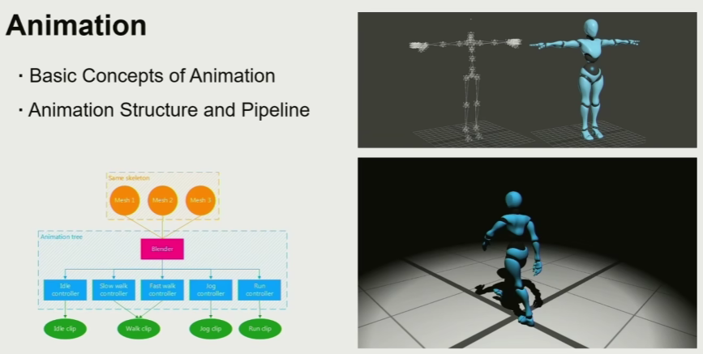

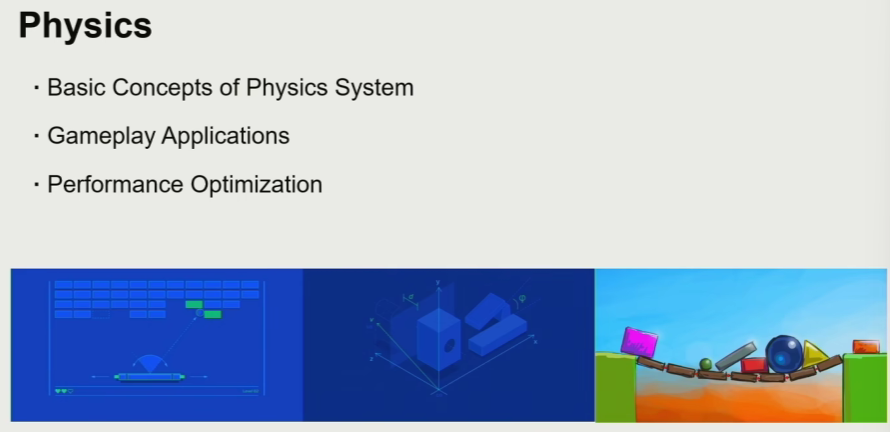

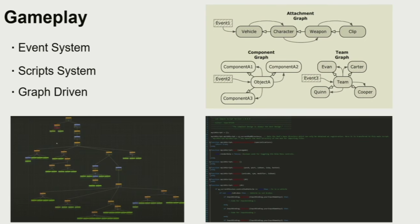

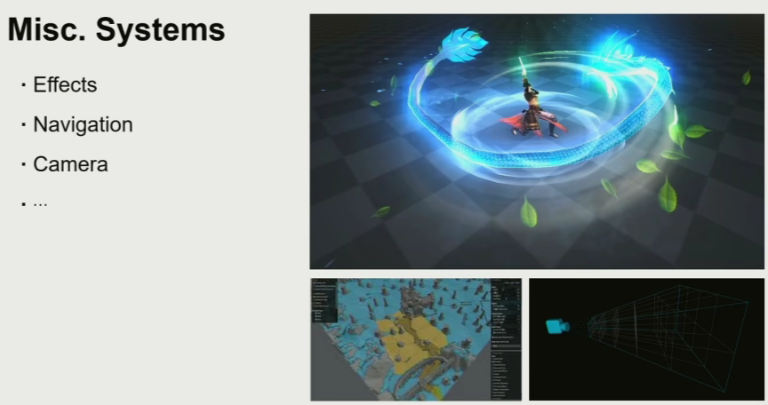

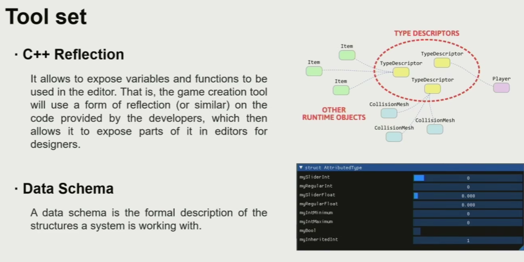

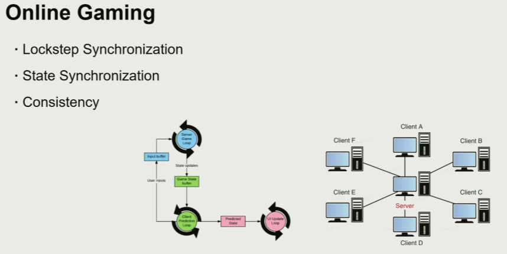

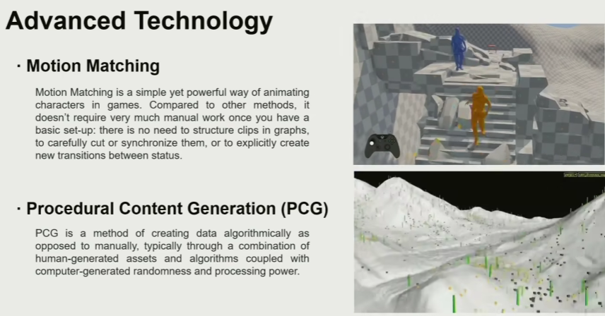

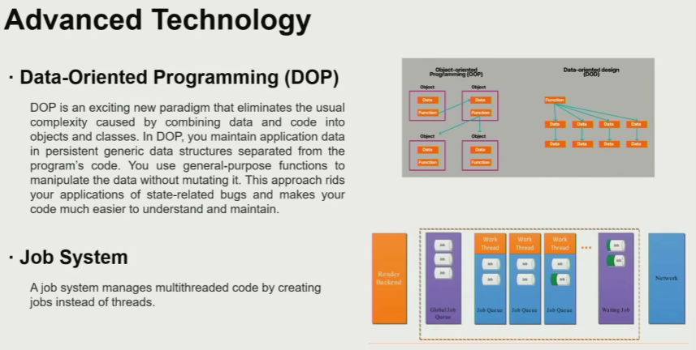

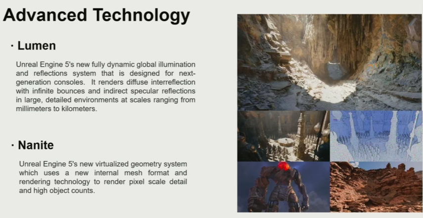

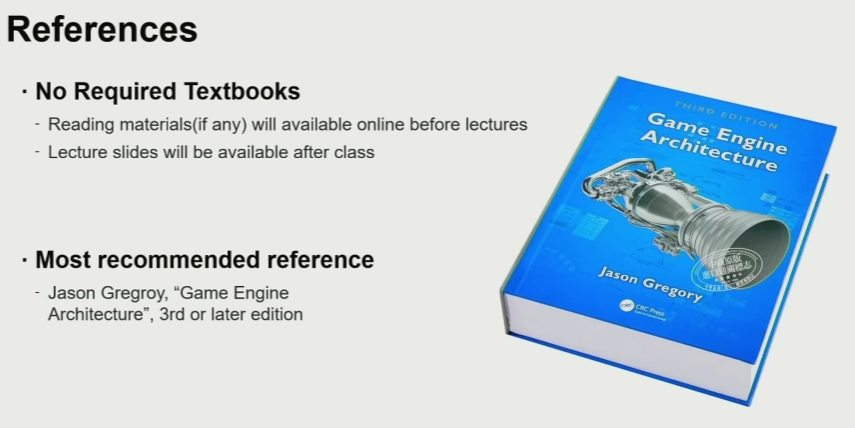

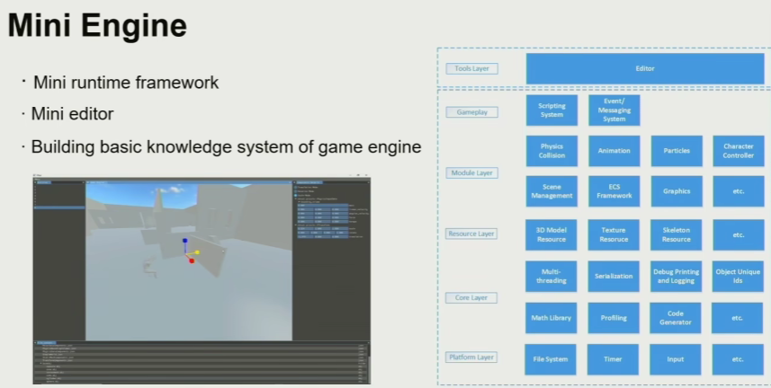

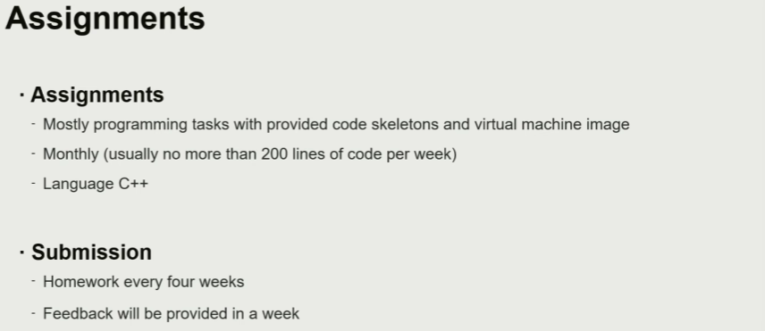