# 网络游戏架构基础

## Challenge

- 一致性 Consistency
- 网络传输可靠性 Reliability
- 安全性 Security
- 游戏类型、平台、设备多样性 Diversities
- 复杂性 Complexities
  - 高并发
  - 高性能

## 网络协议基础

经典七层模型：

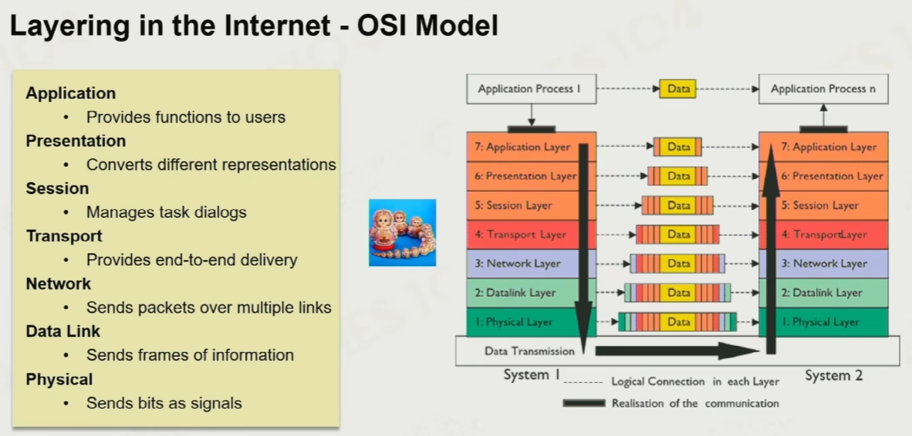

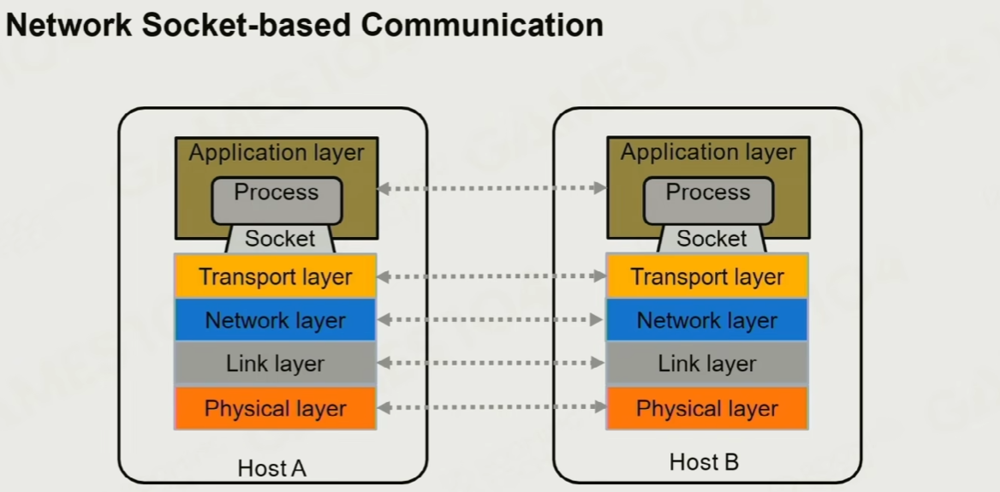

### Socket

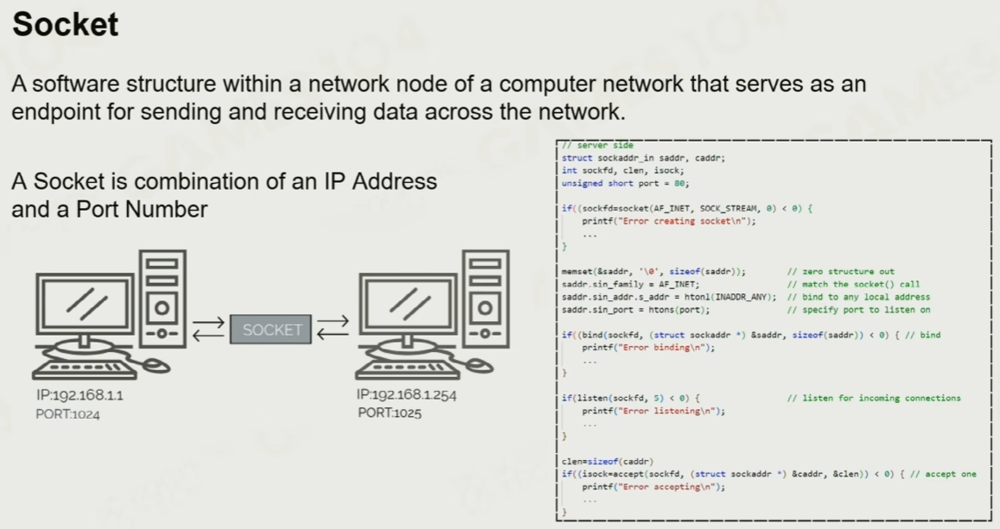

### TCP

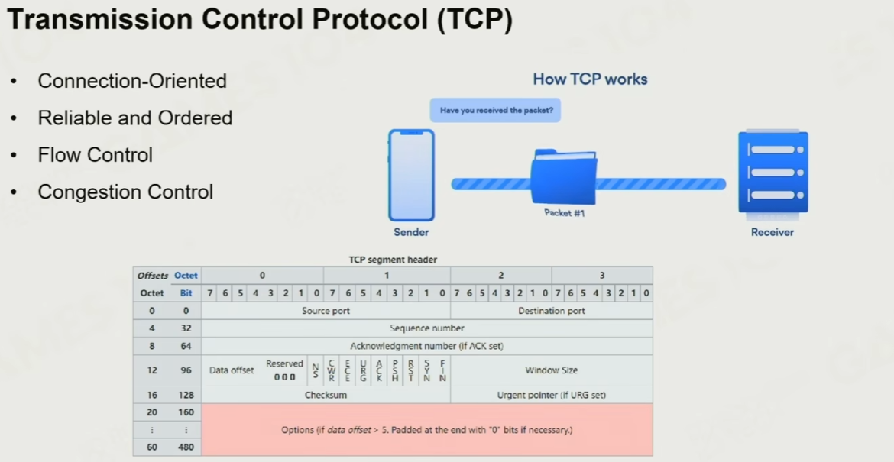

可靠连接，可靠传输，流量控制

TCP核心机制：

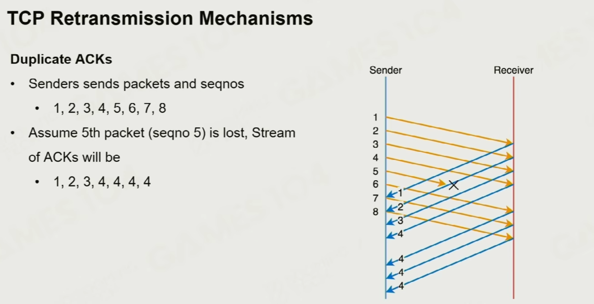

接收方成功接收后，向发送方发送ACK确认接收，允许发送方发接下来的东西

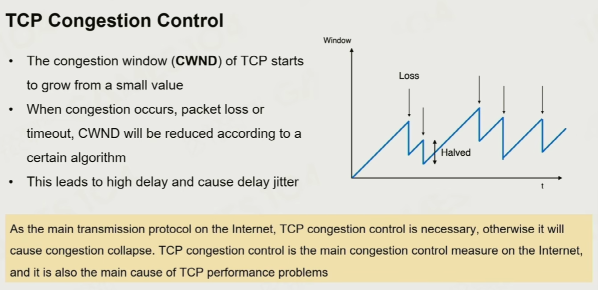

### UDP

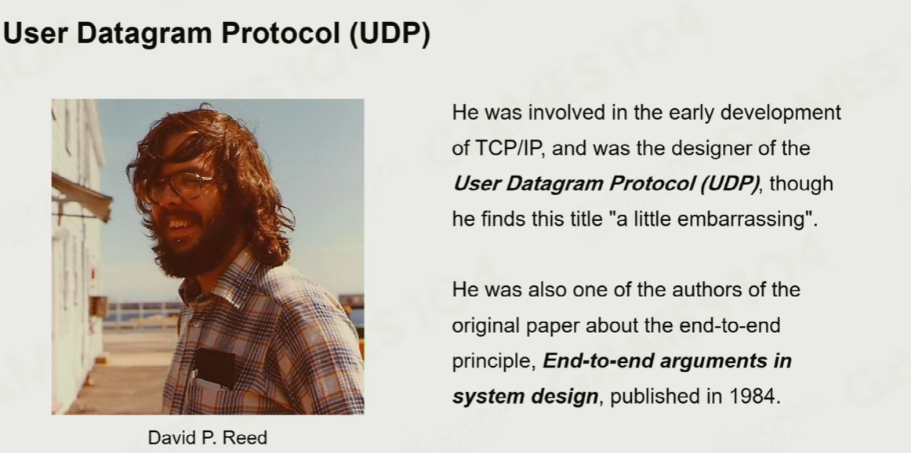

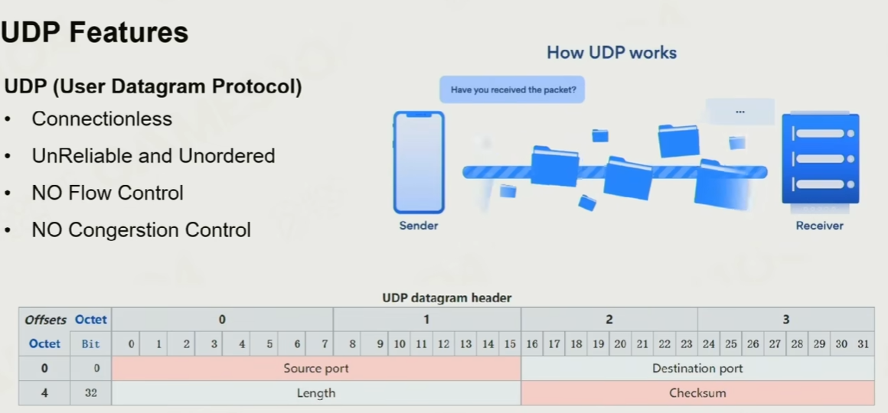

实际游戏中不同的需求可能用不同的协议实现

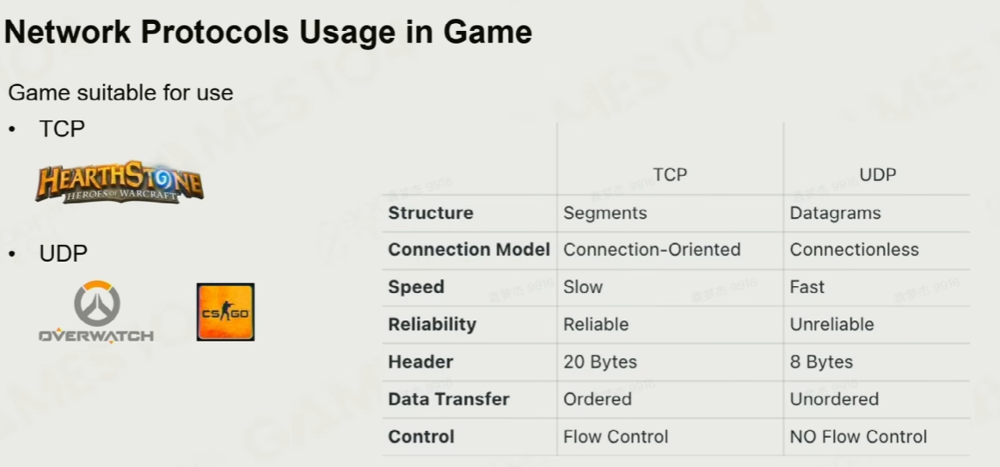

### 改造原生协议

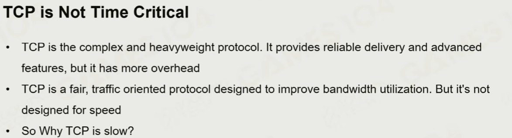

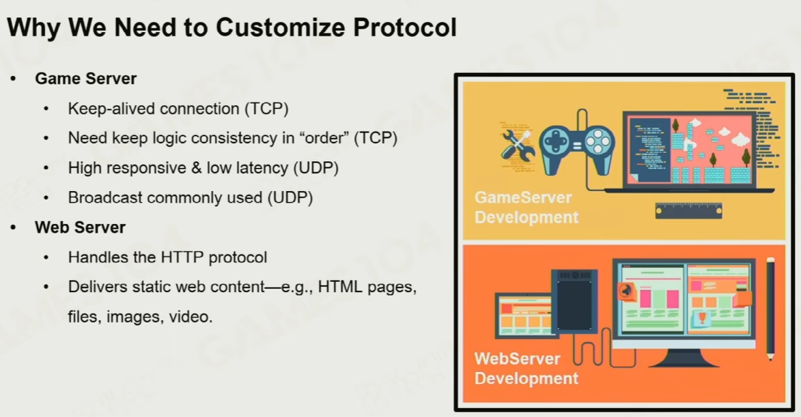

 