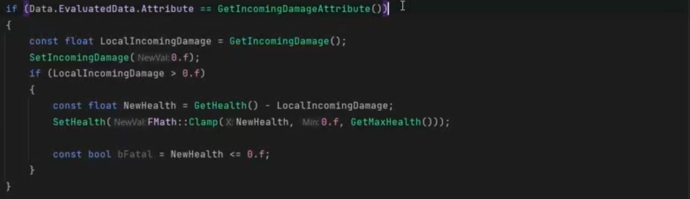
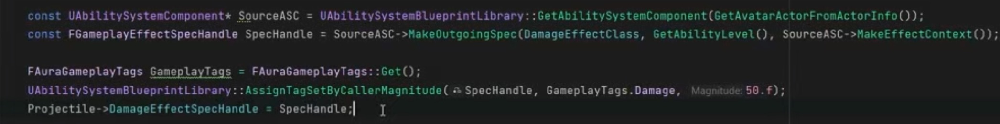
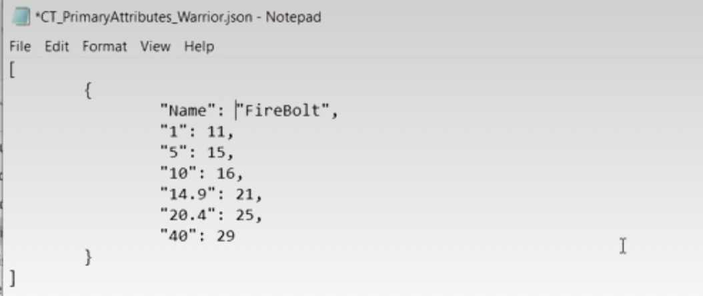
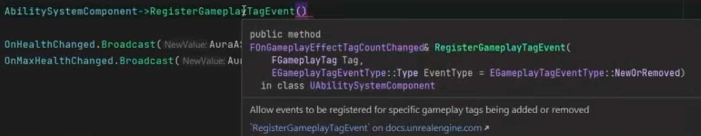

# 虚幻GAS课程跟学笔记（UE开发最佳实践）

### 项目设置

可选设置（推荐）：

- 关掉living code
- 关掉自动编译新C++类
- Asset Editor Open Location设置在Main Window


### 版本管理

使用GitHub为例：

- 在GItHub中创建一个新的仓库，无需更改默认设置，命名好即可
- 打开Git Bash，首先通过cd 打开UE项目文件所在地（文件路径）（像Linux命令一样）
- 在UE项目文件中添加一个.gitignore文本文档，用于忽略一些无需版本管理的内容，一般是Binaries，DerivedDataCache，Intermediate，Saved，Build，以及IDE相关的一些后缀
- 使用**Git Bash**，输入命令：git init初始化仓库，git status可查看保存状态，输入git add添加内容，git commit -m ”text“（第一次一般叫”first commit“之类的，确保你自己了解就行）进行提交。git branch -m main保证分支叫main。再复制仓库中的添加云端仓库的命令，把本地的内容和云端仓库进行关联，最后使用git push -u origin main把本地内容发到云端
- 每次改变后，当工作结束后，需要git add，git commit -m ”text“提交，git push origin main，完成一次完整的提交


## GAS课程跟学

### 第一部分：前置准备

### 1.1 使用调试模式

​	首先需要确保引擎版本下载了”输入调试用符号“，再把Rider中的解决方案配置改成DebugGame，选择”run“就会在非调试模式下运行，选择”debug“在调试模式下运行，在这种情况下需要确保在IDE中关闭项目前保存好项目。

​	调试模式的好处是可以为代码添加**断点**，在进入断点时可以像平时调试代码时一样看到各种类属性（局部变量）的当前值，来确认代码是否达到正确的效果。

### 1.2 创建CharacterBase

​	CharacterBase将作为玩家和NPC的基类，它不会在游戏中直接使用，所以可以在类说明宏中添加（abstract）标记抽象类。

​	同时，该类不需要实现任何tick的逻辑，也不需要设置PlayerInputComponent，把相关的方法删掉。由于不需要tick，.cpp中构造函数实现中bCanEverTick也要设置成False。

**更好地组织C++类：**想要更好地组织C++类，可以在项目文件中增设一些文件夹区分不同的类，更改后需要在包含头文件时增加一下新增的文件夹层级。

#### 1.2.1 派生Player和Enemy

​	从Characterbase派生一个PlayerCharacter，一个Enemy类，命名随意。

​	我们想要让所有的Character都可以装备武器，所以在CharacterBase中（protected）新增一个

```c++
UPROPERTY(EditAnyWhere,Catagory="Combat")
TObjectPtr<USkeletalMeshComponent> Weapon;
```

成员变量，这种指针和直接使用USkeletalMeshComponent* 是类似的，但随着UE发展，新的这种指针更值得使用，以后都将这么做，不再赘述。

​	构造函数中初始化Weapon：

```c++
Weapon = CreateDefaultSubobject<USkeletalMeshComponent>("Weapon");

//把Weapon附着到Character的网格体上的一个叫做“WeaponHandSocket”套接字上
Weapon->SetupAttachment(GetMesh(),FName("WeaponHandSocket"));

//设置Weapon碰撞，无需碰撞
Weapon->SetCollisionEnabled(ECollisionEnabled::NoCollision);
```

​	完成上面的代码后，我们可以派生蓝图类并在蓝图中指定Weapon的网格体模型，并且我们需要给该种Character的骨骼网格体上加上“WeaponHandSocket”套接字，确保Weapon确实能正确附着到合适的位置。加Socket只需右键父骨骼，Add Socket，指定名字，调整一下位置。如果一些骨骼网格体上本来就已经有可以配置Weapon的套接字了（它们不一定专为Weapon服务，本质上它们就是一个手部的插槽），需要更改它的名字以便代码中的设置可以和实际的蓝图类匹配。

### 1.3 创建Character的动画蓝图

#### 1.3.1Player的动画蓝图

​	添加一个状态机，一个Slot

​	在动画蓝图的事件图表中初始化其所属的Character，CharacterMovement


设置角色速度更新，非常基础


#### 1.3.2 Enemy的动画蓝图

​	而对于Enemy，我们可以制作模板动画蓝图，以免为所有敌人都要重写很多内容。

​	仍然是一个状态机，一个slot

​	但状态机中的“IdleWalkRun状态中将使用blendspace Player而不是播放特定的Blendspace（这只是一个初级设置）

​	（后续我们需要按正常的Idle->Run的状态变化去改变动画，这是已经学过的了）

​	动画初始化和更新与Player类似。

之后从该模板动画蓝图派生出关于特定骨架的动画蓝图，把特定的动画指定给其中的BlendSpace Player，就可以完成部署


### 1.4 设置角色移动（角色控制）

​	首先需要在编辑器中创建InputAction和IMC，非常简单，不赘述。

​	PlayerCharacter不应该承担太多的任务，我们应该把角色控制的工作交给专门的人做：PlayerController（C++）

#### 1.4.1 创建并配置PlayerController

​	创建新C++类AuraPlayerController，我们需要为其编写构造函数和BeginPlay，并且创建IMC成员变量。注意到这里的未声明错误，解决此不需要添加头文件，我们使用了TObjectPtr，只需要在类定义前做一个UInputMappingContext的**前置类声明**就可以解决这个问题，此外必须在.Build.cs中包含关于增强输入的模块，以便我们有权访问它。


​	在构造函数中，我们需要把Controller的bReplicates设置成**true**，这将允许服务器上的改变发送到所有连接的客户端，这将为多人游戏打好基础。

​	在BeginPlay中，我们首先检查我们的IMC是否被正确地指定了，我们使用一个“断言”check()来做这件事（if判断当然也是可以的），如果IMC指针为空，则报错崩溃。

> **断言（assertion）**是一种在程序中的[一阶逻辑](https://baike.baidu.com/item/一阶逻辑/8173149?fromModule=lemma_inlink)（如：一个结果为真或假的逻辑判断式），目的是为了表示与验证软件开发者预期的结果。当程序执行到断言的位置时，对应的断言应该为真。若断言不为真时，程序会中止执行，并给出[错误信息](https://baike.baidu.com/item/错误信息/10784923?fromModule=lemma_inlink)。

​	接着我们通过调用UlocalPlayer的静态方法GetSubsystem获取UEnhancedInputLocalPlayerSubsystem，参数是通过PlayerController的GetLocalPlayer方法获得的LocalPlayer。

​	还有一些其他小的输入设置，详情看注释，注意头文件包含了“EnhancedInputSubsystem”


​	

> [!CAUTION]
>
> ​	实际上，这里第二个断言check（Subsystem）是错误的，因为Subsystem存在的前提是有LocalPlayer，但是在多人游戏中，不一定会有一个LocalPlayer，这时就不会有一个Subsystem，这将导致游戏错误地崩溃。

​	但是值得注意的是，我们现在只是通过配置IMC让PlayerController“有能力”检索玩家输入，但实际上现在Controller并不能处理输入。平时我们在Character中处理玩家输入，因为Character自带了PlayerInputComponent可以处理输入，但在Aura中我们在CharacterBase中把它删了，因为我们希望在PlayerController中处理这些数据。而Controller有一个SetupInputComponent函数，我们需要通过它这是一个protected的函数，我们需要在后面重写它。

#### 1.4.2 关联IA与函数

​	IA_Move中的设置：


​	由于我们使用增强输入系统，需要用到InputAction，也要把这个类**前置声明**。并创建一些需要的InputAction指针，如MoveAction


还要声明一些对应于输入的行为函数，如Move，声明如下：


**知识点：**一般来说，结构体FInputActionValue也是需要包含头文件的，但这里的Struct语法起到了前置声明的作用，或类似于UIMC的前置类声明的方式也可以，如果这样做就不需要加这个struct关键字。

​	接下来我们需要通过EnhancedInputComponent将Move函数与MoveAction绑定起来，在此之前它们没有任何关联。这和我们在蓝图中绑定行为到IA是类似的。这一点可以在SetupInputComponent中完成。在SetupInputComponent中我们能把InputComponent强转成一个UEnhancedInputComponent是因为在项目默认设置中，输入设置默认使用了增强输入。


Move的具体逻辑如下：

这里采取if条件判断而不像之前一样用断言是因为Controller是允许没有控制着Pawn的，这并非一个“错误”，不应该用强力的断言处理


### 1.5 创建GameMode

​	首先创建C++类GameMode，再派生一个蓝图类。

​	把默认玩家控制类和默认控制Pawn改成我们自己的类，注意是蓝图类，选到C++基类会被断言搞崩

### 1.6 完善PlayerCharacter

​	为PlayerCharacter添加弹簧臂和摄影机，并把弹簧臂调整到一个合适的角度和臂长，在弹簧臂的类默认值中“摄影机”的继承旋转三个轴都关掉。

​	之后在PlayerCharacter的cpp中在构造函数中使用一些逻辑设置Player的移动相关的内容，如下。其中确保了角色的旋转朝向移动，角色的旋转速率只有Yaw上有旋转固定在平面上，并在刚开始的时候设置到平面上


### 1.7 增加高亮敌人的功能

​	我们希望做到当鼠标放在敌人身上能够高亮敌人从而显示出我们选中了哪个敌人，我们使用接口（C++）来实现这个功能。

​	新建一个EnemyInterface接口类，声明一个HighlightActor()纯虚函数和UnHighlightActor()纯虚函数：


**知识点：**继承接口类却不实现的话，会导致报错，这是因为接口声明了纯虚函数使其变成抽象类，我们无法在不覆写纯虚函数的情况下实例化抽象类。所以必须实现这些纯虚函数，即使你在方法中什么东西都不写，这样就可以解决报错了。

#### 1.7.1 实现PlayerController对鼠标光标下Actor的访问

​	由于查看鼠标光标下的Actor不是一个消耗很大的行为，可以写在tick中，但在PlayerController中，我们使用的是自定义的函数PlayerTick()。PlayerTick负责调用鼠标光标检测相关的函数，鼠标光标检测的功能应单独实现一个函数CursorTrace。使用

```c++
FHitResult CursorHit;
GetHitResultUnderCursor(ECC_Visibility,false,CursorHit);
```

​	首先PlayerController需要两个私有的成员变量记录鼠标指针底下的Actor。LastActor表示上一帧鼠标下的Avtor，ThisActor表示当前帧鼠标底下的Actor。


​	即可获取鼠标下方的Actor，三个参数分别是通道类型，是否使用复杂碰撞，产生的信息赋值给谁


EnemyBase中的设置，只需改变Character的Highlighted状态，具体会发生什么可以在蓝图写


蓝图中使用测试球体，测试一下效果


#### 1.7.2 使用后处理体积高亮敌人

​	需要有一个专门的材质，暂时未学到，学到再说


### 第二部分：开始使用GAS

### 2.1 简单理解GAS的应用场景

​	例如在RPG中，角色可能有一系列的Attributes，Attributes之间可能有复杂的依赖关系，例如“生命值”和“体质”，“伤害”和“力量”。游戏中的Character具有一系列能力Abilities，这些能力在游戏中的表现往往伴随着播放动画，对Attributes造成影响（Effects）（通常要经过一些数学运算）。而玩家往往可以获取经验值，获取足够经验值后升级，然后对Attributes和Abilities造成影响。此外玩家还可能受到Buff的影响。另外，游戏中的一些反馈可能需要视听的表现来提示（Cue）。

​	GAS为UE开发者提供了一个结构良好的模块化，灵活的，可拓展的游戏设计框架，帮助开发者更好地架构游戏，而且它可以良好地使用于网络游戏开发。

#### GAS的主要部分

1. Ability System Component（GAS的必备组件）

   功能：

   - 授予Ability
   - 激活Ability
   - 处理通知

2. Attribute Set

   - 存储Attribute

3. Gameplay Ability（GAS的核心之一）

   - 封装某种事物的功能，如攻击，施法

4. Ability Task（由GA运行）

   - 执行异步代码，行为就像执行GA本身的工作的工人

5. Gameplay Effect

   - 改变Attribute

6. Gameplay Cue

   - 制造视听反馈

7. Gameplay Tag

   - 本身并非GAS独有，通过其提供的层次结构为识别游戏对象提供支持

### 2.2 为玩家应用ASC和Attribute Set的不同方式

1. 直接把ASC和Attribute Set挂在Pawn上

   劣势：Pawn被destroy后这两者也会被destroy，除非你保存了它们的状态，否则它们将直接消失，这点对于Player来说不太好

2. 把它们挂在PlayerState上

   优势：ASC和Attribute Set不会在Pawn被destroy的时候被destroy

### 2.3 GAS的起步工作

1. 创建一个PlayerState Class
2. 创建一个ASC Class
3. 创建一个Attribute Set

##### PlayerState

创建PlayerState C++类，并派生蓝图类，在GameMode中指定

构造函数中调整NetUpdateFrequency，以加快网络更新频率，使客户端和服务端的数据更新速度更快


##### ASC和Attribute Set

需要先在.Bulid.cs中添加三个模块，再创建新类


#### 2.3.1 GAS与网络游戏

Server：

​	作为游戏的**权威版本**，统一各用户游戏的状态。

​	GameMode只存在于Server

​	有PlayerController

Client：

​	有PlayerController，但只有自己本地的Player的PlayerController

​	有HUD，且只有自己的HUD

PlayerState既存在于Server也存在于Client，且每个Client都拥有其他Player的PlayerState


​	**复制**（Replicate）意味着服务端把数据传送给客户端以让客户端同步变化，复制是单向的，只从Server到Client。要把Client上的变化传送给Server，需要以复制函数的形式，称之为**RPC**或**远程过程调用**。


#### 2.3.2 应用ASC与ABS

​	首先为CharacterBase添加ASC和ABS成员（指针），并且实现AS的接口，接口只有一个纯虚函数，用来GetASC，再自己写一个GetABS的函数


​	在PlayerState中我们同样需要如此，以存储Player的AS相关的变量，请注意，此时我们只是给PlayerState挂上了ASC和ABS，但PlayerState上的ASC和ABS均未与确切的PlayerCharacter构建关联，我们将在后面讨论如何让它们知道谁是它们的拥有者。后续初始化PlayerCharacter上的ASC和ABS用的就是PlayerState上已经初始化完的ASC和ABS，所以PlayerCharacter和PlayerState用的ASC和ABS是同一套。

> [!CAUTION]
>
> ​	这里的CharacterBase和PlayerState上的ASC和AttributeSet指针都可以定义成游戏的**自定义的C++基类**，例如ASC是LyraAbilitySystemComponent。


Enemy直接在Pawn上挂ASC和ABS


##### 复制模式

​	ASC需要采取合适的复制模式，依据其所挂载的对象的不同决定。

​	有以下三种模式：

1. **Minimal**

   ​	不会复制GE，但GameplayTags和GameplayCues会被复制到所有客户端。适用于多人游戏中AI控制的Actor。

2. **Mixed**

   ​	会把GE复制到拥有（possess）ASC的客户端上，而GameplayTags和GameplayCues会被复制到所有客户端。适用于多人游戏中由玩家控制的Actor的复制。

   ​	使用Mixed的复制模式时，必须把实际拥有ASC的**Actor的拥有者**设定成Controller，这点会在Possessedby方法中自动执行这个设定。也就是PlayerState的Owner会被自动设置成Controller。

3. **Full**

   ​	会把GE复制到所有的客户端。适用于单人游戏。

#### 2.3.4 ASC的主人与化身

​	对于ASC，其有两个概念：Owner Actor（拥有者）和Avatar Actor（化身）。Owner Actor是实际上拥有ASC的Actor，但Avatar Actor是在游戏中“表现”出ASC的功能的Actor，例如我们把ASC挂在PlayerState上，PlayerState是事实上的ASC的拥有者，但在游戏世界中，我们会认为反映出ASC的功能的Actor是游戏世界中的PlayerCharacter。

​	对Enemy的ASC，Owner Actor和Avatar Actor就是世界中的EnemyCharacter。

​	使用UAbilitySystemComponent::InitAbilityActorInfo(AActor* InOwnerActor,AActor* InAvataActor)方法来告知ASC这些信息。

#####  InitAbilityActorInfo的调用时机

- 必须在Pawn被Controller拥有后
- 在Client上，对于直接挂在Pawn上的ASC，在AcknowledgePossession方法中调用初始化合理的，但对于挂在PlayerState上的ASC来说，应该使用OnRep_PlayerState方法；对于非Player的对象，直接在BeginPlay中初始化即可
- 在Server上，在PossessdBy方法中调用初始化是合理的（Both）


​	为玩家角色在客户端和服务器上都初始化ASC，为了不在成员函数中写重复的代码，我们选择将初始化的实际工作写在 一个私有函数InitialAbilityActorInfo中。


#### 2.3.5 Attribute

​	和在蓝图中为ASC指定ABS有所不同的是，在C++中，在构造PlayerState时同时为其构造ASC和ABS，就会把ABS自动注册到ASC上。

​	Attribute占用的内存很小，所以完全可以把所有用到的Attribute都写在一个ABS上，这是没问题的。但也可以使用多个ABS，可以为ASC注册多个ABS，也是没有问题的。

##### Attribute的本质

​	Attribute是对游戏角色属性的抽象，它们都是浮点数，被存在于一个结构体FGameplayAttributeData中，它们被存储在ABS中，ABS对其进行密切的监督，我们可以知道Attribute什么时候发生了变化，并且用合适的函数去响应它的变化。

​	虽然可以直接在代码中设置Attribute，但是更改它们的首选的方法是应用GE。

​	GE可以使得我们能够**“预测”**Attribute的变化，“预测”的意思是客户端不需要等待服务端的许可就可以更改值，值可以直接立刻在客户端修改，并且服务器会收到修改的通知，然后服务端可以**回滚**它认为无效的更改。预测的特性可以有效降低延迟，很屌。

##### FGameplayAttributeData结构体

​	结构体有两个成员变量：

1. Base Value

   属性的永久值。

2. Current Value

   由基础值加上GE造成的临时修改得到的临时值。

​	但Base Value并不能充当Attribute的最大值。Attribute的最大值和它本身是分开的。例如对于属性Health，其最大值也定义成一个属性MaxHealth

#### 2.3.6 为ABS添加Attribute

​	以下步骤适用于所有使用GAS的项目。

> [!NOTE]
>
> **复制属性的做法适用于其他需要复制的属性！**

​	由于Attribute实际上存储在FGameplayAttributeData结构体中，所以一种Attribute实际上是一个该种结构体对象。

​	大多数的Attribute都会被“复制”到所有的客户端。如果服务端的属性值发生改变，那么客户端将获得更新后的值。如果我们通过GE改变属性值，上文我们说了GE使得我们可以预测Attribute的变化，客户端本地可以更改它们并通知服务端，以便服务端更改它们，一旦服务端发生更改，所有其他客户端都要知道该更改。

​	要让变量可以被复制，需要用UPROPERTY标记其为Replicated

```c++
UPROPERTY(Replicated)
FGameplayAttributeData Health;
```

​	但是对于Attribute，需要使用“复制通知Rep_Notify”，当变量被复制的时候，Rep_Notify会被自动调用，当服务端复制时，将变量发送给客户端，并且客户端会触发该变量的Rep_Notify。

​	因此，我们想要一个代表Health的通知，只需把说明符这样写：

```c++
UPROPERTY(ReplicatedUsing = OnRep_Health)
//OnRep_health是一个自定义函数的名称，OnRep的命名方式是为了贴合虚幻的命名约定，会在Health复制时被自动调用
FGameplayAttributeData Health;
```

​	我们还需要定义一下OnRep_Health这个函数，它可以不接受参数，也可以接受一个参数，如果它接受一个参数，参数类型必须是被复制的变量的类型，它可以是一个常量引用，在发生复制时，OnRep_Health会被调用，并且接受被复制变量的旧的值，这对比较变量旧值和比较变量新值很有用。


​	（OnRep_Health应该是一个const函数，尾部要加一个const）（其实也可以不加，Lyra示例项目没加）

​	当变量被复制以后，它会等于一个新的复制值，但是我们仍然能够通过OnRep_Attribute函数知道其旧值。

​	当我们为Attribute设置Rep_Notify时，我们必须把Attribute的变化通知给对应的AbilitySystem，这样AS才能完成在幕后的记录工作以便保持系统的协同工作。为此我们需要使用一个宏：


​	这个宏会通知AS我们正在复制一个值，它的值刚刚从服务器下来并进行了更改，现在AS可以注册该更改并保持跟踪它的旧值（OldHealth）以防万一要回滚。

​	除了以上的工作以外，类还需要一个特定的函数才能注册变量来复制它们，这个函数是复制任何内容所必须的，我们需要重写它，来注册所有我们想要的复制的变量。


​	宏DOREPLIFETIME_CONDITION_NOTIFY第一个参数是当前类的类名，第二个是要复制的变量，第三个是复制的条件，在这里是无条件复制，其他的条件例如“只复制给所有者”，第四个参数意味着始终执行“如果在服务端上设置了该值，则复制它，并在客户端上该值会被更新和设置”，这个参数的默认值是OnChanged，意味着只有在服务端上改变时才会在客户端上更新和设置，如果服务端上的设置没有导致“改变”，那么就不会复制，这可能是一种优化，但是在GAS中我们可能想要响应“设置”这一个行为，即使值没有改变，所以我们使用Always。

​	再完善一下元数据标识符，Attribute的设置就完成了。


​	按照以上的步骤就可以设置其他的Attribute了。记得要单独设置一个MaxAttribute来表示一个属性的最大值。


#### 2.3.7 为Attribute添加Attribute Accessor

​	为Attribute添加Attribute Accessor可以帮助我们在代码中检索和设置Attribute，即使我们通常不从代码中**设置**它们，但是我们非常需要在代码中能够获取到它们，以便后续的UI部分我们能够广播Attribute。

​	我们可以使用一些宏来帮助我们做到这一点：


​	第一个宏就囊括了后四个宏的功能，所以直接使用第一个宏即可。

#### 2.3.8 使用调试模式来测试当前的成果

​	如果一切无误，在编辑器中开始游戏窗口，按下波浪键，输入showdebug abilitysystem，这时应该可以看到正确的信息。


#### 2.3.9 创建一个EffectActor来测试不使用GE的情形

​	从Actor派生处出一个EffectActor，它的目标是能够和玩家角色发生”重叠“然后应用某种属性变化。这个Actor不需要Tick，所以可以把Tick删掉，并且把bCanbeTicked设置成false。

​	给EffectActor添加一个staticmesh组件和Sphere组件。


​	构造函数中对应初始化：


​	我们还需要自定义两个函数，用来处理Sphere和其他组件碰撞的逻辑，这两个函数会被绑定到Sphere的相关委托上，在正确的时机执行。（形参列表有点长，这个参数列表是取决于要绑定到的委托的声明宏的参数列表）


​	在Beginplay中执行绑定：


​	以上的委托绑定是为一个Component的重叠事件委托绑定函数的一个标准的模板。


​	接下来使用AbilitySystemComponent的接口来尝试调用重叠的Actor的相关成员。

​	

​	虽然这样可以获得重叠Actor上的ABS（如果有的话），但是实际上这样是没有意义的，因为GetAttributeSet返回的是一个常量指针，不允许修改其指向的对象，也不能调用非const成员函数。


### 2.4 学习设计UI架构

​	通常来说，游戏的属性Attribute要展示在玩家的屏幕上，我们将屏幕上显示的对象称为Widget（小部件）。在虚幻中我们创建Widget Blueprint来提供游戏数据的可视化表示，Widget Blueprint由C++类UUserWidget派生而来。Widget Blueprint需要接受数据，可以选择让它们直接获取有关的类的引用和指针，但是这不是最好的方法。

​	在一个结构良好的程序中，我们应该”分离关注点“，对于UI，我们有三个”域“：

1. 数据视觉效果的展示

   ​	这个域被称为”View“，它包含了Player游玩时的视图

2. 数据本身

   ​	它们可能是玩家的生命值、法力值、等级、经验等等，这个域被称为”Model“，因为它对游戏的基本规则和结果进行建模，这些数据最终驱动我们在View中看到的Widget。我们要考虑的一个任务就是从Model获取数据然后把它们呈现到View，完成这个任务的一种好的方式是构建一些类专门用来处理从Model检索数据并将其广播到View，它们不仅可以检索数据，还可以计算或执行算法。而这种类被称为：

3. Controller，从Model到View的中间层

   这里所说的Controller和UE中的Controller不是一个概念

​	以上的软件设计框架分离了三个”域“的关注点，这使得系统高度模块化，更灵活且更容易拓展。Model不必关心使用哪些Controller和Widget来表示数据，Controller也不必知道哪些Widget正在接收它广播的数据，这形成了两种Widget->Controller，Controller->Model的单向依赖，这样就使得Model不必为了Controller改变自己，Contoller不必为了Widget改变自己。

​	Controller可以是一个简单的UObejct，我们将赋予它从Model收集数据的能力，并将其广播到Widget，并且我们要创建能够和我们的Controller兼容的Widget类。

我们接下来的任务就是：

1. 设计我们的Widget类，UAuraUserWidget
2. 设计我们的Controller类，UAuraWidgetController
3. 子类化HUD，设计我们的HUD类，AAuraHUD

#### 2.4.1 创建WidgetC++基类和Widget Controller（C++）

​	从UserWidget派生出一个AuraUserWidget类，从Object派生出一个AuraWidgetController类。

##### 创建AuraUserWidget

​	Widget的设计会采取C++与蓝图相结合的方式。首先我们需要为Widger的C++基类做一些工作。

​	我们希望我们的UserWidget具有Controller的概念，所有的Widget都应该设置其Controller，当Controller广播数据时，widget就可以接受这些数据并且对其做出响应。这样的话就只会建立起从Widget到Controller的单向依赖。WidgetController不必知道它与哪些widget相关联。

​	

​	我们的UserWidget需要一个UObject类型指针存储其WidgetController。SetWidgetController函数是用来设置WidgetController的一个方法，它可以在蓝图中被调用，并且它会调用函数WidgetControllerSet，这个函数用来响应WidgetController被设置这个事情，具体如何响应我们可以在蓝图中实现。


##### 创建AuraWidgetController

​	我们希望让我们的WidgetController拥有一组变量，从中可以获取任何数据。这些变量被设置成蓝图只读。

​	我们主要对四个东西感兴趣：

1. AbilitySystemComponent
2. AttributeSet
3. PlayerState
4. PlayerController


​	在游戏中，我们可以有不止一个WidgetController，像玩家的生命值，游戏菜单等UI都可以给一个设置一个Controller

#### 2.4.2 基于AuraUserWidget创建一个ProgressBar

​	新建一个派生自AuraUserWidget的蓝图类WBP_ProgressBarBase.

​	为它添加一个”Size Box“，并把其尺寸大小设置成“Desired”，这样用户就可以自定义其大小。我们再为其添加两个Float类型变量BoxWidth和BoxHeight，来为自定义BoxSize提供一个接口。还要把“Size Box”设置成“Is Variable”

​	我们可以通过Event Pre Construct来设置它们：


​	还需要添加一个“Overlay”，Overlay可以让东西能够被叠放在一起。还有一个”Image“，并且要把它设置成”Is Variable“。还要新增一个”Slate Brush“类型的变量来方便设置”Image“，这样就可以在蓝图子类设置它们。


​	接着我们需要添加一个”Progress Bar“。

##### 关于ProgressBar

​	ProgressBar的Fill Image就是进度条的”身体“，进度条的进度可以决定它显示的百分比，这就使得进度条不一定是一个“条”，而是可以通过设计其填充图像来使其有丰富的形态。

​	Background Image是进度条的背景，它不会随着进度的改变而改变。

​	在”Progress"一栏可以设置progress bar的填充模式。


​	我们之所以要为WBP_ProgressBarBase设置这样的一个或者说还有能设置更多的属性的前构造函数是因为从它派生出子类之后不会保有原来的Widget的结构，没办法直接在类默认值设置它，所以要这样给子类开放一些接口可以修改这些值。


#### 2.4.3 创建一个WBP_Overlay作为UI的“容器”

​	这里所说的Overlay不是Widget中自带的overlay，只是基于其功能命名，它会负责展示玩家的信息，它也是继承自我们创建的AuraUserWidget。

​	为WBP_Overlay添加一个Canvas Panel，并把创建好的WBP_ProgressBar添加上去。

​	可以在关卡蓝图中使用Create Widget并把它Add to Viewport来测试效果，但只是测试。这并不是一个合适的添加UI的方式。

​	在GameMode中，我们可以设置游戏所使用的HUD类，HUD类非常适合执行HUD相关的操作，例如把Widget绘制到屏幕上，所以接下来我们要创建一个HUD类（C++）

#### 2.4.4 创建一个HUD类

​	我们要为HUD类添加一个变量存储Overlay，一个变量来存储我们使用的Overlay Class。


​	让Overlay Class EditAnywhere，使得我们可以在编辑器、蓝图等任何地方编辑它。它会决定我们用哪个类来创建一个OverlayWidget。

​	接着我们重写Beginplay方法，在Beginplay中，创建一个UUserWidget，它的所有者是World，类别是OverlayWidget中存储的类，然后把它添加到视口。

​	派生一个蓝图类BP_AuraHUD，把BP_Overlay设置给它，再在GameMode中把BP_AuraHUD设置成默认HUD类，点击play就能看到和在关卡蓝图中看到的一样了。

#### 2.4.5 为Overlay添加WidgetController

​	首先，先前我们为WidgetController添加了一些成员变量，但是我们可以把它们打包成一个结构体来方便使用。


​	再给WidgetController添加一个函数SetWidgetController来通过这个结构体初始化自己的这四个变量。


##### 从WidgetController派生OverlayWidgetController专门管理Overlay

​	接着我们要从WidgetController再派生出一个C++类专门用来控制Overlay，创建后还不需要添加任何代码。

​	在HUD类中为Widget创建其WidgetController是一个不错的方式，我们在AuraHUD中自定义一个**函数**用来为Overlay创建一个WidgetController，如果Overlay已经拥有了一个WidgetController，那么就将它返回而不是再创建，并且我们要在HUD中新增一个指针变量来存储Overlay的Controller，以便HUD跟踪它。


​	还需要一个TSubClass来决定Overlay的WidgetController是哪个类。


​	函数内的逻辑：


​	但是这时，我们还没有一个方式来初始化这个WidgetController，尽管我们已经可以在Beginplay中创建了Overlay。这时我们需要一个函数专门实现Overlay的一次性初始化，包括初始化它本身，初始化它的Controller，并且把它们绑定起来。这时我们就不需要在Beginplay中做这些事了，也不需要Beginplay了。


​	但是我们要在哪里调用这个函数呢？要在什么时机调用它们呢？我们关注到这个函数涉及到了ASC和ABS，这两个东西的设置是有其固定时机的，我们会想起它们在AuraPlayerCharacter中有特定的时机创建，我们来回顾一下在AuraPlayerCharacter中它们是如何创建的。


​	我们可以在InitAbilityActorInfo中选择调用HUD的InitOverlay函数。具体的方法如下：


​	在InitAbilityActorInfo中首先已经得到了PlayerState，并且通过PlayerState获得了ASC和ABS，现在正好缺一个参数PlayerContoller而正好PlayerController可以拿到当前的HUD，恰好可以用来调用InitOverlay，一切都是刚刚好。

​	在启动游戏测试之前还要别忘了在BP_AuraHUD中指定好OverlayWidgetClass和OverlayWidgetControllerClass，这样才能正常运作。

​	现在我们已经初步搭建好了UI的基础UserWidget，和MVC中的Controller的地基，接下来就要去实现Model向Controller Broadcast数据变化和Controller监听Model的变化。

#### 2.4.6 Attribute变化的Broadcast和Listen

​	现在，我们的OverlayWidget已经设置好了它的Controller，Controller知道四个属性：PlayerController，PlayerState，AbilitySystemComponent，AttributeSet。

​	现在我们要开始使用**委托**来广播“Model”中的数据变化到Widget，Controller无需知道它向谁广播，只需有合适的Widget去监听特定的广播就可以。

##### 广播Attribute的变化

​	首先为WidgetController类添加一个虚函数，用来广播Model的初始值。这个函数对于其子类可以重写以适应不同的Model初始值广播。这个函数在AuraWidgetController中没有具体实现，这个函数本质上就是一次若干委托的广播。所以就需要声明一些合适的委托并在合适的时机响应。


​	现在我们只有OverlayWidgetController这一个WidgetController具体类，所以我们先来实现OverlayWidgetController中的广播。

​	现在在OverlayWidgetController中要添加一些动态多播委托，之所以是动态的，是希望能在蓝图中分配事件，之所以是多播的，是希望能够被多个其他函数调用。


​	我们暂时只添加了两个一个参数的动态多播委托，用来委托Player的Health和MaxHealth的变化，并分别声明了两个对应的委托类型的“函数签名”。由于其有一个参数，我们需要传递一个正确的参数给它，也就是Health和MaxHealth的正确的值。在BroadcastInitialValue中，我们会调用它们一次，来将Widget上的表现初始化。


​	现在我们已经完成了BroadcastInitialValues的编写，但下一个问题是：我们应该在哪里调用这个函数？我们注意到这里要广播Health和MaxHealth，那么起码要在Health和MaxHealth被正确设置好了才行，再考虑我们现在是要广播这两个属性，那肯定要广播给合适的对象，那我们知道我们现在讨论的是UI的问题，那就是要广播给Widget了。那么在哪个地方做这件事比较好呢？

​	可以在HUD的InitOverlay中调用，首先此时ASC和ABS肯定已经创建了，而在InitOverlay也会开始初始化Overlay，正好这是一个不错的节点。


​	接下来，就需要在BP_Overlay中设置委托的监听了。

​	首先，我们可以确定BP_Overlay是有一个OverlayWidgetController的，同时BP_Overlay中的小组件（Widget）也可以拥有一个WidgetController但是它们暂时没有。我们可以把OverlayWidget的Controller也指定给它们，让它们能够监听OverlayWidgetController中的委托。

​	但是又有一个问题，我们在代码中并不知道OverlayWidget有哪些Widget需要被指定Controller，我们没办法把它们写死在代码里，需要很灵活地变通。这时，先前我们在AuraUserWidget中声明的一个蓝图可实现的函数就可以派上用场了，它原来什么代码都没有，就是为了在蓝图中实现。


​	它会在SetWidgetController函数中被调用，换而言之也就是在Widget被设置WidgetController时被调用。


​	当Overlay的Controller被设置了，其下的小组件也可以立刻紧随其后跟上老大的步伐设置Controller。这样，这些小组件也会触发一次自己的WidgetControllerSet，它们又可以执行自己的逻辑。

​	在这些小组件完成WidgetController的绑定后，就可以把WidgetController CastTo OverlayWidgetController，这样才可以去**绑定**OverlayWidgetController中的委托。

​	由于此时需要在蓝图中CastTo OverlayWidgetController，这需要给OverlayWidgetControllerClass的UCLASS标识符加上”BlueprintType“，而还可以添加”Blueprintable“来使其可以被制作成一个蓝图。

​	下面是Widget的蓝图逻辑：

​	BP_Overlay:


​	BP_HealthBar:

​	

​	现在我们实现了Widget对Controller广播的Attribute的初始化的监听，但是，实际上，现在Controller还并没有实现对Attribute的变化的实时监听。上面的“初始化”是Attribute从无到有的一次更新，所以在初始化Widget的时候就可以广播Attribute的初始值。我们接下来要实现Controller对ASC的Attribute的实时监听。

##### 绑定回调函数

​	这需要使用一个ASC自有的委托，但这个委托只是一个多播委托，并非动态，不能在蓝图中绑定，所以我们不能把它直接用来向Widget广播。这也符合MVC的设计模式，如果让Model的ASC能直接向View广播，这就违背了MVC的框架。所以我们需要借助Controller的中间层实现类似于中转的效果。


​	这个委托声明在“GameplayEffectTypes.h”中，可以通过AbilitySystemComponent的这个函数去获得它的一个实例。


​	这个委托实际上是属于ActiveGameplayEffectContainer结构体下的一个委托。它接受一个FGameplayAttribute类型的参数，虽然我们没有主动创建它，我们创建的属性只是FGameplayAttributeData类型的，但是我们在使用帮助宏创建Accessor时帮助宏就完成了它的创建，这也进一步说明Attribute的Accessor是很有必要的。GetGameplayAttributeValueChangeDelegate会去维护了一系列Attribute和FOnGameplayAttributeValueChange类型委托的映射集（Map）中试图寻找传入的Attribute类型绑定的委托，如果没有找到，就会新增一组相应的映射，也就为Attribute新增一个委托。

​	接着，就可以**把函数绑定**到委托上，由于这个委托只是一个多播委托，没有AddDynamic，所以使用AddUoObject，这一步在C++中绑定委托，是新的知识。我们之前在蓝图中也有把其他函数绑定到委托上。这里所做的绑定函数到委托就是绑定**回调函数**（Callback）。

​	我们可以想到，其实在所有的UserWidget中，都可能有**绑定回调函数到委托**的需求，这一点我们可以专门在WidgetController中定义一个函数统一完成。WidgetControllerClass提供其声明和空定义，其具体实现由子类自己完成。


​	但是现在我们还要绑定什么回调函数到依赖呢？我们需要对每种有需要的Attribute定义一个专门的回调函数。我们以xxxChanged的格式命名这些回调函数。


​	请注意，这些函数接受的参数类型并非FGameplayAttributeData。这些函数要接受委托传递给他们的Attribute的”变化“

FOnAttributeChangeData结构体存储了Attribute变化前后的值，它专门服务于Attribute值变化时的传参。

​	现在Controller能够通过绑定回调函数到AttributeChange时的委托去响应Attribute的变化，也应该让Widget去了解到这一点，Widget要响应Controller了解到的变化。Widget是如何了解Controller告诉它的变化的？也是通过委托对吧。所以在Controller响应Attribute的变化时，也广播Controller对Widget的委托就好了。


​	最后，就要把回调函数通过BindCallbackToDependencies绑定到委托，要为它的调用选择一个合适的时机。想一下，这也需要有效的ASC和ABS被创建对吧。我们仍然可以在HUD中完成这件事。我们想到在生成OverWidgetController时，ASC，ABS当然还有PlayerController和PlayerState都已经是有效的了。所以在为Overlay创建OverlayWidgetController后立即绑定回调函数是不错的。


​	现在，我们就完成了从View到Controller的单向依赖，Controller到Modle的单向依赖。ASC对Widget和Controller一无所知，但是它的变化通过Controller的中介传递给了Widget，Controlled对Widget也一无所知，它只负责监听ASC的变化和广播变化触发的委托，Widget同样对ASC一无所知，它只负责监听广播响应变化。

​	通过这样的广播-监听逻辑，我们就可以完成Model中所有的Attribute在Widget中的实时反映了。非常好！

### 2.5 学习使用GameplayEffect的基础

​	现在开始我们要开始学习GameplayEffect咯！

​	GameplayEffect，类名是UGameplayEffect，GE可以用来改变GameplayTag和Attribute。

##### GE使用的一些特性：

1. GE只有数据，GE本身不涉及业务逻辑。

2. 我们根据UGameplayEffect创建一个蓝图类，但是我们不会再从这个蓝图类又派生出子类。

3. GameplayEffect通过Modifiers和Executions来改变Attribute。

   Modifiers有多种形式，包括Attribute更改时更复杂的自定义计算，它们是和游戏具体玩法相关的。设计Modifiers指定对Attribute进行的运算类型，它们采用一个称为Magnitude（幅度）的值，并且用它来改变Attribute的方式取决于Modifier Operations。有以下四种Operation：

   1. Add（加负数就是减法）
   2. Multiply
   3. Divide
   4. Override（覆写）

   Magnitude 的运算类型也有几种：（Magnitude Calculation Type aka MMC）

   1. Scalable Float，最简单的运算，可以用写死的值，也可以用数值表。
   2. Attribute Based，基于另一种属性值进行运算。
   3. Custom Calculation Class，自定义计算类，我们可以创建一个类来捕获其他变量来参与计算。
   4. Set by Caller，一个键值对，分配与名称或游戏标签关联的Magnitude。

   在GE中改变Attribute的最强大的方法是Exection，它可以改变不止一个Attribute，且可以执行我们编码的任何其他操作。

4. GameplayEffect有Duration Policy（持续时间方式）

   它们有：

   1. Instant，即时效果，一次性执行完毕
   2. Has Duration，拥有持续时间
   3. Infinite，并非真正的无限持续，只是没有明确的结束时间，可以设置一些逻辑来移除它们。

5. Stack，GE可以有其叠加策略

6. Add Gameplay Tags

7. Grant Abilities

8. 还有很多丰富的功能……

##### GameplayEffectSpec

​	虽然GE可以被直接apply（应用），但是通常我们会创建它们的更轻量级的版本（light-weight）称为GameplayEffect Spec。这种Spec的概念在GAS中很常见，它是一种优化形式。Spec包含执行Modify所需的基本信息以及唯一实际的信息通常实例化的GE类的实例是类默认对象ClassDefaultObject（CDO）。

​	GE Spec包含了GE拥有的Tags，并且它还有一个GE Context（上下文），一个可以存储有关正在被应用的效果的更多信息的附加类，以及对于GE的Causer和Target的引用。

##### GameplayEffect的简单总结

​	GameplayEffect具有很强的灵活性和通用性，它旨在应对关于Attribute的各种变化需求。GameplayAbility通常在GamaplayAbility中被应用，但并非必须如此，例如一些可交互的物品能够在玩家“捡到”它时对玩家应用GameplayEffect。

#### 2.5.1 使用GameplayEffect改善之前的EffectActor

​	现在我们不需要在C++中确定EffectActor的Mesh和Sphere，我们希望在蓝图中完成其他这些内容的指定，这样会更方便灵活。所以之前代码中有关的内容都可以删除掉。

​	我们需要在代码中设置一个SceneComponent作为Actor的根组件。

​	我们想要EffectActor能够拥有一个可在蓝图类默认值中设置（EditAnywhere）和在蓝图中查看（BlueprintRead）的GEClass属性（，和一个GameplayEffectClass的ApplyGE的函数。


​	在ApplyEffectToTarget函数中，我们可以通过强转成ASC接口类来尝试获取Target的ASC，但是这种方式要求Target要实现了ASInterface才能获取到ASC。


​	而GAS给我们提供了一个蓝图函数库方法可以不管是否实现了ASInterface，都可以尝试获取ASC，其本质也是先看有没有ASInterface，如果没有，再试图直接在Component中找ASC，且这个函数是可以在蓝图中直接调用的。


​	接下来实现应用GE到Target，当我们输入关键字时我们可以看到有4个类似的函数。


​	我们选择使用ApplyGameplayEffectSpecToSelf（这里的Self是Target）。实际上，如果选择ApplyGameplayEffect的话，也是离不开要有GEContext，level之类的参数。


​	从其形参列表可以看到它需要一个FGameplayEffcetSpec的引用类型，还有一个可选的Prediction Key。但是我们只有GE二没有GESpec，没关系，ASC有其依据一个GEClass”制造“出一个“GESpec”的能力，我们要借助这个能力去获得一个GESpec。


​	我们可以通过MakeOutgoingSpec方法制造出一个GESpecHandle，注意，是Handle！可以看到其接受一个GEClass，一个Level，还有一个FGameplayEffectContextHandle，GEContext是GE施加时的”情况“。我们还需要去获得一个FGameplayEffectContextHandle，”Handle“也是一种更轻量级的存储GEContext的版本，本质就是一种包装，ASC也有”制作“GEContextHandle的能力。


​	通过查看FGameplayEffectContextHandle的定义，我们了解到其只有一个成员变量，也就是其代表的GEContext本身。其中有很多成员方法其实就是在调用GEContext的对应方法。GESpecHandle也是类似的。


​	现在我们有一个GESpecHandle，但是它不是我们需要的FGameplayEffcetSpec的引用类型，但是GESpecHandle中的Data是一个FGameplayEffcetSpec类别的TSharedPtr，需要通过其Get方法获取到FGameplayEffcetSpec**指针**，但是仍不是一个FGameplayEffcetSpec的引用类型，所以还要*去解引用。

​	此外，由于我们想要在Overlap中调用它，并不是每个与EffectActor Overlap的Actor都可以被施加某个效果，所以要用if限制一下条件，而且我们希望EffectActor可以使用自己拥有的GEClass，而不是随意施加GE，所以要检查传入的参数是不是真的是一个有效的GEClass。

​	ApplyEffectToTarget的完整代码：


​	现在可以转到蓝图中去设计一些派生自EffectActor的Actor了。

​	在蓝图中可以看到C++代码的效果。

​	

#### 2.5.2 创建GameplayEffect

​	值得注意的是，新版本的GameplayEffect相较旧版有所变化，之前会把所有的类默认值条目列出来，现在可以在组件（Component）处选择需要的内容，才会显示出对应的部分。很多设置需要选中了对应的选项才会显示出来。


​	创建一个新的GE_Heal，直接派生自GameplayEffect，然后将其持续时间设置为**Instant**（实时），选择Modifier作用的Attribute为Health，它会自动显示我们已有的Attribute。硬编码一个“回复值”给它（25）

​	EffectActor(Heal)中的蓝图逻辑：


​	记得把EffectActor的StaticMesh的碰撞设置成不要阻挡的类型。接下来开始游戏，并且showdebug abilitysystem，就能看到Health增加了25（如果MaxHealth没有设置的话，MaxHealth是0，这时HealthBar的Progress会是0%）

​	按照这样的方法，就可以设置各种改变属性的“可拾取物“了，且我们能够注意到，这类Actor上并不需要ASC，EffectActor在C++代码中，通过外部Actor的ASC来”制造“了GameplayEffectContext和GameplayEffectSpec等。

​	虽然这样还有不少小bug，例如NPC也能”拾取“到这些EffectActor并另其被Destroy，甚至非Character也能导致其被Destroy，这并不是实际游戏中应该发生的，但是现在这样已经实现了通过代码中编写好的逻辑，把Effect Apply给一个其他的Actor。代码中的逻辑实际上也可以在蓝图中同样地复现，不过在蓝图中缺少为EffectContextHandle AddSourceObject的蓝图可调用的函数。 在蓝图中代码会更简洁一点点，但是会有一点丑。

​	Has Duration模式便于我们创造有持续时间的效果，避免了我们需要制作一些Timer.

##### 不同持续时间策略（Duration Policies）的解读

​	我们还记得Attribute是一个FGameplayAttributeData结构，其有一个BaseValue和一个CurrentValue。Instant的GE会修改BaseValue，HasDuration和Infinite的GE会修改CurrentValue。HasDuration和Infinite可以转变成Periodic，Periodic的GE会修改BaseValue，当其周期性执行时，会被视为一次Instant的GE。

​	有一个选项Execute Periodic Effect on Application，勾选它就会使得Effect被Apply的时候就立即执行一次，例如周期是1s，持续时间是10s。如果勾选了这个选项，就会一共执行11次Effect。

​	还有一个Periodic Inhibition Policy和GameplayTag有关，可以通过GameplayTag来抑制GE，后面学到GameplayTag再深入。

##### GameplayEffect的Stacking

​	Stack（堆叠）的策略有三种：None，Aggregate by Source，Aggregate by Sourse。

​	None是无堆叠，例如有一种回复药水，喝了会在10秒内均匀恢复10滴血，如果同时喝三瓶这种药水，就会在10秒内均匀恢复30滴血，这有点不太符合游戏中药水的使用。

​	Aggregate by Sourse，会把来自同一来源（来源指的是制造GE的ASC，而不是其逻辑上的来源）的GE限制数量，数量由Stack Limit Count决定。

​	Aggregate by Target，会把针对同一目标的GE限制数量，数量由Stack Limit Count决定。	

​	Stacking还涉及了一些在Stack变化时的不同的策略，可以组合出很多有趣的效果，不一一介绍，在实际运用中我们能够学习到它们。

##### Infinite GameplayEffect引起的思考

​	Infinite GameplayEffect何使被**移除**是我们需要考虑的。

​	这使得我们可能要考虑好几件事情：

1. 怎么移除一个效果
2. 哪种类型的效果需要被移除

​	此外我们还能想到一件事，不同EffectActor Apply和Remove GE的时间节点策略可能是不同的，有的可能在OnOverlap时就Apply GE，有的可能需要在OnEndOverlap时才Apply GE或Remove GE，对Infinite GE，可能又有像MOBA游戏泉水那样，进泉水给回血效果，出泉水结束效果。如果泉水回血用Infinite GE实现，那么出泉水时就要Remove它。

​	Remove只对Infinite GE有意义，因为Instant GE 一次性完成，不存在被Remove的可能性，Duration有其自己的Remove策略。但Apply的策略对三种Effect都有意义。

​	这时我们可以为EffectActor新增一个**枚举类**来命名一些Apply和Remove GE的策略，来保证EffectActor作为一个基类有其逻辑来处理这多种情况，而不需要子类还要自己去编写自己的”策略“。

​	由于一个EffectActor可能有三种持续时间策略的GE，这些不同持续时间类型的GE的Apply和Remove的策略也应该分开。


​	注意到这里枚举的报错，需要在枚举类后加一个uint8，像这样：


​	给EffectActor的每种持续时间策略加上相应的Apply或Remove的策略的一个成员枚举变量，这样在蓝图中派生子类设计起来就会很容易，默认值给一个DoNotApply可以防止错误调用未设置的EffectClass。


​	接下来写两个函数处理Overlap和EndOverlap的情况，此外还有一个小小的bool用来决定是不是要在EndOverlap时Destroy自身。这样的话ApplyEffectToTarget的逻辑就在C++中实现了而蓝图则只需决定是OnOverlap还是OnEndOverlap，以及它们的Apply和Remove的策略是如何的。

​	如下我们实现了Instant和HasDuration的不同时机的Apply，它们不需要Remove，但是如何Remove一个Infinite GE是我们还不知道的。


#### 2.5.3 GameplayEffect的Remove

​	在我们使用ApplyGameplayEffectSpec时，它会返回一个FActiveGameplayEffectHandle，一旦Apply了一个GE，就会使该GE进入Active的”状态“，我们需要存储一下这个FActiveGameplayEffectHandle，以便我们能在合适的时机去Remove它。

​	我们希望能够判断GE是否处在Active的状态，但是呢，我们仅仅需要去检查一个持续时间类型是”Infinite“的GE是否Active，因为我们不会去移除其他两种GE，实际上这是可以通过EffectSpecHandle去获取到一个GE的持续时间策略的，方式在后文给出并说明。（或者也可以为Instant，HasDuration这两种情况写一个ApplyEffectToTarget，为Infinite单独写一个）

​	但是如何存储FActiveGameplayEffectHandle使得我们能够很好地处理各种情况呢？我们如何知道要移除哪个Actor上的ASC上的ActiveGameplayEffect呢？

​	毕竟像”泉水“这样的EffectActor不是一次性的，它允许多个Player去Overlap并且按理应该给ActorApplyGE，这时就会产生多个关于不同Actor的FActiveGameplayEffectHandle。我们需要在FActiveGameplayEffectHandle和被Apply了对应的GE的Actor之间建立联系，这样才可以去Remove正确的GE，使用TMap来建立这种联系是很好的选择。


​	如何检查一个GE的持续时间类型是否是Infinite？


​	我们在ApplyEffectToTarget方法中，接受了一个GEClass并用它来制造了一个EffectSpecHandle，我们需要从它入手，去了解这个GEClass的持续时间类型，这个”持续时间类型“是一个枚举类型。

​	我们知道，”Handle“是一种包装器，其中的Data其实就是它代表的Spec，但是是一个TSharedPtr，需要通过Get方法得到原始指针，但是这样也只是得到了EffectSpec的原始指针，我们需要的是GameplayEffect，而EffectSpec对应的GameplayEffect在Spec中叫”Def“，它是一个TObjectPtr，还要用一次Get去取得其原始指针，这样才可以对其进行解引用出”DurationPolicy“属性。

​	在此我们把其作为是否为Infinite存储在一个bool，方便下一步使用。

​	接下来要给EffectActor添加一个TMap来存储FActiveGameplayEffectHandle和其影响的Actor，实际上我们只需关心Actor上的ASC就可以了，而不需要完整的Actor，所以TMap将关联FActiveGameplayEffectHandle和其影响的Actor的ASC。


> [!IMPORTANT]
>
> **新知识：**	
>
> ​	由于要使用FActiveGameplayEffectHandle的实例，所以要包含头文件，但我们使用UAuraAbilitySystemComponent的指针类型，所以可以只作前向声明。

​	我们把调用ApplyEffectToTarget方法返回的FActiveGameplayEffectHandle暂存在一个该类型的局部变量中，如果GE确实是Infinite的，且还要满足该GE是需要被Remove的那么就将其加到TMap中管理。


​	现在来看如何移除Infinite的GE，由于我们这里设定EffectActor的InfiniteGE只有在OnEndOverlap时才可能被移除，所以这时需要在OnEndOverlap方法中完成的。


​	首先判断InfiniteGE是否需要在EndOverlap时移除，如果需要的话，就根据TargetActor的ASC去在TMap中遍历出要移除的GE，由于在移除GE之后我们还要在Map中删除这个联系，所以我们还想把要移除的键值对给记录一下（在遍历TMap时删除是不可取的），所以我们制作了一个临时的数组记录要删除的”键“，之后再遍历这个数组并删除其键相关的键值对。

​	值得注意的一件事是，如果要设计一种可以堆叠的infiniteGE，在移除GE的方法RemoveActiveGameplayEffect中，其实它还有一个参数，其默认值是-1.当其为-1时，它会把该GE相关的所有堆栈删掉，这会导致一些逻辑上的bug。GE的Stack的一个特性此时就能体现出来，GE不会把多个相同的GE认为是分开如果你使用了Stack的一种策略的话，而是会把同一个GE的多次Apply归在一起。


​	现在我们的EffectActor每次只能Apply一个GE，想要可以施加多个GE，需要使用GE的数组。

#### 2.5.4 PreAttributeChange和PostGameEffectExecute

​	到目前为止，我们还没有对Attribute做一个上下限的限制，MaxAttribute实际上还没有开始起作用。

​	我们需要在AuraAttributeSet中对Attribute做一些处理来实现Attribute的上下限。

​	PreAttributeChange和PostGameEffectExecute无需我们在代码中手动调用，为其定义之后其会在Attribute改变时自己被调用。

​	虽然我们可以在前后处理中写别的逻辑，但是最好只用它来做夹值。

​	我们可以在其中写一些UE_LOG，可以方便调试。

##### PreAttributeChange的细节


​	注意这是两个引用类型，但只有New Value是可更改的，它就是可以做夹值的东西。

PreAttributeChange有以下细节

- 可以调整对CurrentValue的Change
  - 调用在Attribute实际发生改变前
- 可以被任何导致Attribute变化的因素触发
  - Attribute Accessors
  - GameplayEffect
- 不会永久地改变Modifier，只会该改变从Modifier返回的值
- 在PreAttributeChange之后的计算会重新计算从所有Modifier修改之后得到的新的CurrentValue，导致PreAttributeChange的夹值实际上失效，这使得它不是对Attribute做夹值的好地方，我们要在PostGameEffectExecute中进行夹值。

  PreAttributeChange所说的NewValue来自Modifier修饰后的Attribute的**查询结果**，它也将被应用到Attribute的**显示**的值上（甚至是在Debug中），但是实际的Attribute实际上并没有被夹值，它仍然被GE畅通无阻地修改了，下面的例子中实际上是实际的Health溢出了。
- 在PreAttributeChange中做夹值会导致一些Bug，例如MaxHealth是100，当前Health是50，吃了两个回血道具，回复量都是40，这时虽然在Debug中能看到Health并没有超过MaxHealth，但是再去受到伤害时，居然没有掉血。


##### PostGameEffectExecute的细节


​	首先应关注到其接受的参数是一个FGameplayEffectModCallbackData结构体，其包含了很多有用的关于GameplayEffect执行的信息，我们可以通过访问Data来拿到它们。


​	在此我们可以看到我们有三个属性可以访问，其中EvaluatedData就是被修改的Attribute的信息，我们可以从中了解到哪个Attribute正在被修改，可以看到它的注释。


​	FGameplayEffectModCallbackData结构体包含了众多有用的信息，可以通过设置断点查看其涵盖的各方面信息，我们几乎可以涉及GameplayEffect中涉及的所有实体，这在实现Combat时很有效。

​	课程中使用了一个自定义的结构体EffectProperties来存储从FGameplayEffectModCallbackData结构体提取的重要的信息。

##### 在PostGameEffectExecute中夹值的代码：


#### 2.5.5 为Scalable Floats使用CurveTable

​	由于GameplayEffect和等级挂钩，所以我们可以使用CurveTable来为不同等级设置不同的GE的Magnitude。

​	创建一个新的CurveTable（只是CurveTable而不是别的），选择Linear，这样我们的数值之间是线性的。

​	插入一些合适的值，注意到一个CurveTable实际上可以添加多条曲线，可以把同种事物的数值曲线都写在一张CurveTable。行表示数值，列表示等级，其看似是离散的，但由于其是一个CurveTable，离散的键之间会建立直线，使得有连续的值。曲线上的点可以拖动，来“拟合”出某些曲线。


	

​	把CurveTable应用给GE_Heal，可以看到其效果。使用CurveTable为GE赋值时，这时GE的Magnitude就变成了一个乘数因子。	

​	想要使用不同等级的GE的话，例如在EffectActor中，AbilitySystem没有专门设置一个ActorLevel要求开发者实现，我们可以自己给EffectActor增加一个float的Level（可以不是整数），并且在ApplyEffectToTarget时把这个ActorLevel应用给EffectSpec的Level，而不是使用一个硬编码的值（之前我们设置了1.f）。这样的话我们可以为所有的Effect实例赋值不同的ActorLevel。

### 2.6 学习使用GameplayTag

​	GameplayTag不是GAS独有的，可以在不使用GAS的情况下使用。

​	GameplayTag基本上就是一个Name，它的核心是一个FName，它的类型是FGameplayTag，并且在GameplayTag Manager中被注册。

​	GameplayTag本质上是分层级的，用.分隔层级，它们可以有各种层级。

#### 2.6.1 GameplayTag更优秀的特性

​	相比于只是使用字符串或FName，Tag的层级结构使其具有更强的灵活性。GAS被设计为能够几乎在各个类中使用Tag，在GAS中我们把Tag赋予ASC，ASC实现了一个接口叫：IGameplayTagAssetInterface，它拥有许多功能如查看所有拥有的Tag，查看特定的Tag是否存在……

​	由于类可以有多个Tag，所以需要存储它们，但是我们用的不是数组而是**GameplayTagContainer**，它拥有一些面向Tag的功能，它具有Tag映射计数的概念，这意味着可以拥有单个标签的多个实例，这使得可以统计给定Tag的的数量。

​	在GAS中，Tag可以被GE授予给ASC，Tag可以阻止GameplayAbility的触发或为GameplayAbility的触发设置一定的Tag的条件。

​	除此之外，Tag还能被用于识别Inputs，Abilities，Attributes，DamageTypes，Buffs/DeBuffs，Messages，Data……等等很多的事情。

#### 2.6.2 创建GameplayTag

##### 在Editor中创建GameplayTag

​	在编辑器的”Project Settings“中的”Project“类别的”GameplayTag“中可以创建GameplayTag。


​	创建新的GameplayTag时需要思考一下合适的层级结构。

​	给Health加一个GameplayTag，要注意选择一下源文件，在添加源文件之前我们只有DefaultGameplayTages.ini。


​	创建成功。可以看到GameplayTag来自不同的源文件。


​	可以为已有的Tag添加子标签：


​	可以在”config“文件夹内看到GameplayTags现在的源文件，并且可以打开它看到其中的信息，并且可以直接编辑它。


##### 在DataTable中创建GameplayTag

​	创建一个DataTable，并且选择GameplayTagTableRow的行结构。


创建新的Tag道理一样：


​	仍然回到编辑器的”Project Settings“中的”Project“类别的”GameplayTag“中，可以选择增加一个GameplayTagList，添加后就能看到我们在表格中新增的Tag。


​	使用DataTable来创建GameplayTag更加方便灵活，更易于统一管理Tag。


#### 2.6.3 用GameplayEffect施加GameplayTag

​	新版本需要手动添加关于Tag的组件，使得Tag部分东一块西一块……


​	资产标签只是GE自己拥有，而不会授予应用了GE的对象。其中三个选项和继承有关，但是对于GE我们一般不设置继承层级，所以不会从父类继承标签，可以鼠标放上去查看说明。其他类型的标签自行查看。

​	有些标签选项是有条件的，否则会编译错误，例如Instant的GE不能授予目标Tag，这个在新版本会报错，提示了开发者不要做没有意义的事情。

​	被授予Tag时，可以在debug看到OwnedTag。

​	要注意的是，Tag可以堆叠，但是是不堆叠（No Stacking）的GE会造成多个Tag，而能够堆叠的GE不会造成多个Tag。

#### 2.6.4 GameplayEffectDelegates

##### 阅读AbilitySystemComponent的头文件

​	在AbilitySystemComponent的头文件我们能够找到很多关于ApplyEffect和RemoveEffect的多播委托，接下来我们将利用这些委托。实际上到目前为止，我们还并没有在AuraAbilitySystemComponent中增加任何内容。

##### 绑定回调函数到第一个委托

​	我们现在想要给AuraASC实现一个新的委托，我们将要绑定一个回调函数给它。

​	委托的类型是FOnGameplayEffectAppliedDelegate，这种类型的委托有几个，我们要绑定的委托是OnGameplayEffectAppliedDelegateToSelf

​	我们声明一个将要绑定的回调函数：


​	但是在什么**时机**去进行绑定是值得我们考虑的。我们希望在游戏实际开始的时候才去绑定而不是在构造函数中绑定。使用我们需要设置一个函数来专门用来进行绑定回调函数到委托，然后在合适的时机执行它。

​	我们记得在AuraPlayerCharacter中有一个函数InitialAbilityActorInfo，在这个函数中我们不仅完成了AbilityActorInfo的初始化，还完成了Overlay的初始化（主要是把各种重要的东西告知OverlayWidgetController），这里已经被认为是一个完成初始化的不错的地方，所以我们不如在这里也完成ASC上的回调函数的绑定。

​	但是，注意，这里我们只是关于PlayerCharacter，而具有ASC的NPC也需要绑定回调函数，所以我们不妨让AuraCharacterBase给出InitAbilityActorInfo，让Player和NPC继承并重写，这样NPC绑定回调函数也就可以在它自己的InitAbilityActorInfo中进行，这样就保持了Character之间的统一。

​	CharacterBase：


​	EnemyCharacter:


​	此外，我们还想为ASC新增一个函数，用于处理ActorInfo被设置好时，就和SetWidgetController与WidgetControllerSet类似。


​	在ASC的ActorInfo被设置好的时候，我们就调用一下：

​	PlayerCharacter：


​	EnemyCharacter：


​	现在Character正式开始对ASC有了依赖，但是ASC不必了解它关联的Character，以此形成了一种单向依赖。

​	现在我们有了一个函数AbilityActorInfoSet，这个函数的调用时机很适合我们进行绑定回调函数。


​	现在在Player的ASC Apply GE给自己的时候，就会触发这个函数了，这将对我们非常有用。

#### 2.6.5 Get All Asset Tags并把他们广播给View

​	现在我们希望在View种呈现出一些GameplayEffect的信息，这意味着我们要从Model输出Data到View。这当然还要经过中间层Controller了，所以我们的思路仍然是Model向Controller广播，Controller再向View广播。

​	所以我们需要给ASC增加一些**委托**，而GameplayTag是一个很好的用来识别事物的东西。

​	在EffectApplied函数中，我们可以接收到以恶搞EffectSpec，从这个EffectSpec中，我们能够拿到GE的AssetTags，而这需要一个TagContainer的一个引用来接收他们。


​	接下来我们希望在获取到AssetTag之后把他们都广播给WidgetController，我们选择直接把从EffectSpec中得到的AssetTags全部打包在TagContainer中用委托广播出去，我们在EffectApplied中广播它。


​	

​	在OverlayWidgetController中，我们原来已经有一个专门用来绑定回调函数的地方了：


​	我们不一定要使用AddUObject，而可以使用AddLambda，这个方法接收一个Lambda函数，Lambda函数是一种匿名函数，不需要函数名，但是有函数的形参列表和具体实现：


> [!NOTE]
>
> ​	Lambda函数中（）里写形参列表，{}里写实现。使用Lambda函数可以避免为类创造太多的成员函数，使用Lambda函数可以完成一些简单的工作。

#### 2.6.6 UI Widget Data Table

​	随着我们向View广播的信息越多，我们现在可以考虑创建一种**资产**来记录查找可以广播到Widget的信息。我们可以使用一个DataTable来记录这些信息，我们可以在C++中定义它的行结构，我们可以在OverlayWidgetController.h中定义其行结构。


​	这个结构体定义了我们将要根据GameplayTag的类型去在UI中**显示信息**的方式，注意其继承了FTableRowBase，这个方式将被我们在DataTable中用来方便地配置显示的信息。我们可以看到其中包含了GameplayTag，一个FText用来面向玩家显示文字，一个AuraUserWidget的子类用来决定用什么UserWidget来显示信息，一个Texture2D的指针用来决定显示的图片。

​	接下来在编辑器中，我们在"UI"文件夹下，新建一个”Data“文件夹用来存储和UI相关的数据资产或DataTable。新建一个DataTable，现在我们可以很容易地在其中找到我们新定义的UIWidgetRow。我们命名新的DataTable为DT_MessageWidgetTable，我们用它来配置”Message“类的Widget要表现的内容。我们也新建一些”Message“类的标签来贴合MessageWidget。


​	接下来我们就要考虑在ASC向WidgetController广播GE携带的AssetTags时，如果WidgetController查找到AssetTags中有”Message“Tag，那么就在DataTable中查找其对应的相关的信息。

​	现在我们需要在OverlayWidgetController中新增一个成员变量用于存储这个DataTable，便于从中搜索信息，这样我们就可以在OverlayWidgetController的蓝图派生类中配置对应的表格了。


​	在DataTable中搜索行可以按照行的命名来搜索，所以我们可以把行的名字用Tag的名字命名，记得要在蓝图中给BP_OverlayWidgetController挂上这个DataTable。

​	课程中提到，在DataTable中进行这样的命名不能避免拼写错误，这有时会不太好，使用DataAsset是比用DataTable更好的选择，此处我们只是为了了解使用DataTable，之后我们会学习使用DataAsset。

​	接下来我们想要通过一个Tag去找到一个DataTable中的Row，但是我们知道DataTable的行结构是不同的，所以我们可能希望创建一个可以根据Tag返回不同类型的DataTableRow的函数，所以在此我们将使用我们在此项目中的第一个模板。

​	OverlayWidgetController中：（protected）


​	模板函数的定义会直接出现在头文件中。其实在自己的函数库中编写这样的模板函数会是一个更好的选择。

​	

​	其中，TEXT("")输入了一个空字符串，这个参数是一个上下文，可以不输入任何有效字符串。


​	Lambda函数虽然被定义在OverlayWidgetController这个类中，但是实际上它对这个类一无所知，所以它不知道OverlayWidgetController类中的成员，我们需要让它知道，而方法就是在[ ]中告知它，我们只需在[ ]中加入一个this，它就能了解到我们使用的类成员实际上是谁。


​	现在我们需要广播这个Row给Widget，所以需要委托。


##### Tag是否存在的判断

​	在现在的这个Lambda函数中有一些问题，我们没办法保证遍历到的Tag都是MessaegTag，如果遍历到了别的类型Tag，那么根据GetDataTableRowByTag就无从谈起。所以我们需要判断得到的Tag是否是MessageTag，否则我们不应该进行错误的操作。索性FGameplay有一个函数可以帮到我们：


​	这个函数需要传入一个FGameplayTag去判断是否与之匹配，我们可以用FGameplayTag的一个静态类成员函数来根据FName制造一个Tag，来输入进去。


​	这样就可以只根据MessageTag广播DataTableRow了。

#### 2.6.7 制作MessageWidget

​	现在我们已经向OverlayWidgetController广播了TagContainer并且OverlayWidgetController也向Widget广播了MessageRow，我们现在可以专门制作一个MessageWidget来展示MessegaRow的信息。

​	我们可以用一个水平框（Horizontal Box）来组织我们的MessageWiget中呈现的信息，这个Horizontal Box还需要一个Overlay来包裹来避免其中的Image错误拉伸，水平框内的Widget不能随意控制间隔，但是我们在其中加入一个”Spacer“（垫片），通过调整其大小来空出一些空间。


​	我们不想在Pre Construction中设置MessageWidget的各种变量，所以我们新建一个函数来完成这些事。


​	还记得我们在一个DataTable中存储了关于MessageTag的一系列信息吗？其中包含了一项MessageWidget，它描述了用什么Widget来呈现这个MessageTag相关的信息。现在我们可以在WBP_Overlay中通过OverlayWidgetController接收MessageRow的广播，我们可以利用其中的关于MessageWidget的信息来为新的Message创建对应的MessageWidget。

​		

​	但是现在这样新创建的MessageWidget会直接出现在屏幕左上角，而且位置不受控，我们需要调整其生成位置。

​	使用一些临时的策略调整它，下面的蓝图会使MessageWidget生成在屏幕中心。


##### 制作MessageWidget的动画

​	现在我们的MessageWidget只会凭空产生然后留在屏幕上，不会消失。我们希望给它制作一个逐渐消失的效果，这需要使用Widget的动画，甚至我们还可以分开制作Image和Text的动画。Widget的动画在下方。


​	新建一个Animation，并且为其添加一条Track，首先制作Text的动画。


​	这条Track控制Text的Transform。


​	Widget的动画制作其实就是K帧，对着各种属性K帧，缩放时间轴需要按ctrl+滚轮。

​	可以开启曲线编辑器制作更有趣的动画效果。

​	做好的动画需要在Widget的时间图表中播放才有效果。


​	接下来还需要在之后延迟一小会“销毁”它，“销毁”Widget其实是需要将其从父项移除（Viewport），而且由于Delay不能再函数中使用，所以需要自定义一个新的事件。


​	在被RemoveFromParent后，Widget会自己销毁。

​	我们可以再给TextMessage加一个透明度（Opacity）的轨道，来制作一种淡出的效果，不要忘记调整destroy的延迟。

#### 2.6.8 用Lambda函数替换OverlayController中有名字的回调函数

​	实际上这些函数都可以用Lambda函数替换掉。


​	它们的代码都很简单，没必要占据这么多地方使得代码臃肿。

​	如果用Lambda函数替代了这些回调函数，在蓝图中委托会出一点点错，只需要右键刷新一下节点而不需要重新编写蓝图。

#### *2.6.9 制作幽灵血条

​	游戏中常常能见到除了常规的血条外，受伤以后血条的进度条有一部分是落后于实际的血条且平缓地趋近实际的血条，课程中称其为“Ghost ProgressBar”。

​	由于这也是一种ProgressBar，那么可以改进我们之前制作好的ProgressBar的基类，为其添加一个新的ProgressBar。

​	一种实现思路是，在每次设置实际进度条的进度时，延迟一下下，然后设置一个浮点变量为GhostBar的进度条**目标的**进度值。然后使用Tick对这个目标进行插值，使用FInterp to节点：


​	Current使用当前进度条的进度，Target就是目标进度，DeltaTime就使用Tick传入的InDeltaTime，Speed设置一个合适的就行，然后把返回值作为进度值就行了传给Ghost ProgressBar就行了。

### 2.7 进一步学习Attribute的细节

#### 2.7.1 Attribute的初始化的方式

​	目前我们使用的初始化的方式是在AttributeSet的构造函数利用了InitAttribute进行硬编码的初始化。

​	但是我们还有很多种方式可以初始化Attribute。

##### 使用DataTable初始化Attribute

​	首先我们来学习使用DataTable，虽然这不是一个最好的方式。

​	首先我们先添加一些新的Attribute。

​	由于它们和之前的Attribute的各种声明准备不同的只有名字，所以可以复制之前的东西，然后使用快捷替换，选择含有要替换的Attribute名字的代码 ，然后CTRL+H可以呼出搜索框。


​	这个功能甚至可以保持一段时间内一直进行而不需要多次呼出这个面板，非常适合替换文本。剩下的内容都可以这样完成。

​	新增的四个属性：


​	要用DataTable配置Attribute，需要把ASC暴露给蓝图。因为我们采用的方式是PlayerState作为OwnerActor，所以只需要暴露PlayerState上的ASC，把其UPROPERTY改成VisibleAnywhere。这样就可以在完整的蓝图视图的Component栏目下看到它。

​	在“属性测试”一栏可以看到关于AttributeSet的配置信息。


​	创建一个以AttributeMetaData为行结构的DataTable，当前该行结构只有BaseValue是有效的，bro还没开发完。

##### 使用GameplayEffect初始化Attribute

> [!CAUTION]
>
> ​	这样的话就记得不要在ASC中使用DataTable了。

​	由于我们使用GE来初始化Character的Attribute，所以每个Character都应该有其初始化的GE，而我们也需要能够容易地配置它，所以我们可以在CharacterBase中添加一个成员属性，来设置使用的GEClass。


​	然后我们再写一个内部函数用来Apply GamplayEffect初始化Attribute，这里使用ToTarget单纯只是为了练习使用一下它，ToTarget其实本质也是ToSelf，看源码就知道。


​	这个函数适合在InitAbilityActorInfo中调用。

​	接着就需要创建一个GameplayEffect来完成它的最后一块拼图。

​	修改的属性选择新建的四个属性，修改方式为Override，随便给几个Scalable Float，完成后记得给PlayerCharacter配置上。

#### 2.7.2Modifier的更多细节

##### Attribute Based Modifier

​	目前我们只使用过GE的Modifier中的Scalable Float，现在我们来了解一下Attribute Based模式。

​	顾名思义这个模式就是根据其他Attribute来进行修改，非常适合于从其他属性派生的属性。

​	为了测试不同的GE，我们创建一个派生自EffectActor的TestActor，并给它一个可视的Box。

​	创建一个GE_TestAttributeBased用于简单测试。

​	当选择Attribute Based就会出现很多新内容：


​	在“支持属性”（Backing Attribute）选择“属性源”为“Target”，因为我们想要基于Aura自己的属性来修改，我们选择捕获属性为“Vigor”（初始化为9）。


​	因为我们选择的属性操作是“加”，“基于属性的幅度”的系数是1.0，所以对Aura应用这个GE的效果就是给Aura的Health加9（Vigor的值）。

##### Modifier Order Of Operation

​	我们可以在一个GE中添加多个Modifier，现在我们要考虑一下它们的执行顺序。

​	Modifier的执行顺序遵照其在GameplayEffect中的**排序**执行。

##### Modifier Coefficient


​	属性乘数。

​	例如选择“Add”，BackingAttribute是Vigor=9，修改的Attribute是Health=50，Coefficient是0.1，那么就会使Health=50+9*0.1=50.9.

​	预乘加值——会在进行系数的乘算之前先给BackingAttribute的数值加上预乘加值，再用得到的和去乘系数。

​	后乘加值则会在系数的乘算之后加给乘算的结果。

#### 2.7.3 Derived Attributes

​	现在我们学习了更复杂的GameplayEffect的功能，它给我们打开了一扇通往Derived Attributes的大门，Derived Attribute部分或完全依赖于其他属性。

​	现在我们有了Vital和Intelligence，我们不妨根据它们分别派生我们的Max Health和Max Mana，这样的话就不需要在AttributeSet中初始化它们了。

​	在GAS中，基于Primary Attribute决定Secondary Attribute可以使用Infinite的GE，这可以使Primary Attribute改变时Secondary Attribute跟着改变，这样就不必考虑要在修改Primary Attribute还要去修改Secondary Attribute了，这是一个非常好的性质。这就意味着我们可以通过InfiniteGE来实现Secondary Attribute对Primary Attribute的依赖。这个依赖通过执行一个初始化GE来建立。所以就像我们有InitializePrimaryAttribute，我们也可以有InitializeSecondaryAttribute，对应的也需要一个TSubClassOf<UGameplayEffect>


​	可以看出这两个函数其实非常相似，所以可以考虑把它们的本质功能打包成一个新的函数，由于这两个函数作用于Player自己，所以不妨可称ApplyEffectToSelf，这样它也不只是可以做当前这两件事，之后可能还有类似的需求。

​	优化后：


​	现在来新建一个Infinite的GE专门用来修改Secondary Attributes，修改方式是Override。

​	然后随意设置一种派生关系。

#### 2.7.4 自定义计算类

​	虽然现在我们学到Modifier已经有很不错的功能，但是这还不够，我们需要能够处理更复杂的运算的Modifier，这就需要自定义计算类了。比如说我们要用到不属于AttributeSet中的值进行计算，这时之前的方式就不够看了。自定义计算类Custom Calculation，又称Modifier Magnitude Calculation（MMC）。那有什么“值”是不会出现在AttributeSet中但是我们又可能会要其参与到Attribute的运算中呢？例如“等级”，为什么“等级”不适合用Attribute实现，首先其于GAS的联系没有那么紧密，其次“等级”更像是一个进度计数器，我们可能会根据“等级”来触发特定的事件，但是它和Attribute的触发事件又有所不同。

​	此外，我们还希望MMC更具广泛的适用性，所以其不会依赖于特定的类，而是依赖于**接口**，这符合**最佳实践**。


​	假如我们现在就是增加一个int32 的Level，我们需要它参与Attribute的运算。

​	对于Player，Level需要在PlayerState上，且需要复制，对于NPC，Level只需要在Character上。


> [!CAUTION]
>
> 接下来需要一个接口类来实现不同的角色类的获取“等级”。（没有完成）	

​	在PlayerState中实现了一个GetPlayerLevel成员函数，其函数体只有：{Return Level；}，所以使用了FORCEINLINE宏对其进行了一点优化。

##### 创建并使用自定义计算类

​	创建自定义计算类需要使用C++，我们选择在C++下的AbilitySystem文件夹下创建。MMC的C++基类叫：

​	UGameplayModMagnitudeCalculation

​	MMC的命名可以遵循使用“MMC _"作为前缀，其修改的相关的Attribute在”MMC__“后面。

​	使用MMC首先要为其定义一个构造函数。

​	接着我们要重载一个函数：


​	这个函数返回一个float，即返回计算得出的AttributeValue，接收一个FGameplayEffectSpec，很显然就是和GE的关系。

​	此外，MMC还可以捕获Attribute，就像Modifier中的AttributeBased一样，这需要为被捕获的Attribute创建一个变量，变量的类型是FGameplayEffectAttributeCaptureDefinition。


​	首先我们要捕获Attribute的话，就需要在构造函数中先行配置它。


​	再一次，Attribute的Accessor又帮到忙了。

​	然后再设置捕获的Attribute的来源和是否使用Snapshot。


​	Snapshot和捕获Attribute的timing有关，以及何时创建GESpec，何时Apply GESpec。在目前的情况我们都是在创建完GESpec后立即应用它，但是在其他的一些情况下我们不一定是这样的。例如我们释放一个火球，那么就要在完成吟唱的时候在火球上创建GESpec，而在火球命中目标时才Apply GESpec。而SnapShot就是捕获创建GESpec时的Attribute的状态。

​	MMC可以捕获多个Attribute，捕获到的Attribute需要我们将其添加到一个捕获Attribute数组中。


​	接着我们就来进行实际的计算的实现，首先我们需要先准备一些参数用于填入一个函数：


​	Def和Spec我们都已经有了，现在来看第三个参数的制作：


​	我们从GESpec中可以得知Source和Target上聚合的标签，我们获取它并将它们赋予给一个临时的用作填写参数的结构体。

​	接着通过这个函数，我们可以捕获到到满足参数条件的Attribute的值，并且把它赋予给临时用作接收的变量Vigor。


​	这样我们就完成了Vigor实际值的捕获。假设进行捕获时，要捕获的Vigor是10，那么这个float Vigor在捕获后就会变成10.

​	还可以对它进行一个合适的限制取值，避免出现一些完全错误的值，在这里因为Vigor没有最大值，所以在Vigor和0之间取一个最大值。


​	捕获完了Backing Attribute之后，我们就可以去捕获非Attribute的值，例如上面说的Level，这就体现出AddSourceObject的作用了，我们通过CombatInterface来可以很容易地获取到它。（这里之前还没有定义CombatInterface，所以报红色）


​	最后我们再将计算得到的值返回即可：


​	再在编辑器中配置GE，我们甚至还可以为其设置**乘算系数**、**预乘加值**和**后乘加值**。

### 2.8 Attribute Menu

​	我们需要一个UI来显示Attribute的信息。

​	《Aura》中想要实现的AttributeMenu。


​	可以看出其中有很多要素其实是相似的。

​	我们主要有这几个Widget要制作：

1. 显示属性值的WBP_FramedValue
2. 显示文字（属性）和属性值的WBP_TextValueRow
3. 显示文字（属性）和属性值以及一个加点按钮的WBP_TextValueButtonRow
4. 承载上面所述的Widget的大的WBP_AttributeMenu


​	我们可以选择在UI文件夹下创建一个关于AttributeMenu的文件夹。

#### 2.8.1 WBP_FramedValue

​	制作比较简单，使用前面的UI制作知识可以handle。

​	大致思路是用SizeBox+Overlay组织内容，核心是”Text“Widget。记得暴露Size Box的修改参数

#### 2.8.2 WBP_TextValueRow

​	大致思路是用SizeBox+HorizontalBox，在HorizontalBox中布置”Text“和WBP_FramedValue，用Spacer隔开它们便于调整其间距，再添加一个”Named Slot“用于便于派生WBP_TextValueButtonRow，使用它可以让子类在那里添加Widget。

#### 2.8.3 WBP_TextValueButtonRow

​	可以从WBP_TextValueRow派生一个子类，在NameSlot中添加一个Overlay来布置Widget，然后添加一个”Button“，设置其悬浮、按下等的图像。

#### 2.8.4 Attribute Menu

​	我们同样将使用SizeBox+Overlay为基础，但是此外还要给SizeBox外套一层Overlay来保证其正常显示。

​	设计UI边框的小技巧：把作为边框的图片设置成Draw As Border，然后调整其Margin，这样可以时它能够自适应大小的变化

​	我们可以使用Wrap Box来组织Menu中的小Widget，在Wrap Box中也同样可以使用Spacer来控制Widget之间的间距。

​	如果属性太多，可以添加一个Scroll Box，为了避免Scroll Box超出Menu的范围，我们还可以给它用一个Size Box套一层，来避免它超出恰当的范围。

​	我们可以在OverlayWidget中添加一个Button来控制Attribute Menu的打开，设计思路是，按下按钮，**先禁用按钮**的功能（避免重复创建），然后创建Widget。

​	在Attribute Menu中添加一个按钮用来控制Menu的关闭（Destroy），并且我们需要用到一个事件分发器来广播Menu的销毁以恢复打开Menu按钮的功能。

​	动态创建Widget对性能的影响不大，所以不必通过改变Widget的可视性来提升性能。

#### 2.8.5 展示Menu中Attribute的Data

​	接下来我们考虑改进我们的AttributeMenu，我们希望可以做到例如鼠标放到Menu上某个Attribute上时可以显示出其相关的Data，例如其介绍等等。 

​	一种方式是，为每一种Attribute都分别定义一些委托和回调函数，哪个Attribute发生了变化就广播对应的委托，这样虽然是可行的，但是这样会令委托和回调函数变得特别多，且不易扩展，每次我们想要为游戏添加一种新的Attribute时，就会要做很多工作。

​	另一种方式是，所有的Attribute变化共享一个通用的委托，而它将广播一系列信息，例如Attribute相关的GameplayTag，Attribute的Name，它的Value以及它的描述……我们可以把它打包成一个结构体，把该结构体广播到Widget端，而Widget可以检查其中的GameplayTag，或许我们可以令显示Attribute的Widget也具有自己的Tag，这样就可以根据Tag选择性地广播Attribute相关的Data。

​	接下来我们要学习如何使用**DataAsset**来完成这一点，因为相比于DataTable，DataAsset不仅仅可以按照名称查找，还可以按照我们想要的任何内容进行查找。

​	首先处理Attribute的广播也意味着我们需要为AttributeMenu定义一个WidgetController。

​	接着我们还要考虑如何将接收到的Attribute和特定的GameplayTag建立联系，以及我们还希望有一种方式在C++来引用这些Gameplay Tag，之前我们已经有过一种方式为RequestGameplayTag，它通过一个FName来搜索GameplayTag，这种方式其实是通过向GameplayTagManager发送请求询问它是否拥有一种Tag符合这个FName。这种方式很容易出错，因为我们被迫要”打字“，我们希望有一种类可以存储一个全局源可以让我们访问Tag 变量。

​	然后我们将新建一个DataAsset称UAttributeInfo，它接收一个GameplayTag然后可以返回一个包含所有关于Attribute的信息的结构体。

​	最后一步就是要将Attribute相关的Data广播给Widget。

##### 为所有的Attribute添加GameplayTag By 单例原生C++结构和AssetManager

​	之前我们已经学习过两种添加GameplayTag的方式：一种是在ProjectSettings中直接添加，另一种是使用DataTable。但是这两种方式创建出来的Tag在C++用起来不是很方便，在C++中我们要使用一个特定的Tag的时候，需要根据一个FName去查找，手动输入FName的时候我们可能会打错字，这种错误就非常令人厌烦了。我们接下来学习一种使用变量的方式，并且为所有的GameplayTag提供一种中央变量源来方便我们访问它。

​	接下来我们要为所有我们需要在C++中使用的GameplayTag创建一个**单例的**变量源，它可以是一个类或结构体，它不继承任何已有的引擎类，我们直接把它放在C++文件夹第一层即可。我们将其命名为“AuraGameplayTags”。


​	我们选择把它变成一个结构体而不是类，所以我们要把自带的东西删掉。

​	由于我们的需求是制作一个单例（Singleton）的结构体，所以我们需要创建一个静态的Getter，来使我们不必通过结构体实例即可返回一个该结构体的唯一存在的实例。

​	但是如何制造一个唯一存在的实例呢？我们只需在结构体的私有部分声明一个静态的该结构体类型的成员变量即可，如下：

​	（不需要USTRUCT反射宏）


​	然后再在源文件中写以下的声明语句，这是在类外为静态成员变量分配内存。


​	接下来我们再定义一个静态函数来初始化我们的GameplayTag


​	我们知道，我们的在创建GameplayTag的时候，它会在UGameplayTagManager中注册，它会管理GameplayTag，我们可以用它来增加也就是新创建一些GameplayTags，我们可以在InitializeNativeGameplayTags中利用它来添加我们在C++中定义的原生的（Native）GameplayTag。


​	但是我们该在哪里调用这个InitializeNativeGameplayTags呢？我们得尽可能先于它们被使用时去调用这个初始化对吧？这可以用到AssetManager去帮助我们。

​	接下来我们来创建自己的一个AssetManager，AssetManager也是一个单例（Singleton），整个项目中AssetManager只会有一个，AssetManager是在项目级别上设置的，我们会在项目的设置中设置它，然后我们的引擎就会去使用它作为一个AssetManager，于是我们就可以通过引擎（GEngine）去得到它，所以首先我们也要给它定义一个Getter。

​	

​	接下来我们需要去重写一些AssetManager的函数。


​	这个函数是我们开始加载游戏资源的地方，所以在这里很适合去创建我们的原生GameplayTags。


​	然后我们需要去把AuraAssetManager设置成我们项目的AssetManager，这需要在文件的层级上去修改，我们要去修改项目的Config中的“DefaultEngine.ini”在[/Script/Engine.Engine]一栏下添加：

​	AssetManagerClassName=/Script/Aura.AuraAssetManager（根据实际情况来）


​	之后重新在Rider启动引擎，就可以在ProjectSettings中看到我们新添加的Tags了，它被显示为Native


##### 获取原生GameplayTags

​	之后我们就可以通过这个单例的“AuraGameplayTags”来在C++中轻松地访问我们的GameplayTags。但是首先我们还需要在该结构中添加一些和Tag相关的变量来方便我们去以访问成员变量的方式去得到它们。这样的访问方式可以避免我们在调用它们时打错字导致的错误。我们最多只会在定义它们也就是在FAuraGameplayTags单例结构体中定义时。


​	调用GameplayTagManager的AddNativeGameplayTag时它会返回一个该种Tag，所以我们可以把它存在我们的成员变量中。


​	学习了创建原生GameplayTag之后，我们可能有必要把所有的Attribute的Tag都改成原生的，或是给没有创建原生Tag的Attribute都创建原生Tag。

> [!NOTE]
>
> ​	可以在声明Tag变量时使用TAG_tag的层级结构的命名规律，这样可以方便辨认出是一个GameplayTag


##### 创建Attribute Info Data Asset

​	接下来我们要来创建一种DataAsset用来存储和Attribute相关的信息。

​	首先先来创建一个派生自DataAsset的类，我们命名其为AttributeInfo，并且将其放在AbilitySystem文件夹下的Data文件夹下。


​	然后我们再为AttributeInfo定义一个结构体用于存储我们想要在UI中显示出来的信息。


​	注意AttributeValue的反射宏的元数据标识符有些不同，我们不希望去修改它，而是应该让它显示一个实际的游戏内的值。

​	接着我们在我们的DataAsset中创建一个FAuraAttributeInfo的数组用于存储所有这些Attribute的信息，并且我们还要写一个配套的函数去允许我们能够通过Tag找到对应的这个信息。


​	这个函数我们提供了一个可选的参数用来设置是否要在查找失败时发送log。

​	接下来我们就可以在编辑器中去填写一下这些信息，只需要创建一个DataAsset，选择使用我们定义好的FAttributeInfo，可以放在content中的GAS的Data文件夹中。


##### 创建AttributeMenuWidgetController

​	接下来让我们创建一个AttributeMenuWidgetController。

​	先把必要的需要重写的函数写出来，但是此时它们还没有定义。


​	接下来考虑我们应该在什么地方创建这一个WidgetController呢？我们可以想到OverlayWidgetController是在HUD中创建的。但是这是因为我们的Overlay和HUD是强烈相关的，而且我们的WidgetController在游戏中只有唯一的一个，我们的生命值进度条之类的小的Widget也是使用的OverlayWidget的Controller，但是AttributeMenu则不然。

​	但是我们不希望每次我们想要给一个Widget设置它自己的Controller就必须要去找到HUD，这样会有些麻烦。我们希望能够有一些很易于使用的蓝图函数，我们可以使用它们来访问WidgetController。**这个时机是一个绝佳的使用蓝图函数库的时机。**

##### 为WidgetController创建蓝图函数库

​	蓝图函数库本质上还是一个有很多静态函数的C++类，我们选择把它放在AbilitySystem文件夹中，基类是BlueprintFunctionLibrary。


​	由于蓝图函数库中的函数都是静态函数，它们都不能去访问任何已存在的实例，因为蓝图函数库这个类本身可能不存在于世界上，所以为了能够去寻找别的对象，蓝图函数库中的函数往往会接收一个世界上下文对象（WorldContextObject），这样静态函数就可以根据它去追踪我们希望去访问的东西。


​	这里的BlueprintPure的意思就是没有一个顺序执行引脚


​	就像这种：


写好的逻辑：


​	这个函数相当于是借用了一下HUD中的函数GetOverlayWidgetController来获取一个OverlayWidgetController，本质上还是通过HUD去实现了这一点，但是我们现在通过把它写成一个蓝图函数库函数，现在我们在蓝图中想要获得OverlayWidgetController就不必要写很多关于HUD的逻辑了。

​	这里的逻辑是固定了获得的PlayerController是0号Player的Controller，这可能不够好，也许我们也可以把PlayerIndex暴露出去，或者干脆就要求要传入一个PlayerController。

##### 创建AttributeMenuWidgetController

​	这个事情和我们在HUD中创建OverlayWidgetController是十分相似的。我们也将同样要在HUD中进行。（有点懒，后面没看，用到的时候再说吧）

​	

##### 创建Attribute Info Delegate

​	我们需要创建一个委托用于将AuraAttributeInfo结构体中存储的信息广播给Widget，这需要对应的DataAsset即FAttributeInfo，则需要一个TObjectPtr。但是回想一下，我们只允许在编辑器的DataAsset中定义其Tag，Name，和Description，而没有具体的值，具体的值需要我们去访问一下AttributeSet，得到对应的Attribute当前的实际值并把它赋值给结构体中没有被赋值的AttributeValue，然后将再去广播。

### 2.9 GameplayAbility

​	GameplayAbility是Actor可以在游戏中执行的动作或技能，它定义了Ability的作用和使用条件。GameplayAbility有Cost和Cooldonwn的机制。

​	GameplayAbility使用AbilityTasks，不一定需要，但是它很有用。AbilityTask派生自UGameplayTasks，它们在GameplayAbility执行期间执行异步工作，它们可以通过广播委托来影响执行流程，这些Task可以在C++中使用，但它们也可以以专门的形式出现在蓝图中。

​	要使用一个GameplayAbility，必须首先将其“授予”ASC，这时就会产生一个FGameplayAbilitySpec，它定义了许多关于Ability的信息。

​	GameplayAbility有“激活”的概念，一旦被激活，它们就会一直处于被激活的状态，直到它们被结束或取消，Ability可以自行结束，也可以从外部取消。

#### 2.9.1 Granting Abilities

​	我们首先先为GameplayAbility创建一个新的基类作为项目中我们使用的GA的基类，在AbilitySystem下添加一个文件夹Abilities。

​	接着我们就要给CharacterBase添加一个Ability的数组用于确定初始化时要给Character授予哪些Abilities。


​	并且我们需要让ASC获得这些技能，就需要把这些技能赋予ASC，所以我们需要创建一个函数来完成这件事，而这个函数实际上是需要去调用ASC的一个专门的函数去完成这件事，所以我们还要在ASC中定义一个**公共的**函数去初始化Abilities。


​	要把Abilities授予给ASC，就需要为Ability制作对应的AbilitySpec，制作一个AbilitySpec比之前制作一个GESpec简单很多。我们只需要调用ASC的GiveAbility函数就可以将一个GA授予它。


​	ASC还有一个授予Ability的函数：GiveAbilityAndActiveOnce，但这个函数所使用的GASpec就不能是const的了。

​	接下来回到CharacterBase，在AddCharacterAbilities中调用ASC的AddCharacterAbilities：


​	在Player中Add初始Abilities的好地方是在PossessedBy中：


##### 创建一个蓝图GameplayAbility测试效果

​	接下来我们可以创建一个蓝图GameplayAbility，它派生自我们的AuraGameplayAbility，来测试一下我们授予初始GA的逻辑是否能成功，测试的话，我们可以在授予GA时调用GiveAbilityAndActiveOnce，这样它会被激活一次。

​	在GameplayAbility的事件图表中我们可以看到两个事件：

​	其中OnEndAbility需要显式地调用“EndAbility”才会执行。


#### 2.9.2 Settings on Gameplay Abilities

​	现在我们来关注一下GameplayAbility的类默认值中的内容。

​	首先可以看到GameplayAbility有很多的标签相关的内容，它们的介绍都很简单易懂，不多介绍。


​	一些和网络游戏相关的内容：


​	使用Ability可以有“开销”（Cost），例如释放魔法消耗“魔力”（Mana）


​	触发器是指该Ability能够根据其他要素被触发。


​	GameplayAbility可以有“冷却时间”


##### Instancing Policy

​	GameplayAbility有三种Instancing policies	


##### Net Excution Policy


- Local Only适用于对游戏玩法影响不大的东西，不需要其他人看到或交互的东西
- Local Predicated适用于本地先执行，由服务器决定是否合法的 
- Server Only适用于一些一直被做的被动的事情
- Server Initiated用的场景不多


​	GameplayAbility默认会自动复制，我们无需更改复制策略

##### Things Not to do

​	列出一些我们无需管的GA的东西：

1. Replication Policy，无需更改
2. Server Respects Remote Ability Cancellation，可以不管
3. Replicate Input Directly，不应该启用

#### 2.9.3 Input Config Data Asset

​	我们希望能够使用特定的输入来激活一个GA，现在我们来考虑一下如何做。

1. 在增强输入出现之前，可以把输入绑定到ASC，但是这样做是有些僵化不灵活的。
2. 有了增强输入之后，我们通过输入映射上下文把IA绑定到Inputs，我们可以决定如何去激活Ability以响应Inputs，Lyra中有这样的例子，但是它稍微有点过于复杂了。我们会采取类似的方式，但是我们可以降低其复杂度。

​	我们将利用增强输入系统，采用数据驱动的方式，我们可以去在游戏中更改Input to Abilities的映射。我们要做的是创建一个包含输入操作的DataAsset，我们会把Input Actions和GameplayTags联系在一起，在运行的时候，我们应该能够为我们的GameplayAbility分配各种标签，当我们激活GA时，每个GA都会与其输入的Tag相关联。

##### 创建 Input Config Data Asset 并配置

​	创建新C++DataAsset类：


​	首先我们需要一个结构体来关联InputAction和GameplayTag


​	然后我们的DataAsset需要一个FAuraInputAction数组


​	我们提供了一个用来凭Tag寻找InputConfig中的FAuraInputAction的方法，其带一个可选的是否log的参数：


​	我们还需要一系列的和InputAction相关的Tag，我们可以把它添加到C++原生Tag中，不要忘记初始化了。（这里比较懒只搞了一个）


​	接下来我们就可以在编辑器中新增一些InputAction。

​	首先创建DataAsset，称DA_AuraInputConfig


​	再新增InputAction，并且要配置到**输入映射上下文**，然后把InputAction配置到DA_AuraInputConfig中。


#### 2.9.4 Aura Input Component

​	我们之前**绑定回调函数到InputAction**的方式是在PlayerController中，而实际上BindAction本身就是定义在EnhancedInputComponent中的函数，结构上来说肯定是在它内部做绑定会比较好。但是随着我们的InputAction多起来之后，我们希望能够编写一个我们自定义的InputComponent，把初始化绑定InputAction和对应函数的逻辑都放在它身上。

​	创建一个新C++类：


​	定义一个函数用来绑定回调函数，这是一个模板函数，模板有几个方面，其中有关于UserClass和各种回调函数都是模板，注意我们在此需要添加AuraInputAction的头文件。


​	这个函数接收三个要绑定的回调函数，它们代表了不同输入情况下的对应的操作


​	这个函数会接收一个InputConfig，而InputConfig**接下来**只在**PlayerController**中有出现，然后给InputConfig中所有的InputAction都绑定输入的函数，但是由于我们的AbilityInput需要特定的Tag才能触发，所以只有特定的Input才能**触发特定的Ability**。注意这里的BindAction的最后一个参数，我们把Action.InputTag作为一个参数传入进来，实际上这个参数会传递给前面的参数Func。

​	接下来我们需要给PlayerController添加一个UAuraInputConfig指针成员变量：


​	然后添加AbilityInputTag的三种回调函数，注意这里的参数类型并非引用，引用会导致错误！！！：


​	接着再从PlayerController中将三个函数利用AuraInputComponent的BindAbilityAction绑定到所有的InputAction上即可。不要忘记之后要在编辑器中改变游戏使用的默认InputComponent类，以及**给PlayerController挂上InputConfig（DataAsset）**，可以给回调函数上打一些log来检测效果，暂时我们还没有在里面进行有意义的逻辑，但我们很快会回来。绑定回调函数到InputAction我们在PlayerController的**SetupInputComponent**中完成：


​	有趣的是，InputComponent是一个AActor所拥有的字段属性，也就是说所有的AActor都可以有一个InputComponent。

​	之后，我们就可以把不同的GameplayAbility和不同的InputTag关联起来，然后可以**在游戏运行的时候**修改GA和Tag的关联关系，这样就可以完成Ability和InputAction的重映射。

#### 2.9.5 Activating Abilities

​	我们希望我们的**一开始就有的**（即Startup）GameplayAbility可以在游戏最开始的时候有一种**默认**的InputTag，现在让我们来给AuraGameplayAbility增加一个GameplayTag成员属性。


​	接着，虽然我们把它加到了我们的GAClass中，但是我们在游戏中授予技能的方式是给予一个GASpec，所以，我们需要把这个Tag添加到GASpec的一个TagContainer中去，这样GASpec才能去依据这个Tag去进行之后的Input检测。


​	接下来我们想要给AuraAbilitySystemComponent定义几个函数来便于PlayerController中绑定的回调函数去激活Ability。

​	不过此时我们的PlayerController中还没有存储AuraAbilitySystemComponent的成员变量，我们希望可以将其存储一下，避免每次用到都要重新获取一次，于是我们还可以定义一个GetASC来初始化一下这个成员变量，之后我们就可以随意使用它来访问PlayerController控制的Pawn上的ASC（通过蓝图函数库的函数）


​	现在在ASC中声明一下对应于PlayerController的三种回调函数中的两种，注意，这里的参数可以是引用！！！：


​	对应在PlayerController中的InputAction回调函数：


##### AuraAbilitySystem中的AbilityInputTagHeld定义

​	现在来看在AuraAbilitySystem中如何定义AbilityInputTagHeld


​	它会遍历ASC中可以被激活（没有被Block）的Abilities，然后去**尝试激活**任何带有"InputTag"的Ability，并且会通过ASC自有的函数**AbilitySpecInputPressed**来将一个bool变量设置为真，来告知”现在这个Ability正在被Pressed“


##### AuraAbilitySystem中的AbilityInputTagReleased定义

​	现在来看在AuraAbilitySystem中如何定义AbilityInputTagReleased。

​	由于并不是所有的Ability都会在释放按键时取消，所以在此我们不会去选择取消它们，而是只是如AbilityInputTagHeld中先做一些必要的检查，然后通过**AbilitySpecInputReleased**来告知其状态为”被释放“


​	接着我们可以使用GA_TestGameplayAbility测试一下，测试之前不要忘记检查一下有没有把GA_TestGameplayAbility挂给PlayerCharacter，InputConfig有没有设置好，InputTag有没有创建好，不然可能测试不出来。

​	现在，我们触发能力的逻辑就是，当按下一个配置好了InputTag的按键（InputAction），我们通过InputAction和InputTag在InputConfig这个DataAsset中的相互关系以及InputMappingContext中为InputAction设置对应的按键做到，由于我们为所有的InputAction都绑定了可以触发玩家拥有的Ability（BindAction），所以每个InputAction都可以去试图激活Ability，但是必须要这个Ability有对应的InputTag，它才会被激活。那我们只要为AbilitySpec动态添加或修改DynamicTag来改变AbilitySpec拥有的InputTag。

#### 2.9.6 Click-to-Move

##### 虚幻引擎模板项目中的Click-to-Move

​	虚幻提供了一个俯视角模板项目，它提供了一种实现Click to Move的方式，但是这种实现在多人游戏中会有点Bug，这是它的局限性。

​	它的实现思路是：

​	首先为InputAction绑定了一些回调函数，绑定了关于按下、按住、释放等的回调函数。

​	在“按下”（Started）中，只是停止当前移动。

​	在“按住”（Triggered）中，会在按下时每帧获取鼠标底下的东西，通过GetHitResultUnderCursor，并先准备一个FHitResult接收结果（因为GetHitResultUnderCursor返回的是一个“是否成功碰撞”的bool），然后去缓存鼠标获得的HitResult的Location->CachedDestination，通过CachedDestination-Pawn当前的方向向量（首尾连，指被减），去试图为其所控制的Pawn设置一个**运动终点**，以此来AddMovement，这个方式使用到了MovementComponent内置的功能，而且很不错的一点是MovementComponent已经做好了网络复制的功能，这种运动方式不会进行避障，只会向着目标方向前进。

​	虚幻的俯视角的一个多人游戏Bug在于，它在“释放”按键时会去判断这个按键的按压是否是一个“短促的”按压，通过判断按键的持续持续时间是否小于一个给定的阈值，如果是一个“短促的”按压，就在点击的地方发出一个“点地板”的特效，然后用AI蓝图帮助库中的SimpleMoveToLocation去通过AI的方式移动过去，但是AI蓝图帮助库的函数适用于在服务器上运行的AI从服务器到客户端复制，因此无法在客户端间复制。但是这个AI移动可以做一些简单的避障效果，这是不错的，这也是使用了**寻路体积**的。

##### Aura将要实现更好的Click-to-Move的方式

​	我们会想要使用AddMovement这个函数，因为它已经可以进行网络复制，但是我们如何通过这个函数实现一种”避障“的效果呢？同时我们希望我们的运动是顺滑的，不要出现瞬间的大角度方向变化，这样会很不好，这就意味着我们不能通过只简单地设置几个目标点来实现避障。

​	我们可以通过”样条线“（Spline Line）来实现顺滑的移动，我们只需要每帧获取样条线上的切线的方向，以这个方向为运动方向，就能实现顺滑的运动。

​	现在让我们来实现一下我们的更好的Click-to-Move。

​	首先，在运动时，我们有一些变量想要让PlayerController存储一下：

1. 一个缓存的目的地
2. 一个按下按键的持续时间
3. 一个判断短摁的阈值时间
4. 一个是否要进行自动奔跑
5. 一个可接受的接近目标范围
6. 一个样条线组件


​	样条线组件需要在构造函数中初始化：


​	但是，现在再考虑多一点，我们的鼠标可以能有多个任务要完成，首先是这里的移动到点击处，另一个可能是激活Ability，激活Ability可能是针对例如Enemy的。那么我们可能需要增加一个变量来判断我们此时鼠标点击应该要做的事是移动还是针对目标激活Ability，我们可以增加一个bool判断我们此时是否在focus在一个”目标“上。


​	如何设置bTargeting呢？换句话说，我们如何知道我们当前鼠标下的是一个”非地板“Actor呢？

​	我们还记得在实现”鼠标高亮敌人“时，我们会每帧捕捉鼠标底下的目标，如果捕捉到的Actor是一个IEnemyInterface，”ThisActor“才会有指，否则它就会是一个空指针。


​	所以我们可以通过ThisActor是否是一个空指针来在AbilityInputTagPressed中判定bTargeting是真还是假。同时在AbilityInputTagPressed中我们还需要把bAutoRunning设置成false，因为我们还不知道我们此时的按键持续有多长？需不需要自动奔跑？还是沿着鼠标方向走？

> [!CAUTION]
>
> ​	有点懒，这个部分制作Click to Move跳过了。

#### 2.9.7 Aura Projectile

​	创建AuraProjectileActor的思路比较简单，定义一个Actor包含一个Sphere，一个ProjectileMovement组件让它可以飞，还有一个NiagraSystem组件用来呈现视觉效果。

​	需要修改Sphere的碰撞通道相应类型。（其实也可以在蓝图改了）

​	注意AuraProjectile在构造函数中被设置成不可Tick的，也就是bCanEverTick = false。

​	此外还有一些别的设置，以及要给Sphere组件的OnComponentBeginOverLap委托绑定对应的回调函数，暂时是一个空函数。


> [!NOTE]
>
> ​	这里介绍了一个UEBlueprint的小知识，就是很多类中都会有带有K2_前缀的函数，实际上这些函数就是暴露在蓝图中的某些函数的蓝图版本，K2的意思是"Kismet 第二版"。为什么它们在蓝图中不带有”K2__“的前缀？是因为在UFUNCTION宏中定义了它的DisplayName为没有前缀的版本。

##### 重写AuraProjectileSpell（继承自AuraGameplayAbility）的ActiveAbility函数

​	可以重写这个GameplayAbility的ActiveAbility函数来使得它在被激活时做出一些事情。

​	我们想要通过AuraProjectileSpell来生成一个发射物，但是我们想要让发射物**生成在服务器上**，然后让发射物被**复制**到客户端上，这样多人游戏中就能看到**一样的发射物的情况**。

​	所以要实现这一点，我们需要让GA去判断自己是否在服务器上，使用**HasAuthority（&ActivationInfo）**来判断自己是否在服务器上，（ActivationInfo是ActiveAbility函数接收的一个参数）如果在的话，才去执行自己的功能，否则就不做任何事直接返回。

AuraProjectileSpell的ActiveAbility的具体实现：


​	值得注意的是，这里使用了SpawnActorDeferred——延迟生成Actor，它不会立即生成Actor，而是需要在决定要完成生成的时候在它生成的Actor上调用FinishSpawning函数，并要求传入一个SpawnTransform。在它被要求生成到完成生成的这段时间内，我们就可以对这个Actor做一些别的事情，例如给它挂上要Apply给命中目标的GE，正如这里的TODO指出的，所以目前这个GA是不会施加GE的。

​	还有就是目前这里的并没有给Spawn出来的Actor设置正确的Rotation，这也是**要做的事情**。

​	还有现在我们只要一按下对应的激活技能的按键，例如在这里就是LMB，这个生成物就会立刻从我们预设好的一个PlayerCharacter上的Socket的位置上生成出来，这显然是不合适的，正常来说是：

1. **按下释放**技能的按键
2. 播放技能动画，我们常称其为播放技能**前摇**
3. 前摇结束，真正**生成**出AuraProjectileActor

​	我们会在接下来的AbilityTask中去继续学习如何使我们的Ability更完善。

### 2.10 AbilityTask

​	AbilityTask对于Ability的意义类似于一个用来完成任务的工人，它可以立即完成一些事情或跨越一段时间完成一些事情。在GAS中已经有定义好了的很多Task，而我们还可以自定义自己的Task。

​	先贴出AbilityTask中的使用注释：

```c++
/**
 *  AbilityTasks are small, self contained operations that can be performed while executing an ability.
 *  They are latent/asynchronous is nature. They will generally follow the pattern of 'start something and wait until it is finished or interrupted'
 *  
 *  We have code in K2Node_LatentAbilityCall to make using these in blueprints streamlined. The best way to become familiar with AbilityTasks is to 
 *  look at existing tasks like UAbilityTask_WaitOverlap (very simple) and UAbilityTask_WaitTargetData (much more complex).
 *  
 *  These are the basic requirements for using an ability task:
 *  
 *  1) Define dynamic multicast, BlueprintAssignable delegates in your AbilityTask. These are the OUTPUTs of your task. When these delegates fire,
 *  execution resumes in the calling blueprints.
 *  
 *  2) Your inputs are defined by a static factory function which will instantiate an instance of your task. The parameters of this function define
 *  the INPUTs into your task. All the factory function should do is instantiate your task and possibly set starting parameters. It should NOT invoke
 *  any of the callback delegates!
 *  
 *  3) Implement a Activate() function (defined here in base class). This function should actually start/execute your task logic. It is safe to invoke
 *  callback delegates here.
 *  
 *  
 *  This is all you need for basic AbilityTasks. 
 *  
 *  
 *  CheckList:
 *     -Override ::OnDestroy() and unregister any callbacks that the task registered. Call Super::EndTask too!
 *     -Implemented an Activate function which truly 'starts' the task. Do not 'start' the task in your static factory function!
 *  
 *  
 *  --------------------------------------
 *  
 *  We have additional support for AbilityTasks that want to spawn actors. Though this could be accomplished in an Activate() function, it would not be
 *  possible to pass in dynamic "ExposeOnSpawn" actor properties. This is a powerful feature of blueprints, in order to support this, you need to implement 
 *  a different step 3:
 *  
 *  Instead of an Activate() function, you should implement a BeginSpawningActor() and FinishSpawningActor() function.
 *  
 *  BeginSpawningActor() must take in a TSubclassOf<YourActorClassToSpawn> parameters named 'Class'. It must also have a out reference parameters of type 
 *  YourActorClassToSpawn*& named SpawnedActor. This function is allowed to decide whether it wants to spawn the actor or not (useful if wishing to
 *  predicate actor spawning on network authority).
 *  
 *  BeginSpawningActor() can instantiate an actor with SpawnActorDeferred. This is important, otherwise the UCS will run before spawn parameters are set.
 *  BeginSpawningActor() should also set the SpawnedActor parameter to the actor it spawned.
 *  
 *  [Next, the generated byte code will set the expose on spawn parameters to whatever the user has set]
 *  
 *  If you spawned something, FinishSpawningActor() will be called and pass in the same actor that was just spawned. You MUST call ExecuteConstruction + PostActorConstruction
 *  on this actor!
 *  
 *  This is a lot of steps but in general, AbilityTask_SpawnActor() gives a clear, minimal example.
 *  
 *  
 */

/**
 *  Latent tasks are waiting on something. This is to differeniate waiting on the user to do something vs waiting on the game to do something.
 *  Tasks start WaitingOnGame, and are set to WaitingOnUser when appropriate (see WaitTargetData, WaitIiputPress, etc)
 */
```

#### 2.10.1 从PlayMontageAndWait入手了解AbilityTask的机制

​	**PlayMontageAndWait**（UAbilityTask_PlayMontageAndWait）就是一种定义好的GameplayTask，它和普通的PlayMontage不同，可以执行异步的工作。

​	查看UAbilityTask_PlayMontageAndWait，它的异步的工作通过几个**委托**来实现，我们在蓝图事件图表中调用的PlayMontageAndWait函数其实是一个UAbilityTask_PlayMontageAndWait内的**静态函数**，它会返回一个UAbilityTask_PlayMontageAndWait*，在其内部它会帮完成一些初始化，我们可以把它认为是一个类似于构造函数的东西，便于我们去调用并获得一个AbilityTask。

以下是AbilityTask_PlayMontageAndWait.h

```c++
#include "CoreMinimal.h"
#include "UObject/ObjectMacros.h"
#include "Animation/AnimInstance.h"
#include "Abilities/Tasks/AbilityTask.h"
#include "AbilityTask_PlayMontageAndWait.generated.h"

DECLARE_DYNAMIC_MULTICAST_DELEGATE(FMontageWaitSimpleDelegate);

/** Ability task to simply play a montage. Many games will want to make a modified version of this task that looks for game-specific events */
UCLASS()
class GAMEPLAYABILITIES_API UAbilityTask_PlayMontageAndWait : public UAbilityTask
{
    GENERATED_BODY()
public:

    UPROPERTY(BlueprintAssignable)
    FMontageWaitSimpleDelegate OnCompleted;

    UPROPERTY(BlueprintAssignable)
    FMontageWaitSimpleDelegate OnBlendOut;

    UPROPERTY(BlueprintAssignable)
    FMontageWaitSimpleDelegate OnInterrupted;

    UPROPERTY(BlueprintAssignable)
    FMontageWaitSimpleDelegate OnCancelled;

    UFUNCTION()
    void OnMontageBlendingOut(UAnimMontage* Montage, bool bInterrupted);

    UE_DEPRECATED(5.3, "Please use OnGameplayAbilityCancelled instead. This function naming implied the Montage was already interrupted (instead, we are about to interrupt it).")
    UFUNCTION()
    void OnMontageInterrupted();

    /** Callback function for when the owning Gameplay Ability is cancelled */
    UFUNCTION()
    void OnGameplayAbilityCancelled();

    UFUNCTION()
    void OnMontageEnded(UAnimMontage* Montage, bool bInterrupted);

    /** 
     * Start playing an animation montage on the avatar actor and wait for it to finish
     * If StopWhenAbilityEnds is true, this montage will be aborted if the ability ends normally. It is always stopped when the ability is explicitly cancelled.
     * On normal execution, OnBlendOut is called when the montage is blending out, and OnCompleted when it is completely done playing
     * OnInterrupted is called if another montage overwrites this, and OnCancelled is called if the ability or task is cancelled
     *
     * @param TaskInstanceName Set to override the name of this task, for later querying
     * @param MontageToPlay The montage to play on the character
     * @param Rate Change to play the montage faster or slower
     * @param StartSection If not empty, named montage section to start from
     * @param bStopWhenAbilityEnds If true, this montage will be aborted if the ability ends normally. It is always stopped when the ability is explicitly cancelled
     * @param AnimRootMotionTranslationScale Change to modify size of root motion or set to 0 to block it entirely
     * @param StartTimeSeconds Starting time offset in montage, this will be overridden by StartSection if that is also set
     * @param bAllowInterruptAfterBlendOut If true, you can receive OnInterrupted after an OnBlendOut started (otherwise OnInterrupted will not fire when interrupted, but you will not get OnComplete).
     */
    UFUNCTION(BlueprintCallable, Category="Ability|Tasks", meta = (DisplayName="PlayMontageAndWait",
       HidePin = "OwningAbility", DefaultToSelf = "OwningAbility", BlueprintInternalUseOnly = "TRUE"))
    static UAbilityTask_PlayMontageAndWait* CreatePlayMontageAndWaitProxy(UGameplayAbility* OwningAbility,
       FName TaskInstanceName, UAnimMontage* MontageToPlay, float Rate = 1.f, FName StartSection = NAME_None, bool bStopWhenAbilityEnds = true, float AnimRootMotionTranslationScale = 1.f, float StartTimeSeconds = 0.f, bool bAllowInterruptAfterBlendOut = false);

    virtual void Activate() override;

    /** Called when the ability is asked to cancel from an outside node. What this means depends on the individual task. By default, this does nothing other than ending the task. */
    virtual void ExternalCancel() override;

    virtual FString GetDebugString() const override;

protected:

    virtual void OnDestroy(bool AbilityEnded) override;

    /** Checks if the ability is playing a montage and stops that montage, returns true if a montage was stopped, false if not. */
    bool StopPlayingMontage();

    FOnMontageBlendingOutStarted BlendingOutDelegate;
    FOnMontageEnded MontageEndedDelegate;
    FDelegateHandle InterruptedHandle;

    UPROPERTY()
    TObjectPtr<UAnimMontage> MontageToPlay;

    UPROPERTY()
    float Rate;

    UPROPERTY()
    FName StartSection;

    UPROPERTY()
    float AnimRootMotionTranslationScale;

    UPROPERTY()
    float StartTimeSeconds;

    UPROPERTY()
    bool bStopWhenAbilityEnds;

    UPROPERTY()
    bool bAllowInterruptAfterBlendOut;
};
```

​	PlayMontageAndWait这个AbilityTask会在Activate函数中利用自己存储的AbilitySystemComponent去执行一个播放Montage，以下是AbilityTask父类中的ASC成员出处：


PlayMontageAndWait的**CreatePlayMontageAndWaitProxy**的实现：

```c++
UAbilityTask_PlayMontageAndWait* UAbilityTask_PlayMontageAndWait::CreatePlayMontageAndWaitProxy(UGameplayAbility* OwningAbility,
    FName TaskInstanceName, UAnimMontage *MontageToPlay, float Rate, FName StartSection, bool bStopWhenAbilityEnds, float AnimRootMotionTranslationScale, float StartTimeSeconds, bool bAllowInterruptAfterBlendOut)
{

    UAbilitySystemGlobals::NonShipping_ApplyGlobalAbilityScaler_Rate(Rate);

    UAbilityTask_PlayMontageAndWait* MyObj = NewAbilityTask<UAbilityTask_PlayMontageAndWait>(OwningAbility, TaskInstanceName);
    MyObj->MontageToPlay = MontageToPlay;
    MyObj->Rate = Rate;
    MyObj->StartSection = StartSection;
    MyObj->AnimRootMotionTranslationScale = AnimRootMotionTranslationScale;
    MyObj->bStopWhenAbilityEnds = bStopWhenAbilityEnds;
    MyObj->bAllowInterruptAfterBlendOut = bAllowInterruptAfterBlendOut;
    MyObj->StartTimeSeconds = StartTimeSeconds;
    
    return MyObj;
}
```

Activate的实现：

```c++
void UAbilityTask_PlayMontageAndWait::Activate()
{
    if (Ability == nullptr)
    {
       return;
    }

    bool bPlayedMontage = false;

    if (UAbilitySystemComponent* ASC = AbilitySystemComponent.Get())
    {
       const FGameplayAbilityActorInfo* ActorInfo = Ability->GetCurrentActorInfo();
       UAnimInstance* AnimInstance = ActorInfo->GetAnimInstance();
       if (AnimInstance != nullptr)
       {
          if (ASC->PlayMontage(Ability, Ability->GetCurrentActivationInfo(), MontageToPlay, Rate, StartSection, StartTimeSeconds) > 0.f)
          {
             // Playing a montage could potentially fire off a callback into game code which could kill this ability! Early out if we are  pending kill.
             if (ShouldBroadcastAbilityTaskDelegates() == false)
             {
                return;
             }

             InterruptedHandle = Ability->OnGameplayAbilityCancelled.AddUObject(this, &UAbilityTask_PlayMontageAndWait::OnGameplayAbilityCancelled);

             BlendingOutDelegate.BindUObject(this, &UAbilityTask_PlayMontageAndWait::OnMontageBlendingOut);
             AnimInstance->Montage_SetBlendingOutDelegate(BlendingOutDelegate, MontageToPlay);

             MontageEndedDelegate.BindUObject(this, &UAbilityTask_PlayMontageAndWait::OnMontageEnded);
             AnimInstance->Montage_SetEndDelegate(MontageEndedDelegate, MontageToPlay);

             ACharacter* Character = Cast<ACharacter>(GetAvatarActor());
             if (Character && (Character->GetLocalRole() == ROLE_Authority ||
                           (Character->GetLocalRole() == ROLE_AutonomousProxy && Ability->GetNetExecutionPolicy() == EGameplayAbilityNetExecutionPolicy::LocalPredicted)))
             {
                Character->SetAnimRootMotionTranslationScale(AnimRootMotionTranslationScale);
             }

             bPlayedMontage = true;
          }
       }
       else
       {
          ABILITY_LOG(Warning, TEXT("UAbilityTask_PlayMontageAndWait call to PlayMontage failed!"));
       }
    }
    else
    {
       ABILITY_LOG(Warning, TEXT("UAbilityTask_PlayMontageAndWait called on invalid AbilitySystemComponent"));
    }

    if (!bPlayedMontage)
    {
       ABILITY_LOG(Warning, TEXT("UAbilityTask_PlayMontageAndWait called in Ability %s failed to play montage %s; Task Instance Name %s."), *Ability->GetName(), *GetNameSafe(MontageToPlay),*InstanceName.ToString());
       if (ShouldBroadcastAbilityTaskDelegates())
       {
          OnCancelled.Broadcast();
       }
    }

    SetWaitingOnAvatar();
}
```

​	在Activate中它执行了很多的委托的**回调函数的绑定**。简单看看即可，我们无需深入研究，其中它通过GameplayTask持有的ASC拿到了ASC的AvatarActor，然后拿它去做了一些有关Animation的事情。

#### 2.10.2 Sending GameplayEvent

##### 监听GameplayEvent

​	正如我们之前提到，一个技能的释放可能需要涉及到技能动画，一个正确的技能释放应该和其技能动画相匹配，应该在技能动画播放到合适的地方的时候才去进行技能真正的释放。但是要如何才能让我们的GA了解到什么时候我们的技能动画来到了应该触发技能事件的地方呢？这就需要GameplayEvent的帮助了。

​	我们要做的就是在Montage的合适的位置发送一个AnimNotify，用其来发送一个GameplayEvent，由GA来监听这个Event，GA可以通过WaitForGameplayEvent这个GameplayTask来**监听Event**。


​	WaitGameplayEvent这个Task通过EventTag（GameplayTag）来识别一个GameplayEvent，由于我们不需要在C++中访问这个Tag，我们可以只是在Project Settings中设置它。

##### 发送GameplayEvent

​	为了在Montage中发送GameplayEvent，我们需要用到AnimNotify，我们可以自定义一个自己的AnimNotify蓝图类来专门处理GameplayEvent的发送。

​	我们需要去重载AN中的函数ReceivedNotify，首先，基本的Sending GameplayEvent To Actor，此时我们还未指定EventTag给它


​	GameplayEvent除了识别的EventTag以外，还可以传入一个Payload，这样的话目标的监听Actor就能拿到这个Payload，用它来做别的事，Payload使得GameplayEvent可以携带一些有用的信息。

​	我们把EventTag提升成AN_MontageEvent的一个公有的变量，这样我们将其暴露出来，就可以在不同的AN中传入不同的EventTag，发送带有不同GameplayTag的GameplayEvent。


​	注意右边AN的公开变量EventTag被设置成了一个相应的EventTag。


​	给GA_Test加上一个WaitGameplayEvent并带上对应的Tag，我们可以成功在游戏中收到PrintString打出来的信息！


##### 通过GameplayEvent触发GameplayAbility中定义的函数

​	我们希望在AuraProjectileSpell（C++）中能够实现在等待到一个GameplayEvent后才发射一个Projectile的效果，这样我们就可以实现更合理的技能释放，我们选择打包我们的SpawnProjectile的逻辑到一个新的函数中，但是此时我们需要检查我们是否在Server上，这时我们得不到一个ActivationInfo，我们可以用GetAvatarActorFromActorInfo()->HasAuthority()来确认是否在Server上。

​	我们之后只需在蓝图的ActiveAbility之后的逻辑中在接收到GameplayEvent后调用它即可。

#### 2.10.3 Custom AbilityTask

​	现在我们只能创建一个无法飞向一个合适的方向的Projectile，我们希望能够实现让Projectile能够接受一个目标方向，我们可以自己定义一个AbilityTask来实现这个需求。


​	我们此处对其命名TargetData~，而在GAS中TargetData是有所指向的，有其特殊的含义，我们会在后面进行了解。

​	我们从PlayMontageAndWait知道了AbilityTask采取了一个静态函数生成实例的做法，我们也将跟随这种做法去定义我们自己的AbilityTask。


​	这个函数的反射宏有几个新的参数，其中meta中的信息表示其在蓝图中会隐藏参数OwningAbility的针脚，并且默认输入一个蓝图中的“Self”给它，也就是“this”指针，并且我们可以指定它为BlueprintInternalUseOnly，此外我们还可以改变它在蓝图中显示的名字，只需在meta中修改DisplayName：


​	接着我们需要去实现它，实现的代码可以很简单，只需创建一个新的AbilityTask：


​	这里要用到NewAbilityTask来创建新的AbilityTask，要传入一个GameplayAbility作为新的AbilityTask的OwningAbility，这个参数之后还可以加一个FName定义InstanceName，默认是无。


​	虽然我们似乎什么实际的事情都没做，但事实是我们现在确实已经定义好了一个可以在蓝图中调用的AbilityTask，尽管它什么都做不了，它在蓝图中的节点只有一个向后继续执行的针脚，不会有任何其他输出。

##### 利用委托广播AbilityTask的输出

​	还记得我们的需求吗？我们想要获得鼠标指针下的目标，我们可以在AbilityTask内定义委托成员变量，这样的话我们在蓝图中就能获得新的输出针脚，还可以把事件绑定到这个委托上。

​	我们定义一个一个参数的动态多播委托，并在类中声明一个该类委托成员变量，反射宏需要加上BlueprintAssignable


​	蓝图中的节点：


​	但是此时连接其他节点到这个ValidData节点是没有任何用的，因为我们并没有在AbilityTask中去广播这个委托，这个委托永远不会被调用，所以我们需要在AbilityTask中广播这个委托。

​	要做到这一点，我们需要重写AbilityTask的Activate函数，这个函数是private的：（原本是GameplayTask的protected的成员，它在AbilityTask基类中没有override，在GameplayTask的版本中它只是用来打了个Log，所以没有必要调用Super::）

​	 我们需要得到PlayerController来获取鼠标指针下的HitResult：


> [!NOTE]
>
> ​	这里使用到的GetHitResultUnderCursor在蓝图中被设置成不让用的，用会报编译错误，是因为UE叫用**GetHitResultUnderCursorByChannel**或GetHitResultUnderCursorForObjects替代。但是实际上GetHitResultUnderCursor和GetHitResultUnderCursorByChannel的代码是一模一样的……

​	通过广播委托的方式，我们就可以实现**异步**的信息传递和逻辑执行。

​	但是这样子在多人游戏中有其**局限性**，只有在客户端上实现了正确的Location的传递，而在Server上Location的传递是不正确的，没能传递应该传递的Location。这点可以在Ability中使用传出的Location来Draw Debug Sphere，并开启多人模式运行游戏来检验。这是因为只有客户端知道我们本地的MouseCursor在哪，而Server是不知道的，但是在Server上依然执行了该Ability。如果我们想要让Server知道我们正确的MouseCursor Hit的位置，我们就必须告知Server。

​	接下来就让我们来学习如何从Client告知Server一些信息。

#### 2.10.4 Target Data

​	GAS为我们准备了一个内置的功能用于向服务器发送TargetData或从服务器发送TargetData。

​	当我们在本地的Client上调用一个Ability并且它激活了一个AbilityTask时，会经过一定的延迟在Server上执行相同的激活AbilityTask，我们假设这个延迟时间是ε。但是我们知道，有些数据是仅限本地Client上产生的，但是我们希望将其同步给Server，这需要用到**RPC**，且将Data发送到Server上也需要经历一定的时间，我们设这个时间为δ。

​	但是问题来了，ε和δ谁比较小呢？哪件事情会先发生呢？很遗憾，它们的发生顺序是无法确定的。为了处理这个问题，GAS内置了一些功能，我们可以通过FGameplayAbilityTargetData结构体提供的方法来处理这些问题。

​	ASC中内置了和发送FGameplayAbilityTargetData相关的方法ServerSetReplicatedTargetData()，它会将Data从Client发送到Server，当Server收到它时，会广播一个委托**FAbilityTargetDataSetDelegate**，注意这是一个新的委托，不是我们自己原有的。如果有任何回调函数绑定到这个委托，就可以响应这个广播并接收这个TargetData。

​	而在Server的Activate中，我们会进行上述委托的绑定的操作，这样如果Activate在Server上的调用**早于**RPC发送到Server上，这样的话就可以进行正常的委托广播，回调函数可以正常响应。

​	但是如果Server上的Activate调用得太晚了，当委托广播时Server还没有进行委托的绑定，这样委托的广播就不会被Server接收到了，这时就可以调用CallReplicatedTargetDataDelegateIfSet()，它可以为我们提供兜底，它会再次广播一次那个RPC委托，并传递出TargetData。

​	那么接下来，我们就要去分离一个AbilityTask中Server和Client上不同的逻辑，然后依据AbilityTask所处的机器上去分别调用它们。

#### 2.10.5 AbilityTask的Server和Client逻辑分离

##### Client：SendMouseCursorData

​	获取本地鼠标光标位置是在Client上做的，我们新定义一个函数用来处理这其中的逻辑。

​	接着，在Activate中我们需要判断触发 触发AbilityTask的Ability 发Actor是否在Client本地，如果是的话，就做Client本地应该去做的事情，是在Server上的话就去做Server应该做的事情。


​	这时我们在SendMouseCursor中就需要用到GAS的FGameplayAbilityTargetData了，这是一个结构体，它是一个**通用**的TargetData基类，且它派生了很多具体的不同类型的TargetData，我们要使用其派生的具体子类。

​	以下是FGameplayAbilityTargetData的定义：

```c++
/**
 *  A generic structure for targeting data. We want generic functions to produce this data and other generic
 *  functions to consume this data.
 *
 *  We expect this to be able to hold specific actors/object reference and also generic location/direction/origin
 *  information.
 *
 *  Some example producers:
 *     -Overlap/Hit collision event generates TargetData about who was hit in a melee attack
 *     -A mouse input causes a hit trace and the actor infront of the crosshair is turned into TargetData
 *     -A mouse input causes TargetData to be generated from the owner's crosshair view origin/direction
 *     -An AOE/aura pulses and all actors in a radius around the instigator are added to TargetData
 *     -Panzer Dragoon style 'painting' targeting mode
 *     -MMORPG style ground AOE targeting style (potentially both a location on the ground and actors that were targeted)
 *
 *  Some example consumers:
 *     -Apply a GameplayEffect to all actors in TargetData
 *     -Find closest actor from all in TargetData
 *     -Call some function on all actors in TargetData
 *     -Filter or merge TargetDatas
 *     -Spawn a new actor at a TargetData location
 *
 *  Maybe it is better to distinguish between actor list targeting vs positional targeting data?
 *     -AOE/aura type of targeting data blurs the line
 */
USTRUCT()
struct GAMEPLAYABILITIES_API FGameplayAbilityTargetData
{
    GENERATED_USTRUCT_BODY()

    virtual ~FGameplayAbilityTargetData() { }

    /** Applies a gameplay effect to each target represented */
    TArray<FActiveGameplayEffectHandle> ApplyGameplayEffect(const UGameplayEffect* GameplayEffect, const FGameplayEffectContextHandle& InEffectContext, float Level, FPredictionKey PredictionKey = FPredictionKey());

    /** Applies a previously created gameplay effect spec to each target represented */
    virtual TArray<FActiveGameplayEffectHandle> ApplyGameplayEffectSpec(FGameplayEffectSpec& Spec, FPredictionKey PredictionKey = FPredictionKey());

    /** Modifies the context and adds this target data to the target data handle stored within */
    virtual void AddTargetDataToContext(FGameplayEffectContextHandle& Context, bool bIncludeActorArray) const;

    /** Returns all actors targeted, almost always overridden */
    virtual TArray<TWeakObjectPtr<AActor>> GetActors() const
    {
       return TArray<TWeakObjectPtr<AActor>>();
    }

    /** Modify the actor list */
    virtual bool SetActors(TArray<TWeakObjectPtr<AActor>> NewActorArray)
    {
       //By default, we don't keep this data, and therefore can't set it.
       return false;
    }

    /** Return true in subclasses if GetHitResult will work */
    virtual bool HasHitResult() const
    {
       return false;
    }

    /** Override to return a hit result */
    virtual const FHitResult* GetHitResult() const
    {
       return nullptr;
    }

    /** Override to true if GetOrigin will work */
    virtual bool HasOrigin() const
    {
       return false;
    }

    /** Override to return an origin point, which may be derived from other data */
    virtual FTransform GetOrigin() const
    {
       return FTransform::Identity;
    }

    /** Override to true if GetEndPoint/Transform will work */
    virtual bool HasEndPoint() const
    {
       return false;
    }

    /** Override to return a target/end point */
    virtual FVector GetEndPoint() const
    {
       return FVector::ZeroVector;
    }

    /** Override to return a transform, default will create one from just the location */
    virtual FTransform GetEndPointTransform() const
    {
       return FTransform(GetEndPoint());
    }

    /** Returns the serialization data, must always be overridden */
    virtual UScriptStruct* GetScriptStruct() const
    {
       return FGameplayAbilityTargetData::StaticStruct();
    }

    /** Returns a debug string representation */
    virtual FString ToString() const;

    /** See notes on delegate definition FOnTargetActorSwapped */
    virtual bool ShouldCheckForTargetActorSwap() const
    {
       return false;
    }

    virtual void ReplaceHitWith(AActor* NewHitActor, const FHitResult* NewHitResult)
    {
       // Intended to be implemented in derived structs.
    }
};
```

​	我们需要用到的FGameplayAbilityTargetData子类是FGameplayAbilityTargetData_SingleTargetHit，它有一个FHitResult成员可以被我们用来传递鼠标光标命中位置，于是我们就可以把之前的获取鼠标光标位置的逻辑剪切到这里来，并将其传给一个新的FGameplayAbilityTargetData_SingleTargetHit


​	然后我们要把它发送给Server，这需要从ASC调用ServerSetReplicatedTargetData()，AbilityTask自己已经持有了对应的ASC，这方便了我们做这件事。

​	接下来注意这个函数调用的参数：


​	这个函数有好多个特别的参数，我们接下来介绍如何传入参数。


- 首先AbilityHandle由AbilityTask持有一个，可以直接调用AbilityTask的Getter。

- 然后需要一个FPredictionKey，从其参数名可以得知它需要的是Ability刚Activate的时候的Key，可以由AbilityTask的Getter得到。

- 再需要一个TargetDataHandle，这个我们必须手动制造一个：

  

- 接着是一个FGameplayTag，暂时可有可无。
- 最后是一个FPredictionKey，参数名表明它需要一个当前的Key，可以通过ASC的ScopedPredictionKey成员获得它。

​	现在我们实现了把TargetData发送给了Server，不要忘了我们本地的Client也需要MouseCursor的信息，所以此时我们还应该**广播给本地**，但是在此之前，我们需要调用一下函数ShouldBroadcastAbilityTaskDelegates()来检查Ability是否仍然被激活，从而判断是否应该广播委托，下面的注释可见其用处。


​	但是现在我们有了TargetData，我们可以不只是传一个FVector，我们可以把DataHandle广播出去。

​	现在这里就完成了Client上需要做的事情，且Client也没有忘记把TargetData传给自己。


​	但是注意我们这里的AbilitySystemComponent->ScopedPredictionKey，我们需要更新这个变量，我们通过创建一个**ScopedPredictionWindow**，在这个Window之下，我们所做的一切本地化的事情都会被预测。且它是Scoped，即有范围的，它仅限我们创建Window时所在的Scope，所以我们还要在所有逻辑的最上方创建一个Window来更新ASC的ScopedPredictionKey。


##### Server：ReceiveTargetData

​	接下来我们要实现Server对TargetData的监听。

​	我们仍然要通过ASC来调用函数AbilityTargetDataSetDelegate，这个函数通过一个AbilitySpecHandle和一个FPreditionKey来在ASC中维护的一个AbilityTargetDataMap中（这个Map以AbilitySpecHandle和PredictionKey建立联系）获取一个FAbilityTargetDataSetDelegate&


​	

​	现在我们获取到了这个委托，这个委托会广播两个信息：一个TargetDataHandle和一个ActivationTag，正如我们在Client上广播的那样。现在我们就需要为其绑定一个函数签名正确的回调函数。


​	由于我们两次用到AbilitySpecHandle和PredictionKey，为了避免反复调用，将其预存在局部变量中。

​	我们通过调用ASC上的CallReplicatedTargetDataDelegatesIfSet()函数来试图广播**TargetData上的**TargetDataDelegates，（这里是通过一个AbilitySpecHandle和PredictionKey的组合来在ASC的**AbilityTargetDataMap**中找收到的对应的TargetData）但是我们也提到了，Server上的Activate的执行时间和TargetData从Client上的Activate广播出来的顺序是不知道的，所以这个广播是可能失败的，所以如果暂且没收到TargetData，我们就让Server等一等这个TargetData.

	

​	最后还有要定义一下这个回调函数中要做的行为。

​	由于我们通过Client向Server发送了TargetData，它会被ASC存在AbilityTargetDataMap中作为缓存，我们要在Server接收到TargetData后先将其在AbilityTargetDataMap的缓存释放掉，然后就可以如在Clients的逻辑一样去把ValidData委托给广播出去蓝图中了。


完整的代码：

```c++
#include "AbilitySystem/AbilityTasks/TargetDataUnderMouse.h"

#include "AbilitySystemComponent.h"

UTargetDataUnderMouse* UTargetDataUnderMouse::CreatTargetDataUnderMouse(UGameplayAbility* OwningAbility)
{
    UTargetDataUnderMouse* MyObj = NewAbilityTask<UTargetDataUnderMouse>(OwningAbility);
    return MyObj;
}

void UTargetDataUnderMouse::Activate()
{
    const bool bIsLocallyControlled = Ability->GetCurrentActorInfo()->IsLocallyControlled();
    if(bIsLocallyControlled)
    {
       SendMouseCursorData();
    }
    else
    {
       const FGameplayAbilitySpecHandle SpecHandle = GetAbilitySpecHandle();
       const FPredictionKey ActivationPredictionKey = GetActivationPredictionKey();
       
       AbilitySystemComponent.Get()->AbilityTargetDataSetDelegate(
          SpecHandle,
          ActivationPredictionKey
          ).AddUObject(this,&UTargetDataUnderMouse::OnTargetDataReplicatedCallBack);
       
       const bool bCalledDelegate = AbilitySystemComponent.Get()->CallReplicatedTargetDataDelegatesIfSet(SpecHandle,ActivationPredictionKey);
       if(!bCalledDelegate)
       {
          SetWaitingOnRemotePlayerData();
       }
    }
}

void UTargetDataUnderMouse::SendMouseCursorData()
{

    FScopedPredictionWindow ScopedPrediction(AbilitySystemComponent.Get());
    
    APlayerController* PC = Ability->GetCurrentActorInfo()->PlayerController.Get();
    FHitResult CursorHit;
    PC->GetHitResultUnderCursor(ECC_Visibility,false,CursorHit);
    
    FGameplayAbilityTargetData_SingleTargetHit* Data = new FGameplayAbilityTargetData_SingleTargetHit();
    Data->HitResult = CursorHit;
    FGameplayAbilityTargetDataHandle DataHandle;
    DataHandle.Add(Data);
    
    AbilitySystemComponent->ServerSetReplicatedTargetData(
       GetAbilitySpecHandle(),
       GetActivationPredictionKey(),
       DataHandle,
       FGameplayTag(),
       AbilitySystemComponent->ScopedPredictionKey
       );

    if(ShouldBroadcastAbilityTaskDelegates())
    {
       ValidData.Broadcast(DataHandle);
    }
}

void UTargetDataUnderMouse::OnTargetDataReplicatedCallBack(const FGameplayAbilityTargetDataHandle& DataHandle,
    FGameplayTag ActivationTag)
{
    AbilitySystemComponent->ConsumeClientReplicatedTargetData(GetAbilitySpecHandle(),GetActivationPredictionKey());
    
    if(ShouldBroadcastAbilityTaskDelegates())
    {
       ValidData.Broadcast(DataHandle);
    }
}
```

##### 最后的步骤——在AssetManager中启用TargetData

​	到目前为止，我们还不能正常使用这个AbilityTask，因为我们需要在AssetManager中初始化GlobalData，这会初始化TargetData静态类，暂时我们不清楚其究竟是干什么的，暂且这样先就好。

	

##### 总结

​	现在通过上面的内容，我们就把Client上获取到的本地Player的鼠标指针的HitResult传给了Server，这样Server就可以拿这个坐标来生成发射物，然后这个发射物是我们设置成了Replicated，能够被复制到所有客户端上，这样我们就能够生成一个能够在多人游戏中正常运作的发射物了。


#### 2.10.6 Prediction

​	我们提到过，为了降低延迟，我们允许Client无需Server的许可，可以自己执行一些事情。而Server要去判断这些事情是否是合法的，就是通过Prediction。

​	GAS自动进行的Prediction是有范围的，包括：

- Gameplay Ability Activation
- TriggeredEvents
- Gameplay Effect Application
  - Attribute Modifiers（Not Execution Calculations）
  - GameplayTag Modifications
- Gameplay Cue Events
  - From within a predicted Gameplay Ability
  - Their own Events
- Montages
- Movement（UCharacterMovement）

​	但是GAS有不能Predict的东西，受限于技术问题：

- Gameplay Effect Removal
- GameplayEffect Periodic Effects


​	Prediction以PredictionKey为中心，一个FPredictionKey只是一个独特的ID，并且它们被存储在Client的一个CentralLocation。

​	当Client执行Prediction操作时，它将向Server发送PreditionKey，并将Prediction操作和一些SideEffect与PredictionKey相关联，Server接收到这个Key以后可以接受或拒绝它，然后它将把任何Server创建的SideEffect和这个Key关联起来，并响应Client，通知它这个Key是被接受了还是拒绝了。这里我们为了方便表达，我们常常也会把从Client发送PredictionKey给Server叫做“Replicate”到Sevrer，在GAS中有很多这样的做法。

​	当Server将PredictionKey发送回Client时，它只会返回给它的**来源**的Client而不会给额外的其他的Client，这个特别的复制行为是在FPredictionKey::NetSerialize()和其他地方实现的，当Server复制PredictionKey给Client时，其只会收到无效的Key或ID为0的Key。

##### Ability的Prediction

​	当Client激活一项Ability，它会明确地告知Server，而Server也会明确地响应它。每当Client预测性地激活一项Ability，此时就存在一个可以发生Prediction的窗口（Window），称为PredictionWindow，当这个Window开启时，Client就可以去进行一些行为而无需Server的许可。

​	ASC提供了在Server和Client之间**传达Ability的Activation**的函数，现在我们已经使用了一个——TryActivateAbility()，当我们在Clientt上调用它时，它会做以下的事情：

- Client calls TryActivateAbility

  - 产生 New PredictionKey——就是我们使用到的ActivationPredictionKey：
  - 

  - Call RPC——**ServerTryActivateAbility** on Server

- Client continues

  - Calls ActivateAbility

  Client does things

  - Generate side effects

- ServerTryActivateAbility

  - Sever decides if valid
  - calls ClientActivateAbilityFailed / ClientActivateAbilitySucceeded

-  Client receives the Server‘s response

  - If failure，kill the ability and undo side effects
  - If success， side effect are valid

- ReplicatedPredictionKey replicates

  - Server发送Key返给Client来选择是否撤回Client上的操作

##### Side Effect

​	何谓Side Effect，Side Effect有很多形式：

- Gameplay Effects
  - Only applied on Clients if：
    - There is a valid prediction key
  - The following are predicted：
    - Attribute Modifications
    - GameplayTagModifications
    - Gameplay Cues
  - When the FActiveGameplayEffect is created
    - stores the prediction key
  - On the Server， it gets the same key
  - FActiveGameplayEffect is replicated
    - Client check the key
    - If they match，then“OnApplied” logic doesn't need to be done

#### 2.10.7 Server和Client上同步Projectile的细节


#### 2.10.8 Projectile Impact

​	做好了Projectile的导航之后，我们还需要实现Projectile的作用效果。

​	首先是它的视听效果，这些我们可以用新建UNiagaraSystem和USoundBase类型的属性来定义。

​	之后就需要在Projectile的OnSphereOverlap中


### 2.13 Damage

​	在游戏中，往往游戏的一些GameplayEffect并不是直接单纯地对Attribute作用，而是要涉及很多方面的计算，例如计算伤害的时候需要计算攻击方的暴击、力量加成等，计算接收方的抗性等等。这就使得计算Attribute的变化非常复杂。而这时就可以用一个中介值（占位符属性）来完成这些计算，完成计算之后再把中介Attribute赋值给实际修改的Attribute。这种中介Attribute被称为Meta Attribute。

​	所以GameplayEffect并不是Attribute改变的决定性因素，最终决定Attribute改变量的是其中经历的数学计算。

​	Meta Attribute和Normal Attribute之间的差别在于，Normal Attribute通常会被复制，而Meta Attribute不会进行复制，它只会在服务器上被使用来执行计算。

#### 2.13.1 使用IncomingDamage处理伤害

​	使用Meta Attribute来处理伤害的逻辑是这样的，例如要对受攻击者造成10点伤害，并非直接对受攻击者的生命值减去10点，而是把10赋予给一个叫做Damage的Meta Attribute，并且由于我们能够在Meta Attribute变化后对其进行响应（PostGameplayEffectExecute），然后根据我们制定的伤害运算规则去计算出最终应该对受攻击者造成的伤害，再把Meta Attribute作用到受攻击者身上。

​	如下是在PostGameplayEffectExecute中处理IncomingDamage作用到Health的逻辑，由于IncomingDamage是一个临时值，所以每次响应其变化后都要将其Reset成0.



​	现在我们就可以对我们的GE_Damage改用修改IncomingDamage了，注意此时Magnitude就需要是一个**正数**而非负数。

#### 2.13.2 GE——Set by Caller

​	为了使我们的伤害的机制更为灵活，我们可以把GE_Damage中的Magnitude Calculation Type设置成Set by Caller，这使得我们可以通过GE的调用者去设置Attribute的值。

​	使用Set by Caller需要用到一个Pair，Key是FGameplayTag，所以我们需要为Damage设置一个Tag。

​	设置Set by Caller的方式是使用GAS蓝图函数库中的函数AssignTagSetByCallerMagnitude，这需要传入一个GESpecHandle，一个Tag，一个Magnitude。这样就会把这个Magnitude和这个Tag对应起来，之后再在GE中设置其Tag，就可以实现以这个“50”为Magnitude。虽然这里我们只是给其硬编码了一个“50”，但是由于我们可以传入一个float变量，所以其实我们能够实现变化的值。



#### 2.13.3 设置GA中的Damage变量

​	由于我们是在GA中创造出一个GESpecHandle，再利用SpecHandle指定一个Set By Caller的值，所以我们可以在GA中设置一个**FScalableFloat**类型（而非简单的float）的Damage变量来指定这个Set By Caller 的Magnitude。这样子还可以通过CurveTable来设置它，这样不同的伤害性技能就能有不同的数值。

##### 使用Json格式的曲线表

Json格式的数据曲线表，第一行的文字表示曲线表的单一曲线的名字，下方数值中，左侧带引号的数值表示横轴“等级”，右侧表示对应的数值。编辑好的曲线表导入UE即可。



#### 2.13.4 使Damage与等级相关

​	现在我们的GA拥有了一个FScalableFloat类型的变量，此时我们可以在代码中调用其相关的函数来获得曲线表上的值，我们可以使用其GetValueAtLevel函数，然后传入GA的Level给它，这样就会根据曲线表的曲线来获取一个float。


#### 2.13.5 Enemy Hit React

​	我们采取使用一个GA来处理角色的Hit React，它可能要在受击是负责播放受击的动画蒙太奇之类的事情，此外还要负责在受击时禁用掉角色的移动、攻击之类的其他事情，想要实现这一点可以使用GameplayTag，而我们知道GE是一个把GameplayTag作用到角色上的好方法。

​	我们要做的是创造一个**GE**用于赋予角色代表受攻击状态的标签，并且通过这个标签block掉一些相斥的行为。我们可能希望在C++中定义回调函数来处理ASC接收到新的Tag的时候的反应，所以我们需要定义C++中Native的GameplayTag。

​	这个GE的Duration Policy应当是Infinite，且我们要给其添加上一个GrantedTag——HitReact。

##### 角色响应ASC的GameplayTag变化

​	在Character中，我们使用ASC的函数RegisterGameplayTagEvent()来为Tag变化绑定回调函数，这个函数返回一个FOnGameplayEffectTagCountChanged类型委托，这个委托接受的回调函数接受两个参数，一个const的FGameplayTag，一个int32.我们还要传入一个想要响应的GameplayTag，以及一个响应的方式枚举，我们选择在Tag完全新增或完全移除时去处理这件事，所以响应枚举选择NewOrRemoved。



##### 定义角色响应伤害的GA

​	角色如何响应受到伤害是角色自己的逻辑，因此，我们可以定义一个GA用于对角色施加Hit的GE，以及做出其他的响应。


## 第三部分：其他游戏机制

### 3.1 保存游戏

​	保存游戏进度是电子游戏中一个重要的机制。对于《Aura》我们可以考虑一下哪些数据是需要保存的？

**对于玩家角色：**

1. AttributeSet中的Attributes，至少要保存Primary Attributes

   ​	保存它们可以直接在SaveGame里面定义一些float类型变量存储它们，而要将其从SaveGame中读取出来，则可以使用Set by Caller的GE来在重新加载存档时把相应的SaveGame中的数值赋值给Player的ASC的AttributeSet
2. PlayerState中的：
   1. 玩家等级
   2. 法术点
   3. 属性点
   4. XP
3. ASC中的Abilities，我们可以通过Abilities的Tag保存它们
4. 玩家角色所在的位置
5. 玩家角色位于的关卡


​	关于存储方式，有在本地磁盘存储和存在云端两种方式。

#### 3.1.1 Model-View-View Model（MVVM）

​	MVVM和MVC一样都是一种设计模式，但是差别是View Model在MVVM中代替了MVC中Controller的作用，作为View和Model之间的媒介，而且View和ViewModel之间是一一对应的关系，一个View有一种ViewModel，ViewModel能够链接到某些变量，它可以被看作是保存数据和功能的容器。
