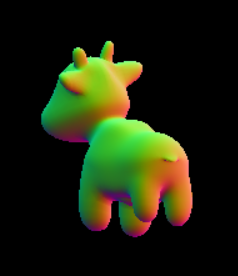
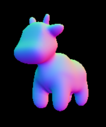

# GAMES101 作业笔记

## Assignment 03 牛牛颠倒问题

下图的颠倒问题是Z-buffer深度处理反了的问题，从摄像机看不到的牛牛的那些面反而全显示出来了，因为在Z-buffer的处理中，我们遵循了作业02的“深度”越小，离摄像机越近，但是在作业三如果我们照搬作业02的代码，实际上作业03拿到的“深度”都是原始的Z轴坐标，都是负数，导致越小（负数绝对值越大）的坐标上的颜色反而显示了出来

解决方式：在处理Z-buffer的部分把原始的Z轴坐标加个-1让它变成“深度”的物理意义

正确结果：

不难看出，这两个牛牛的外轮廓是一模一样的，只是前后颠倒了

还有一个坑：查找纹理颜色的时候可能会出现u，v坐标越界的问题